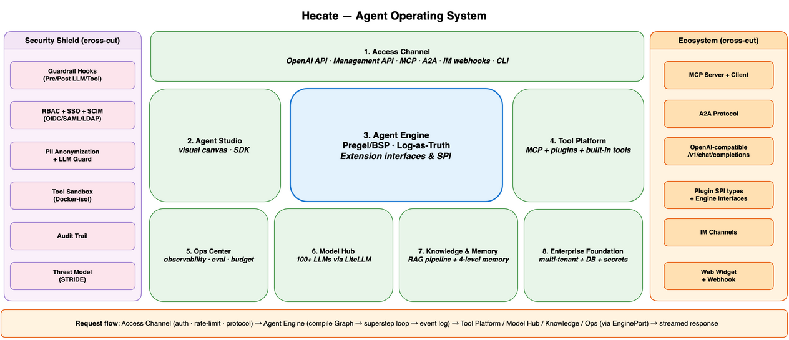

# Hecate

<div align="center">

**The enterprise-grade agent operating system for enterprise intelligent applications — high-code + low-code, self-hosted, MIT-licensed, secured by default.**

[](https://github.com/xueyufish/hecate/actions/workflows/ci.yml)
[](https://www.python.org/downloads/)
[](https://opensource.org/licenses/MIT)
[](https://github.com/xueyufish/hecate)
[](https://modelcontextprotocol.io/)
[](https://a2a-protocol.org/)
[](https://platform.openai.com/docs/api-reference/chat)
[](https://github.com/xueyufish/hecate/blob/main/pyproject.toml)
[](https://github.com/xueyufish/hecate/blob/main/pyproject.toml)
[](https://github.com/xueyufish/hecate/blob/main/.pre-commit-config.yaml)

</div>

> **Hecate is alpha software.** APIs and config schemas may change before 1.0. Pin your version (`hecate==0.1.x`).

---

## Why Hecate?

Hecate is the **enterprise-grade agent operating system** for enterprises building intelligent applications — combining high-code with low-code , secured by enterprise-grade capabilities out of the box:

- **High-code + low-code, one workflow** — Python API for engineers; drag-and-drop visual canvas for business users. Bidirectional JSON graph DSL sync — what you build visually is the same code-defined workflow.
- **Event-sourced execution (Log-as-Truth)** — Append-only event log + durable checkpoints + time-travel replay. Debug any session via `GET /api/sessions/{id}/replay`.
- **Production-grade long-running** — Durable retry, resume, controlled interruption, HITL approval. Multiple built-in tools including sandboxed headless Chromium with per-environment domain allow-lists.
- **Enterprise-grade security by default** — Multi-tenant Org → Workspace → RBAC, SSO (OIDC/SAML/LDAP) + SCIM v2, audit trail, PII redaction, sandboxed execution. Compliance-ready, not bolt-on.
- **Protocol-native** — MCP (server + client) + A2A (server + client) + OpenAI-compatible API. Wire-compatible with existing OpenAI clients.
- **Self-hosted, your data stays** — Deploy on your infrastructure. Prompts and completions go directly to your LLM provider (cloud or local); Hecate itself stores nothing by default.

---

## At a glance



<sub>For the comprehensive L1 architecture with sub-components, see [architecture.md](docs/design/architecture.md).</sub>

---

## How does Hecate compare?

| Dimension | **Hecate** | Dify | LangGraph | n8n | CrewAI |
|---|---|---|---|---|---|
| **Deployment** | Self-hosted OSS (MIT) | Cloud + self-host | OSS library | Cloud + self-host (Fair-code) | Cloud + enterprise |
| **Primary UX** | Code (Python) + Visual | Visual-first | Code (Python) | Visual + code | Code + Visual |
| **Engine** | Self-developed **Pregel/BSP** + event-sourced execution state | DAG-based | Pregel (Google) inspired | DAG-based | Custom |
| **MCP server + client** | ✅ Bidirectional (latest spec) | ✅ Client only | Partial | ✅ | ✅ |
| **A2A protocol** | ✅ (server + client) | ❌ | ❌ | ❌ | Partial |
| **OpenAI-compatible API** | ✅ Wire-compatible | ❌ | ❌ | ❌ | ❌ |
| **Multi-tenancy native** | ✅ Org → Workspace → RBAC + SSO/SCIM | ✅ | ❌ Add-on | ✅ | ✅ |
| **Engine-level extensibility** | ✅ **Many interfaces + multiple SPIs** | Plugins | Decorators | Nodes | Limited |
| **License** | MIT | Apache-2.0 + cloud | MIT (LangGraph) + proprietary (LangSmith) | Sustainable Use License | Proprietary |

> Full comparison (vs Salesforce Agentforce, AWS Bedrock AgentCore, CrewAI, n8n, Chinese platforms, "Linux of agent platforms" framing): see **[Positioning & Competitive Landscape](docs/design/positioning.md)**.

### Pick Hecate when…

- ✅ **Self-hosted is required** (data residency, compliance, or cost reasons)
- ✅ **Multi-tenancy is required** (you build a platform for many teams / customers)
- ✅ **Protocol surface matters** (you need MCP, A2A, and OpenAI-compatible — not just one)
- ✅ **Engine-level extensibility is required** (you'll write a custom scheduler, guardrail hooks, or checkpoint store)
- ✅ **MIT-licensed OSS is required** (no per-seat fees, no telemetry)

### Pick something else when…

| If you want… | Choose |
|---|---|
| Non-developers building chatbots in days | **Dify** |
| A library, not a platform | **LangGraph** |
| General workflow automation (AI is a feature) | **n8n** |
| Managed cloud with sales motion | **CrewAI / Agentforce** |

---

## Quick Start

**Pick your path:**

| Goal | Where to start |
|---|---|
| 🧑‍💻 Build an agent runtime (Python API) | [One-command install](#one-command-install-recommended) below |
| 🎨 Compose agents visually (no code) | After install, open [web/](web/) (the visual canvas) |
| 🔌 Add MCP / A2A integration | [Enable MCP Server](docs/how-to/enable-mcp-server.md) · [Enable A2A Server](docs/how-to/enable-a2a-server.md) |
| 🏢 Deploy to production (K8s / multi-tenant) | [Deploy to production](docs/how-to/deploy-production.md) |

Get Hecate running in **~5 minutes**. **Prerequisites**: Docker, Python 3.12+, [`uv`](https://docs.astral.sh/uv/), and an LLM API key (OpenAI, Anthropic, DeepSeek, Qwen, GLM, Ollama, or any [LiteLLM-supported provider](https://docs.litellm.ai/docs/providers)). **System requirements**: 2 CPU cores, 4 GB RAM (8 GB recommended), 10 GB disk. macOS, Linux, and WSL2 supported; native Windows is experimental. Full guide: [Quickstart](docs/getting-started/quickstart.md).

### One-command install (recommended)

```bash
curl -fsSL https://raw.githubusercontent.com/xueyufish/hecate/main/install.sh | bash
```

This bootstraps the repo, ensures `uv`, copies `.env.example`, **interactively asks for an LLM provider key**, starts Docker Compose infra, runs Alembic migrations, and ends with `hecate preflight`. Then start the server yourself with `uv run uvicorn hecate.main:app --reload`.

> **By default the installer stops after validating the environment** — it does not auto-start the API server, so you can review `.env` first. Pass `--start-server` to additionally launch the `hecate` container and get Swagger live at `http://localhost:8000/docs`:
>
> ```bash
> curl -fsSL https://raw.githubusercontent.com/xueyufish/hecate/main/install.sh | bash -s -- --start-server
> ```

Windows: use [WSL2](https://learn.microsoft.com/en-us/windows/wsl/install) and run the same command, or follow the manual steps below. See [`scripts/install.ps1`](scripts/install.ps1) for the (currently stub) native PowerShell installer.

### Manual install (step-by-step)

If you'd rather drive each step yourself, here is the long form.

#### Step 1 — Start infrastructure and install

```bash
git clone https://github.com/xueyufish/hecate.git && cd hecate
# Create the .env file from the template (Docker Compose requires it; add your LLM API key here)
cp .env.example .env
# Start the infrastructure services (PostgreSQL, Qdrant, MinIO, Temporal)
docker compose -f docker/docker-compose.yml up -d postgres qdrant minio temporal
# Create the virtual environment only if missing (keeps re-runs non-interactive)
[ -d .venv ] || uv venv
# Activate the virtual environment
source .venv/bin/activate
# Install Hecate in editable mode with dev dependencies
# (--prerelease=allow: required while fastmcp 4.x is only available as a beta)
uv pip install --prerelease=allow -e ".[dev]"
# Apply database migrations
alembic upgrade head

# Sanity-check the setup before starting the server:
hecate preflight
# → [PASS] database: OK
# → [PASS] alembic_head: ...
# → [PASS] env_vars: all present
# → [PASS] llm_credentials: found: <your-provider-key>
# → Preflight PASSED.
```

#### Step 2 — Start the server

```bash
uvicorn hecate.main:app --reload
```

Open [http://localhost:8000/docs](http://localhost:8000/docs) for the interactive API explorer (Swagger UI) and `/redoc`.

#### Step 3 — Send your first chat request

The API is **OpenAI-compatible** — any existing OpenAI client works by pointing `base_url` at Hecate. Hecate accepts JWT tokens, database-backed API keys, or any value in the `HECATE_API_KEYS` env var (default `dev-key-change-me`):

```bash
curl -X POST http://localhost:8000/v1/chat/completions \
  -H "Authorization: Bearer $(grep ^HECATE_API_KEYS .env | cut -d= -f2 | cut -d, -f1)" \
  -H "Content-Type: application/json" \
  -d '{
    "model": "zai/glm-4.7-flash",
    "messages": [{"role": "user", "content": "Hello!"}]
  }'
```

**Expected response**: a JSON object with `choices[0].message.content` containing a greeting. If you see that, Hecate is running.

The `model` must match a provider key in your `.env` — Hecate routes via LiteLLM: `zai/glm-4.7-flash` uses `ZAI_API_KEY`, `gpt-4o` uses `OPENAI_API_KEY`, `anthropic/claude-3-5-sonnet-20241022` uses `ANTHROPIC_API_KEY`.

For streaming responses (SSE), add `"stream": true`:

```bash
curl -N -X POST http://localhost:8000/v1/chat/completions \
  -H "Authorization: Bearer $(grep ^HECATE_API_KEYS .env | cut -d= -f2 | cut -d, -f1)" \
  -H "Content-Type: application/json" \
  -d '{"model": "zai/glm-4.7-flash", "stream": true, "messages": [{"role": "user", "content": "Hello!"}]}'
```

`-N `disables curl buffering; tokens stream as they are generated.

#### Step 4 — Or use any OpenAI client (drop-in)

Hecate's `/v1/chat/completions` is wire-compatible with OpenAI. Any existing OpenAI client works by pointing `base_url` at Hecate — no code rewrite. Hecate authenticates the request via the `api_key` you pass to the client; for local development the value from `HECATE_API_KEYS` in your `.env` is the simplest choice:

```python
from openai import OpenAI

api_key = next(
    line.split("=", 1)[1].strip().split(",", 1)[0]
    for line in open(".env")
    if line.startswith("HECATE_API_KEYS=")
)

client = OpenAI(
    base_url="http://localhost:8000/v1",
    api_key=api_key,
)

resp = client.chat.completions.create(
    model="zai/glm-4.7-flash",
    messages=[{"role": "user", "content": "Hello!"}],
)
print(resp.choices[0].message.content)
```

Also works with `litellm`, `langchain-openai`, `instructor`, `vllm`, `llama-index` — any client that speaks OpenAI's wire protocol.

### Troubleshooting

| Symptom | First thing to check |
|---|---|
| `hecate preflight` reports `database: FAIL` | `docker compose -f docker/docker-compose.yml ps` — is Postgres up? |
| `curl` returns `401 Unauthorized` | `cat .env` — is `HECATE_API_KEYS=` set (default `dev-key-change-me`)? The bearer must match `HECATE_API_KEYS`, a JWT, or a DB API key — `OPENAI_API_KEY` is the upstream LLM credential, not the Hecate auth token |
| `curl` returns `502 Bad Gateway` | `docker compose logs hecate` — the server may still be starting |
| Port `8000` already in use | `lsof -i :8000` then `kill <pid>`, or run uvicorn on `--port 8080` |
| Anything else | [Full troubleshooting guide](docs/how-to/troubleshoot.md) |

### What's next

**Tutorials** — feature-focused walkthroughs:

- [Build your first agent](docs/tutorials/01-first-agent.md) — code-first Python walkthrough
- [Add a knowledge base](docs/tutorials/02-knowledge-base.md) — RAG in 10 minutes
- [Connect an MCP server](docs/tutorials/03-mcp-integration.md) — extend with external tools
- [A2A Protocol](docs/tutorials/09-a2a-protocol.md) — cross-agent orchestration
- [OpenAI SDK compatibility](docs/tutorials/10-openai-compatibility.md) — use Hecate as a drop-in for OpenAI
- [Visual canvas](docs/tutorials/11-visual-canvas.md) — drag-and-drop workflow design

**Use cases** — end-to-end business scenarios:

- [Customer support bot](docs/use-cases/01-customer-support-bot.md) — RAG + Guardrails + HITL
- [Code review agent](docs/use-cases/02-code-review-agent.md) — MCP + Multi-Agent
- [Research team](docs/use-cases/03-research-team.md) — Multi-Agent + Streaming + Evaluation

---

## What you get out of the box

### Built-in tools

Every Hecate agent can use these immediately — no extra install required:

| Tool | Risk | Purpose |
|---|---|---|
| `web_search` | LOW | Search the web for information |
| `read_file` | LOW | Read a file from the workspace root |
| `write_file` | MEDIUM | Write content to a file |
| `list_files` | LOW | List files and directories |
| `execute_code` | MEDIUM | Run Python in a sandboxed Docker container |
| `browser_navigate` | MEDIUM | Drive a headless Chromium to a URL (sandboxed, per-env allow-list) |
| `browser_click` | MEDIUM | Click an element on the current page |
| `browser_type` | MEDIUM | Type text into an input element |
| `browser_extract` | MEDIUM | Extract page content (a11y / text / HTML) |
| `browser_screenshot` | MEDIUM | Capture the page as PNG |
| `browser_fill_form` | MEDIUM | Atomically fill multiple form fields |

Browser tools run inside a dedicated Docker sandbox with per-environment domain allow-lists enforced fail-closed. See [Browser automation guide](docs/how-to/browser-automation.md).

### Collaboration patterns

Ship multi-agent workflows as graph templates:

| Pattern | When |
|---|---|
| **Sequential** | Linear pipeline: each step feeds the next |
| **Parallel** | Fan-out / fan-in: independent tasks merged at the end |
| **Handoff** | Agent decides who handles the next turn |
| **Broadcast** | Multiple agents read/write a shared topic channel |
| **Negotiation** | 2 agents negotiate until a condition resolves |
| **Debate** | 2+ agents argue in rounds until a winner emerges |
| **Dynamic** | A COORDINATOR node emits a TaskDAG at runtime |

### Engine extension interfaces and plugin SPI types

The full extension surface — see [Extension Points inventory](docs/reference/extension-points.md) and [Plugin concepts](docs/concepts/plugins.md).

---

## Features

Organized by layer:

### Protocol layer

- **A2A Protocol Native** — Linux Foundation standard — signed AgentCards (`/.well-known/agent-card.json`), JSON-RPC 2.0 task lifecycle, SSE streaming, and JWS+RFC 8785 trust model. Operates as both A2A server and A2A client.
- **MCP Native** — Bidirectional Model Context Protocol: Hecate consumes external MCP servers (GitHub, Slack, etc.) and exposes its own as a server (Streamable HTTP transport, latest MCP spec).
- **OpenAI SDK Drop-in** — Wire-compatible `/v1/chat/completions` endpoint. Any OpenAI client (Python, JS, litellm, langchain-openai, instructor, vllm) works against Hecate by changing `base_url`.

### Engine layer

- **Graph-First Engine** — Self-built Pregel/BSP runtime with many engine extension interfaces and multiple plugin SPI types. Zero external framework dependencies for the engine.
- **Engine-Level Guardrails** — Four hook types (Pre/Post LLM/Tool) at every LLM and Tool boundary; the same hooks power PII masking, audit logging, and human-in-the-loop flows.
- **Context Engineering** — An extensible pipeline (assembler, evidence tracker, phase detector, token budget, provider shaping, message prioritization, tool filtering, offloader) that keeps long-running agents on-budget and on-task.
- **Execution Replay** — Trace-partitioned timelines and time-travel state inspection over the event-sourced execution log (Log-as-Truth, [ADR-030](docs/design/adr/030-event-sourced-execution-state.md)); debug any session via `GET /api/sessions/{id}/replay`.
- **Sandboxed Tool Execution** — Docker-isolated runtime with explicit permission scopes per agent. Browser tools run in a dedicated Chromium sandbox with per-environment domain allow-lists.

### Platform layer

- **Multi-Tenant** — Organization → Workspace → RBAC with `workspace_id` on **many data models** for tenant isolation. SSO via OIDC/SAML/LDAP, SCIM v2 provisioning.
- **Visual Canvas** — Drag-and-drop workflow editor in `web/` (React Flow + Next.js). Bidirectional sync with the JSON graph DSL — what you build visually is the same code-defined workflow.
- **Multi-Agent Orchestration** — Seven collaboration patterns (see above) unified as Graph templates.
- **Plugin System** — Multiple plugin types (Tool / Extension / Trigger / Model / Channel / Evaluator / Auth / Secret) with hot-reload, declared permissions, and versioned manifests.
- **Embeddable Web Widget** — Drop an agent chat into any web page via the `/embed/chat` iframe ([ADR-031](docs/design/adr/031-web-widget-iframe-architecture.md)), reusing the dashboard chat components with existing JWT auth.

### Integration layer

- **IM Channels** — Reach Hecate agents from Feishu (Lark) and Slack via inbound webhooks. Mandatory Bound Identity model ensures every IM user is bound to a Hecate user before any conversation starts. See [Configure Feishu and Slack](docs/how-to/configure-feishu-slack.md).
- **Webhooks** — Trigger workflows from external systems. See [Set up webhooks](docs/how-to/set-up-webhooks.md).
- **OpenSpec Workflow** — Every feature shipped through structured proposal → design → specs → implementation → archive (similar to Python PEPs / Kubernetes KEPs / Rust RFCs). Many ADRs and many archived changes document the architecture.

---

## Engineering Approach

Hecate's design follows three disciplines common to serious agent platforms:

- **Harness engineering** — the runtime is the harness. Every LLM call passes through the Pregel superstep loop, with durable checkpoints, retry policies, and many engine extension interfaces providing observability and control at every boundary.
- **Loop engineering** — agent control loops are first-class. The superstep iteration is complemented by `interrupt()`/`Command()` for human-in-the-loop, `RetryStrategy` for failure recovery, and multi-agent delegation patterns where each subgraph runs its own execution loop.
- **Graph engineering** — workflows are graphs. A JSON DSL describes nodes and edges; the compiler validates, optimizes, and emits an executable `CompiledGraph`. Six multi-agent collaboration patterns ship as static graph templates; a seventh — Dynamic Orchestration — is emitted at runtime as a TaskDAG.

---

## Trust & Security

Built for on-premises and regulated deployments:

- **PII masking and data isolation** — guardrail hooks redact sensitive content before it leaves your network
- **Audit trail** — every LLM call, tool invocation, and checkpoint is logged to your own PostgreSQL
- **Sandboxed tool execution** — Docker-isolated runtime with explicit permission scopes per agent
- **No external data retention** — prompts and completions go directly to your LLM provider; Hecate does not store them

---

## CLI Tools

Hecate ships three console-script entry points:

- **`hecate`** — the main CLI for managing agents, sessions, knowledge bases, workflows, and other resources. See [`docs/reference/cli.md`](docs/reference/cli.md) for the full command list.
- **`hecate-migrate`** — standalone migration runner. Designed for one-shot use as a Docker Compose init service, a Kubernetes init container, or a Helm pre-install hook — runs Alembic migrations without booting the full web application.
- **`hecate-flag-audit`** — CI tool that scans the source tree for stale or orphaned `ENABLE_*` feature flags. See [`docs/reference/cli.md#hecate-flag-audit--feature-flag-audits`](docs/reference/cli.md#hecate-flag-audit--feature-flag-audits).

After `uv pip install -e ".[dev]"`, all three commands are available on your `PATH`.

---

## Documentation

- **[Getting Started](docs/getting-started/)** — install Hecate locally and send your first chat request in ~5 minutes.
- **[Tutorials](docs/tutorials/)** — many end-to-end tutorials (first agent, knowledge base, MCP, multi-agent, A2A, OpenAI SDK, visual canvas, plus use cases).
- **[How-to Guides](docs/how-to/)** — many task-oriented recipes (LLM providers, deployment, MCP, A2A, SSO, backups, webhooks, troubleshooting).
- **[Concepts](docs/concepts/)** — many explanatory articles that help you understand Hecate's core ideas before building.
- **[Reference](docs/reference/)** — REST API, CLI, Graph DSL, plugin manifest, event catalog, extension points, data models.
- **[Architecture Center](docs/design/)** — many architecture deep dives + many ADRs + ADR index, plus [Positioning & Competitive Landscape](docs/design/positioning.md) and [Reference Architectures](docs/design/reference-architectures.md).
- **[Use Cases](docs/use-cases/)** — end-to-end business scenarios (customer support bot, code review agent, research team).
- **[Migrations](docs/migrations/)** — schema migration guides (expand-contract pattern, 0.1 → 0.2 upgrade).
- **[Operations](docs/operations/)** — runbooks for production (health checks, backup, rollback, log analysis, performance).
- **[About](docs/about/)** — inspired by, license, contributors, release notes.
- **[CHANGELOG.md](CHANGELOG.md)** — machine-readable changelog.
- **[GitHub Releases](https://github.com/xueyufish/hecate/releases)** — full release history with auto-generated notes.

---

## Inspired by

Hecate builds on the shoulders of giants: [LangGraph](https://github.com/langchain-ai/langgraph), [Model Context Protocol](https://modelcontextprotocol.io/), [A2A Protocol](https://a2a-protocol.org/), [FastAPI](https://fastapi.tiangolo.com/), [Pydantic](https://docs.pydantic.dev/), [SQLAlchemy](https://www.sqlalchemy.org/), [LiteLLM](https://github.com/BerriAI/litellm). Full credits and specific inspirations are in [docs/about/inspired-by.md](docs/about/inspired-by.md).

---

## Contributing

Contributions are welcome. See [CONTRIBUTING.md](CONTRIBUTING.md) for the workflow, coding conventions, and how to file issues. Every feature ships through the [OpenSpec](openspec/) workflow with requirements, scenarios, and design docs.

---

## License

[MIT](LICENSE)