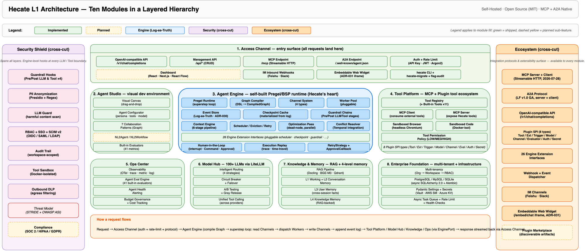

# Hecate

[](https://github.com/xueyufish/hecate/actions/workflows/ci.yml)
[](https://www.python.org/downloads/)
[](https://opensource.org/licenses/MIT)
[](https://github.com/xueyufish/hecate)

Enterprise-grade, multi-tenant, model-agnostic, MCP-first Agent platform.

Hecate is an enterprise-grade Agent platform with a self-developed Pregel execution runtime. It speaks MCP and A2A natively, integrates 100+ LLMs, and exposes an OpenAI-compatible API so existing tools integrate without change. Multi-agent orchestration, engine-level guardrails, and Docker-isolated sandbox execution are first-class concerns.

---

## Who is this for?

Hecate is a good fit if you need any of the following:

- **A flexible agent runtime** — code-first Python API for engineers and a visual canvas for non-developers
- **Engine-level extensibility** — 11 core + 4 SPI extension points let you swap schedulers, checkpointers, guardrails
- **Self-hosted on your own infrastructure** — your prompts never leave your network; LLM traffic uses your API keys
- **Multi-agent orchestration with persistence** — graph-based state, durable checkpoints, human-in-the-loop
- **A multi-tenant foundation** — Organization → Workspace → RBAC for an internal agent platform product
- **To study or extend an agent runtime** — layered architecture with a self-developed Pregel engine and no framework lock-in

Hecate is **not** a good fit if you want a managed cloud service — Hecate is OSS, self-hosted, and you run it on your own infrastructure. (Dify or n8n may be better fits if your team is non-developer-first and you want a pure GUI-driven, no-code experience.)

---

## Quick Start

```bash
git clone https://github.com/xueyufish/hecate.git
cd hecate
docker compose -f docker/docker-compose.yml up -d
source .venv/bin/activate && uv pip install -e ".[dev]"
cp .env.example .env       # edit API keys and DB URLs
alembic upgrade head
uvicorn hecate.main:app --reload
```

Then send your first chat request:

```bash
curl -X POST http://localhost:8000/v1/chat/completions \
  -H "Authorization: Bearer your-api-key" \
  -H "Content-Type: application/json" \
  -d '{
    "model": "gpt-4o",
    "messages": [{"role": "user", "content": "Hello!"}]
  }'
```

Interactive API docs are available at `http://localhost:8000/docs` (Swagger UI) and `/redoc`.



---

## Features

- **Graph-First Engine** — Self-built Pregel/BSP runtime with 11 core + 4 SPI extension points. Zero external framework dependencies for the engine.
- **Context Engineering** — An extensible pipeline (assembler, evidence tracker, phase detector, token budget, provider shaping, message prioritization, tool filtering, offloader) that keeps long-running agents on-budget and on-task.
- **MCP + A2A Native** — Bidirectional MCP client and server, plus Linux Foundation A2A protocol support for cross-framework agent communication.
- **Multi-Agent Orchestration** — Six collaboration patterns (Hierarchical, Handoff, Pipeline, Broadcast, Negotiation, Debate) unified as Graph templates.
- **Multi-Tenant** — Organization → Workspace → RBAC with workspace_id on 35 data models for tenant isolation.
- **Engine-Level Guardrails** — Four hook types (Pre/Post LLM/Tool) at every LLM and Tool boundary; the same hooks power PII masking, audit logging, and human-in-the-loop flows.

---

## Engineering Approach

Hecate's design follows three disciplines common to serious agent platforms:

- **Harness engineering** — the runtime is the harness. Every LLM call passes through the Pregel superstep loop, with durable checkpoints, retry policies, and 11 core + 4 SPI extension points providing observability and control at every boundary.
- **Loop engineering** — agent control loops are first-class. The superstep iteration is complemented by `interrupt()`/`Command()` for human-in-the-loop, `RetryStrategy` for failure recovery, and multi-agent delegation patterns where each subgraph runs its own execution loop.
- **Graph engineering** — workflows are graphs. A JSON DSL describes nodes and edges; the compiler validates, optimizes, and emits an executable `CompiledGraph`. Six multi-agent collaboration patterns ship as static graph templates.

---

## Trust & Security

Built for on-premises and regulated deployments:

- **PII masking and data isolation** — guardrail hooks redact sensitive content before it leaves your network
- **Audit trail** — every LLM call, tool invocation, and checkpoint is logged to your own PostgreSQL
- **Sandboxed tool execution** — Docker-isolated runtime with explicit permission scopes per agent
- **No external data retention** — prompts and completions go directly to your LLM provider; Hecate does not store them

---

## CLI Tools

Hecate ships two console-script entry points:

- **`hecate`** — the main CLI for managing agents, sessions, knowledge bases, workflows, and other resources. See [`docs/reference/cli.md`](docs/reference/cli.md) for the full command list.
- **`hecate-migrate`** — standalone migration runner. Designed for one-shot use as a Docker Compose init service, a Kubernetes init container, or a Helm pre-install hook — runs Alembic migrations without booting the full web application.

After `uv pip install -e ".[dev]"`, both commands are available on your `PATH`.

---

## Documentation

- [Getting Started](docs/getting-started/) — install and run Hecate
- [Tutorials](docs/tutorials/) — end-to-end examples (first agent, knowledge base, MCP, multi-agent)
- [How-to Guides](docs/how-to/) — task-oriented recipes (LLM providers, deployment, backup)
- [API Reference](docs/reference/) — REST and CLI references
- [Architecture](docs/design/) — engine design, concepts, ADRs

---

## Inspired by

Hecate builds on the shoulders of giants: [LangGraph](https://github.com/langchain-ai/langgraph), [Model Context Protocol](https://modelcontextprotocol.io/), [A2A Protocol](https://a2a-protocol.org/), [FastAPI](https://fastapi.tiangolo.com/), [Pydantic](https://docs.pydantic.dev/), [SQLAlchemy](https://www.sqlalchemy.org/), [LiteLLM](https://github.com/BerriAI/litellm). Full credits and specific inspirations are in [docs/about/inspired-by.md](docs/about/inspired-by.md).

---

## Contributing

Contributions are welcome. See [CONTRIBUTING.md](CONTRIBUTING.md) for the workflow, coding conventions, and how to file issues. Every feature ships through the [OpenSpec](openspec/) workflow with requirements, scenarios, and design docs.

---

## License

[MIT](LICENSE)