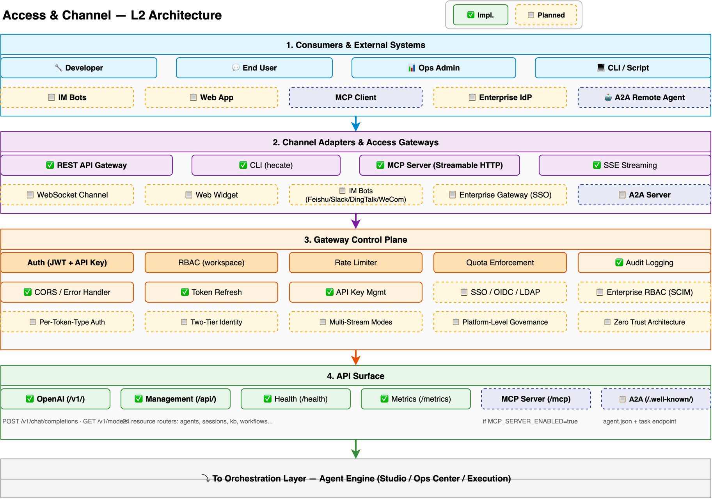

# Access Channel Design

> Deep dive into Hecate's access layer: API surfaces, authentication, gateway control plane, multi-channel adaptation, and zero trust identity. For a system overview, see [Architecture](architecture.md). For security internals (guardrail hooks, PII, audit), see [Security Architecture](security-architecture.md).

---

## Overview

The Access Channel is the entry point for all external requests. It exposes four API surfaces, enforces authentication and authorization through a gateway control plane, and adapts to diverse consumer types — from developers and end users to MCP clients and A2A remote agents.



The access channel has four layers:

1. **Consumers** — Who calls the platform (developers, end users, ops admins, external agents)
2. **Channel Adapters** — How requests arrive (REST, CLI, MCP, A2A, IM bots, WebSocket)
3. **Gateway Control Plane** — What gates every request (auth, RBAC, rate limit, quota, governance)
4. **API Surface** — Where requests land (/v1/, /api/, /mcp, /.well-known/)

All requests are uniformly wrapped as `ExecutionRequest` objects and flow down to the Agent Engine.

---

## Consumers & External Systems

Every request entering Hecate originates from one of these consumer types:

| Consumer | Description | Auth Method |
|----------|-------------|-------------|
| **Developer** | Builds and configures agents via Studio or SDK | API Key + JWT |
| **End User** | Interacts with agents via chat interface | JWT (session) |
| **Ops Admin** | Manages platform operations, monitoring, evaluation | JWT (admin role) |
| **CLI / Script** | Programmatic access via hecate CLI or scripts | API Key |
| **IM Bots** | Feishu, Slack, DingTalk, WeCom, WeChat ecosystem | Bot token → API Key mapping |
| **Web App** | Browser-based end-user application | JWT (session) |
| **MCP Client** | External MCP-compatible tool consumer | API Key |
| **Enterprise IdP** | Azure AD, Okta, OneLogin via SSO/OIDC | SAML/OIDC → JWT |
| **A2A Remote Agent** | External agent calling via A2A protocol | Agent Card + A2A auth scheme |

### Consumer Identity Resolution

Each consumer type maps to one of two identity tiers (see [Two-Tier Identity Model](#two-tier-identity-model)):

- **App-level consumers** (CLI, MCP Client, A2A Remote Agent) authenticate with API Keys — representing the application, not an individual user.
- **User-level consumers** (End User, Web App, IM Bots) authenticate with JWT — representing a specific person in a session.
- **Combined consumers** (Enterprise IdP, Developer) carry both: API Key for the application identity + JWT for the user identity.

---

## Channel Adapters

Channel adapters translate external protocols into Hecate's internal `ExecutionRequest` format. Each adapter handles protocol-specific concerns (connection management, event parsing, message formatting) before handing off to the gateway control plane.

### Adapter Inventory

| Adapter | Protocol | Transport |
|---------|----------|-----------|
| **REST API Gateway** | HTTP/HTTPS | Sync + SSE |
| **CLI (hecate)** | Terminal | Sync |
| **MCP Server** | JSON-RPC | Streamable HTTP (single /mcp endpoint) |
| **SSE Streaming** | HTTP SSE | Server-Sent Events |
| **WebSocket Channel** | WebSocket | Bidirectional persistent |
| **Web Widget** | HTTP + iframe | Embedded chat component |
| **IM Bots** | Platform-specific webhooks | Feishu/Slack/DingTalk/WeCom/WeChat |
| **Enterprise Gateway** | SAML/OIDC | SSO federation |
| **A2A Server** | A2A v1.0 | HTTP + JSON/gRPC |

### ChannelABC SPI

All channel adapters implement the `ChannelABC` interface — one of four Platform SPI extension points (see [ADR-016](adr/016-platform-spi-architecture.md)):

```python
class ChannelABC(ABC):
    @abstractmethod
    async def send(self, message: ChannelMessage) -> None: ...

    @abstractmethod
    async def receive(self) -> ChannelEvent: ...

    @abstractmethod
    def parse_event(self, raw: dict) -> ChannelEvent: ...
```

Built-in adapters (REST, CLI, MCP) ship as `BuiltinChannel` implementations. Third-party adapters (Feishu, Slack, DingTalk, custom SDKs) register as plugins through `PluginRegistry`. This enables the channel ecosystem to grow without modifying core gateway code.

### A2A Server Adapter

The A2A Server adapter handles cross-framework agent communication (see [ADR-011](adr/011-a2a-protocol-adoption.md)):

1. **Agent Card serving** — Responds to `GET /.well-known/agent.json` with the agent's capabilities, skills, and security schemes
2. **Task lifecycle** — Receives task submissions (submitted → working → completed/failed/cancelled), routes them to the Agent Engine, and returns artifacts
3. **Streaming updates** — For long-running tasks, pushes intermediate updates via SSE
4. **Authentication** — Supports APIKey, OAuth2, and MutualTLS schemes declared in the Agent Card

---

## API Surfaces

Hecate exposes four API surfaces, each with distinct protocol semantics (see [ADR-009](adr/009-dual-api-design.md)):

### OpenAI-Compatible API (`/v1/`)

Strictly follows the OpenAI API specification. No Hecate-specific extensions. This is the highest-priority compatibility surface — Hecate works as a drop-in replacement for any tool that calls the OpenAI API.

| Endpoint | Method | Purpose |
|----------|--------|---------|
| `/v1/chat/completions` | POST | Chat completion (sync or SSE streaming) |
| `/v1/models` | GET | List available models |

Streaming responses follow OpenAI's SSE format (`data: {...}\n\n`).

### Management API (`/api/`)

RESTful CRUD for all Hecate entities. Follows REST conventions with a unified error format.

```
POST   /api/agents              — Create agent
GET    /api/agents/{id}         — Get agent
PUT    /api/agents/{id}         — Update agent
DELETE /api/agents/{id}         — Delete agent
GET    /api/sessions            — List sessions
POST   /api/knowledge-bases     — Create knowledge base
POST   /api/knowledge-bases/{id}/documents — Upload document
...
```

The Management API covers 24+ resource routers: agents, sessions, conversations, messages, workflows, tools, skills, knowledge bases, documents, chunks, prompts, memories, memory blocks, organizations, workspaces, users, api keys, model providers, evaluations, traces, audit events, and more.

**Unified error format** (applies to both REST surfaces):

```json
{
  "error": {
    "code": "NOT_FOUND",
    "message": "Agent not found",
    "details": {"agent_id": "..."}
  }
}
```

### MCP Server (`/mcp`)

Streamable HTTP transport per the MCP 2025-03-26 specification (see [ADR-012](adr/012-mcp-streamable-http.md)). Exposes Hecate agents as MCP-compliant tool providers.

- **Single endpoint** — All MCP communication flows through `/mcp` (no separate SSE endpoint)
- **POST** for client→server messages, **GET** for SSE stream subscription
- **Stateless operation** — Standard load balancers (round-robin) work without session affinity
- **SSE upgrade** — Server responds immediately for fast operations, upgrades to SSE for long-running tasks
- **Toggle** — Enabled via `MCP_SERVER_ENABLED=true`

External platforms (Claude Desktop, Cursor, any MCP client) can discover and invoke Hecate agents as tools.

### A2A Server (`/.well-known/agent.json`)

Agent Card discovery and A2A task lifecycle for cross-framework agent communication (see [ADR-011](adr/011-a2a-protocol-adoption.md)).

- **Agent Card** — Served at `/.well-known/agent.json`, declares agent identity, capabilities, skills, supported formats, and security schemes
- **Signed Agent Cards** — Cryptographic signatures verify the card was issued by the domain owner, preventing impersonation
- **Task endpoint** — Accepts task submissions, manages the task state machine (submitted → working → completed/failed/cancelled), and returns artifacts
- **Push notifications** — Optional SSE-based streaming for long-running task updates

### Health & Metrics

| Endpoint | Method | Purpose |
|----------|--------|---------|
| `/health` | GET | Liveness probe (returns 200 if service is up) |
| `/metrics` | GET | Prometheus-format metrics for monitoring |

---

## Gateway Control Plane

Every request — regardless of API surface or channel adapter — passes through the gateway control plane before reaching the Agent Engine. The control plane enforces authentication, authorization, traffic governance, and observability.

### Authentication

#### JWT Token System

| Token Type | Expiry | Algorithm | Claims |
|------------|--------|-----------|--------|
| Access Token | 30 minutes | HS256 | sub, exp, iat, org_id, workspace_id, role, type="access" |
| Refresh Token | 7 days | HS256 | sub, exp, iat, type="refresh" |

**Flow:**
```
Login → verify password (bcrypt/Argon2) → resolve workspace context
      → create_access_token() + create_refresh_token()

API Request → decode_access_token() → validate type="access"
              → extract org_id, workspace_id, role

Token Expired → refresh_tokens() → validate refresh token
              → issue new access + refresh tokens
```

#### API Key Service

| Operation | Details |
|-----------|---------|
| Create | Generate `hcat_<32-char-urlsafe>`, store SHA-256 hash only |
| Verify | Hash input, lookup by hash, check active + not expired |
| Rotate | Create new key, deactivate old |
| Revoke | Set `is_active=False` |

Key format: `hcat_` prefix + 32 bytes URL-safe base64. Only SHA-256 hash is stored — the raw key is shown once at creation time and never persisted.

#### Two-Tier Identity Model

The identity model distinguishes two tiers for every API request:

| Tier | Token Type | Scope | Use Case |
|------|-----------|-------|----------|
| **App-level** | API Key (`hcat_*`) | Application identity | Server-to-server integration, CI/CD pipelines, MCP clients, A2A agents |
| **User-level** | JWT (Bearer) | End-user identity | Interactive sessions, per-user audit, web apps |
| **Combined** | API Key + JWT header | App acting on behalf of user | Dual audit trail, granular access control |

The combined mode enables an application (identified by API Key) to act on behalf of a specific user (identified by JWT). Both identities are recorded in the audit trail — "application X performed action Y on behalf of user Z."

#### Per-Token-Type Auth Pipeline

Different token types route through separate authentication pipelines at the gateway level:

```
Request → Token Type Detection → ┌─ JWT Pipeline ──→ Verify HS256 + Expiry + RBAC scope
                                  ├─ APIKey Pipeline → Verify SHA-256 + Rate Limit + Edition gating
                                  ├─ PAT Pipeline ───→ Verify Personal Access Token scope + Rotation
                                  └─ OAuth SSO ──────→ Verify OIDC discovery + Scope mapping
```

Each pipeline has distinct verification steps, rate limits, and edition gating (Community vs Enterprise). The gateway-level router determines the pipeline before the request reaches business logic.

#### SSO / OIDC / LDAP

Enterprise identity federation via standard protocols:

- **SAML 2.0** — Service Provider initiated SSO with SAML assertions
- **OIDC (OpenID Connect)** — Authorization Code flow with PKCE
- **LDAP** — Bind authentication against Active Directory or OpenLDAP
- **SCIM 2.0** — Automated user/group provisioning and deprovisioning from Azure AD, Okta, OneLogin

SCIM Directory Sync extends the `AuthProviderABC` SPI with `sync_identity` capability — delegated CRUD on the identity provider's user directory.

### Authorization & Access Control

#### RBAC (Workspace-level)

Role-based access control scoped to workspaces:

| Role | Permissions |
|------|-------------|
| Admin | Full CRUD on all workspace resources, manage members |
| Editor | Create/edit agents, workflows, knowledge bases, prompts |
| Viewer | Read-only access to workspace resources |

RBAC is enforced via FastAPI dependency guards that check the user's role claim against the required permission for each endpoint.

#### Enterprise RBAC (SCIM)

SCIM-provisioned users and groups inherit roles from the identity provider's directory. Group-to-role mapping enables bulk access management — "all members of the Data Science group are Editors in the Analytics workspace."

### Traffic Governance

#### Rate Limiting

Per-key and per-IP rate limiting enforced at the gateway:

| Scope | Default Limit | Configurable |
|-------|--------------|--------------|
| Per API Key | 60 requests/minute | ✅ via `RATE_LIMIT_RPM` |
| Per IP | 100 requests/minute | ✅ via `RATE_LIMIT_IP_RPM` |
| Per User (JWT) | 120 requests/minute | ✅ |

Rate limit headers (`X-RateLimit-Limit`, `X-RateLimit-Remaining`, `X-RateLimit-Reset`) are included in all responses.

#### Quota Enforcement

Per-tenant resource quotas:

| Resource | Scope | Default |
|----------|-------|---------|
| API calls | Per workspace per month | Configurable |
| Storage | Documents + vectors | Configurable |
| Compute | Concurrent sessions | Configurable |
| Model tokens | Per workspace per month | Configurable |

Quota exceeded returns `429 Too Many Requests` with a descriptive error message.

#### Platform-Level Governance

A unified governance layer enforces 20+ policies across four domains — all evaluated at the gateway before the request reaches the Agent Engine:

| Domain | Policies |
|--------|----------|
| **Identity** | Auto API key rotation, JWT auth enforcement, suspicious login detection, failed auth rate monitoring |
| **Data** | Real-time sensitive content blocking, PII masking at gateway, data residency rules (geo-fencing) |
| **API** | Rate limiting, quota enforcement, model routing policies, fallback chains, circuit breaker |
| **AI Trust** | Prompt injection defense, output toxicity filtering, hallucination detection, content moderation |

This consolidation (inspired by Salesforce MuleSoft Flex Gateway and Palantir Trust Layer) provides a single choke point for security enforcement — no policy is scattered across middleware, engine, and services.

### Zero Trust Architecture

Traditional perimeter-based security assumes internal traffic is trusted. In agent systems, this assumption fails — tools call external services, agents communicate with other agents (A2A), and LLM outputs can be manipulated. Zero Trust — verify every request regardless of source — is the only safe default.

**Principles:**

- **IAM-based service accounts** — Each agent has a unique identity with scoped permissions (principle of least privilege). Agents are not anonymous execution contexts; they carry cryptographic identity.
- **OAuth 2.0 Token Exchange (RFC 8693)** — Identity propagation across service boundaries. When an agent invokes a tool, its identity is exchanged for a scoped token that the tool can verify.
- **Per-agent identity** — Agents carry identity when invoking tools or communicating with other agents. A2A Signed Agent Cards become a natural extension of per-agent identity for cross-framework communication.
- **Continuous verification** — Every tool call, LLM invocation, and knowledge query is authenticated and authorized. No implicit trust based on network position or prior authentication.

See [ADR-018](adr/018-zero-trust-identity-architecture.md).

### Gateway Observability

#### Audit Logging

Every security-relevant event is logged through the audit pipeline:

```
Security Event → asyncio.Queue → AuditBatchWriter
                                   ├── PolicyEngine.evaluate()
                                   ├── Batch (50 events / 2 seconds)
                                   └── AuditStore.write() → PostgreSQL
                                       └── AuditArchiver → MinIO/S3 (cold storage)
```

Audit events capture: org_id, user_id, action, success/failure, workspace_id, resource_type, resource_id, request_method, request_path, response_status, ip_address, user_agent, and timestamp.

#### CORS & Error Handling

- **CORS** — Configurable allowed origins, methods, and headers. Default: same-origin only.
- **Error Handler** — Unified error format across all API surfaces. Unhandled exceptions return `500 Internal Server Error` with a correlation ID for debugging.

---

## Multi-Stream Modes

Clients can subscribe to multiple stream modes simultaneously, receiving different levels of execution detail through a single connection:

| Mode | Output Content | Use Case |
|------|---------------|----------|
| `values` | Complete state after each superstep | Debugging, full state monitoring |
| `updates` | Incremental diffs per superstep | Progress display, change tracking |
| `messages` | LLM token stream | Frontend real-time response display |
| `debug` | Node events, channel changes, tool calls | Development debugging, trace analysis |

Clients specify desired stream modes in the `ExecutionRequest`. For example, a frontend might subscribe to `messages` for real-time token display while simultaneously receiving `updates` for progress tracking.

Multiple modes are multiplexed over a single SSE stream with mode-prefixed events:

```
data: {"mode": "messages", "content": "Hello"}
data: {"mode": "updates", "node": "guard", "status": "completed"}
data: {"mode": "debug", "channel": "messages", "op": "append"}
```

---

## Request Lifecycle

All requests — regardless of entry point — are wrapped as `ExecutionRequest` objects and flow through the same pipeline:

```
Consumer (Developer / End User / A2A Agent / MCP Client / ...)
    │
    ▼
┌─ Channel Adapter ───────────────────────────────────────┐
│  REST / CLI / MCP / A2A / WebSocket / IM Bot / Widget   │
│  Parse protocol-specific input → unified format          │
└──────────────────────────┬───────────────────────────────┘
                           │
    ▼
┌─ Gateway Control Plane ─────────────────────────────────┐
│  1. Token Type Detection → Auth Pipeline                 │
│  2. RBAC Permission Check                                │
│  3. Rate Limit Check                                     │
│  4. Quota Enforcement                                    │
│  5. Platform-Level Governance (20+ policies)             │
│  6. Audit Log Emission                                   │
│  7. Parse request → ExecutionRequest                     │
└──────────────────────────┬───────────────────────────────┘
                           │
    ▼
┌─ API Surface Router ────────────────────────────────────┐
│  /v1/ → OpenAI-compatible handler                        │
│  /api/ → Management REST handler                         │
│  /mcp  → MCP JSON-RPC handler                            │
│  /.well-known/ → A2A handler                             │
└──────────────────────────┬───────────────────────────────┘
                           │
    ▼
                   Agent Engine
            (Pregel Runtime + Workers)
```

### ExecutionRequest Object

Every request is wrapped as an `ExecutionRequest` containing:

| Field | Type | Description |
|-------|------|-------------|
| `agent_id` | UUID | Target agent to execute |
| `messages` | List[Message] | Input messages (system/user/assistant/tool) |
| `execution_config` | ExecutionConfig | Model override, temperature, max tokens, stream modes |
| `request_context` | RequestContext | User info, session ID, workspace ID, permissions, IP address |
| `knowledge_bases` | List[UUID] | Knowledge bases to query (RAG retrieval) |
| `tools` | List[ToolRef] | Tool overrides (if not using agent defaults) |

The `request_context` carries the authenticated identity (App-level + User-level), which flows through to the engine for per-agent identity enforcement (Zero Trust).

---

## Further Reading

| Document | Description |
|----------|-------------|
| [Architecture](architecture.md) | System overview, module architecture |
| [Security Architecture](security-architecture.md) | Guardrail hooks, PII anonymization, audit system, Zero Trust Identity |
| [Engine Design](engine-design.md) | ExecutionRequest processing, Pregel runtime, streaming modes |
| [Core Concepts](concepts.md) | Zero Trust Identity, Agent Card, Task Lifecycle entity definitions |
| [ADR-009](adr/009-dual-api-design.md) | Four API surfaces decision |
| [ADR-011](adr/011-a2a-protocol-adoption.md) | A2A protocol adoption |
| [ADR-012](adr/012-mcp-streamable-http.md) | MCP Streamable HTTP transport |
| [ADR-016](adr/016-platform-spi-architecture.md) | Platform SPI (ChannelABC, AuthProviderABC) |
| [ADR-018](adr/018-zero-trust-identity-architecture.md) | Zero Trust Identity Architecture |
