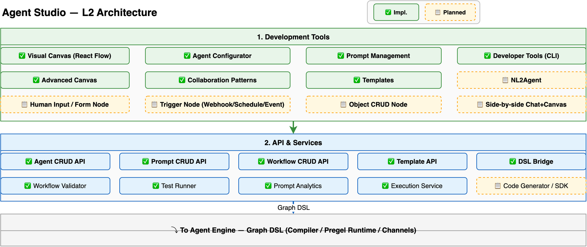

# Agent Studio Design

> Deep dive into Hecate's visual development environment: canvas, agent configurator, multi-agent orchestration, NL2X workflow generation, testing tools, and high-level visual node types. For a system overview, see [Architecture](architecture.md). For engine-level execution details, see [Engine Design](engine-design.md).

---

## Overview

Agent Studio is Hecate's visual development environment — the primary interface for building, configuring, testing, and deploying AI Agent applications. It serves three user personas:

- **Business analysts** — Build agents visually without code (drag-and-drop canvas, templates, NL2Agent)
- **Developers** — Code-first development via SDK, CLI, and DSL; integrate custom tools and knowledge bases
- **Ops engineers** — Monitor agent performance, evaluate quality, manage deployments

The Studio comprises two layers that flow into the Agent Engine:



1. **Development Tools** — Canvas, agent configurator, prompt management, NL2X generation, high-level node types
2. **API & Services** — Agent/Workflow/Prompt CRUD APIs, DSL bridge, test runner, analytics, SDK export

All visual work produces **JSON DSL** — the single source of truth — which compiles into `CompiledGraph` objects for the Pregel Runtime.

---

## Visual Canvas

### React Flow with JSON DSL Bidirectional Sync

The canvas is built on [React Flow](https://reactflow.dev/) (MIT-licensed), selected for its custom node/edge rendering, built-in MiniMap and Controls, and native React 19 + TypeScript integration (see [ADR-010](adr/010-react-flow-canvas.md)).

**Bidirectional sync** ensures the canvas and DSL never diverge:

```
Canvas operation (drag, connect, delete)
    │
    ▼
JSON DSL update → recompilation → CompiledGraph update
    │
    ▼
Canvas re-render (if DSL changed externally)
```

Users can switch between visual and code editing at any time — both interfaces edit the same underlying DSL.

### Node Type Palette

The canvas provides two tiers of node types:

#### Engine-Level Node Types (8 types)

These are the abstract node types defined in the Graph DSL schema (`graph-dsl.schema.json`). All workflows compile to these primitives:

| Type | Description | Channel Interaction |
|------|-------------|---------------------|
| `llm` | LLM inference node | Reads messages/tools → writes response |
| `code` | Code execution node (sandboxed) | Reads input → writes output |
| `condition` | Conditional branch node | Reads state → routes to branch |
| `tool` | Tool invocation node | Reads tool_name/args → writes result |
| `agent` | Sub-Agent node (references another Agent) | Maps parent state → child state → returns result |
| `subgraph` | Subgraph node (nested Workflow) | Maps outer state → inner state → returns result |
| `input` | Workflow input node | Receives external input |
| `output` | Workflow output node | Outputs final result |

#### High-Level Visual Node Types (4 types)

These are canvas-level abstractions that compile to engine primitives (see [ADR-019](adr/019-visual-workflow-node-types.md)). They do not exist in the Graph DSL — the canvas-to-DSL compilation step translates them before the engine processes them:

| Visual Node | Compiles To | Purpose |
|-------------|-------------|---------|
| **Human Input / Form Node** (1.1.24) | `interrupt()` + `Command(resume)` | Structured HITL: form fields, dropdowns, approval routing |
| **Trigger Node** (1.1.25) | `__start__` + external trigger mapping | Event-driven entry: webhook, schedule, event, MCP |
| **Object CRUD Node** (1.1.26) | `tool` node + GraphStore binding | Ontology-aware entity operations: create, update, delete, query |
| **Side-by-side Chat + Canvas** (1.1.27) | UX layer (split-pane layout) | Integrated dev/test: canvas left, live chat right |

### Edge Types and Visual Differentiation

Edges are visually differentiated by type, making the graph topology readable at a glance:

| Edge Type | Visual Style | Usage |
|-----------|-------------|-------|
| **Default** | Solid line | Normal sequential flow |
| **Handoff** | Dashed purple line | Control transfer via `Command(goto)` |
| **Conditional** | Dotted labeled line (true/false) | Branching via `condition` node |
| **Fan-out** | Multi-arrow lines | Parallel dispatch to multiple nodes |
| **Merge** | Converging lines | Fan-in / aggregation point |

An edge type selector appears when connecting two nodes, automatically suggesting the most appropriate edge type based on the source and target node types.

### Fan-out / Merge Patterns

Parallel execution is modeled through fan-out (dispatch to multiple nodes) and merge (aggregation point) patterns:

- **Fan-out node** — Dispatches to N downstream nodes simultaneously; each branch receives a copy of the input state
- **Merge node** — Aggregates results from N upstream branches; configurable merge strategy (wait-for-all, first-to-complete, majority-vote)
- Subgraph composition enables nested parallelism — a subgraph node can contain its own internal fan-out/merge structure

### Advanced Canvas: Subgraph and Nested Graph Visualization

Nested graph structures are essential for the Agent-as-Tool pattern (2.3d) and Agent-Workflow mutual embedding (2.9a):

- **Expand/Collapse** — Click an Agent node to reveal its internal workflow DAG; click a Workflow node to see its graph structure
- **Visual hierarchy** — Indentation, border styles, and color coding indicate nesting depth
- **Recursive nesting** — Supports up to 3 levels of nesting (IBM anti-pattern guidance limits deeper nesting for maintainability)
- **State passthrough** — Outer → inner state mapping is configurable via the node's config panel

---

## Agent Configuration

### Agent Configurator

The Agent Configurator provides a visual interface for defining an Agent's complete configuration:

| Section | Fields | Purpose |
|---------|--------|---------|
| **Identity** | Name, persona (system prompt), workspace_id | Agent identity and behavior |
| **Model** | Primary model, fallback model, temperature, max tokens, top_p | LLM configuration via `model_config` |
| **Tools** | Tool selection (built-in, custom, MCP) | What the agent can call |
| **Knowledge** | Knowledge base association (multi-KB) | What the agent can search |
| **Memory** | Memory blocks (L1 working memory) | What the agent remembers |
| **Skills** | Skill association (multi-skill) | What the agent can learn |
| **Channels** | Channel association (API, CLI, IM, Web, MCP) | How users access the agent |
| **Security** | Risk level (LOW/MEDIUM/HIGH/CRITICAL), approval scope | When human approval is needed |

### Execution Modes

Agents operate in three modes, each representing a different level of workflow complexity:

| Mode | Description | When to Use |
|------|-------------|-------------|
| **Conversation** (Level 0) | Direct chat — no workflow graph; the agent responds to messages directly | Simple Q&A, chatbots |
| **Three-layer** (Level 1) | Guard → Plan → Sub-Agent preset template (one-click activation) | Standard agent with security checks and task planning |
| **Workflow** (Level 2) | Custom directed graph via visual canvas or JSON DSL | Complex multi-step processes, multi-agent orchestration |

Mode conversion between Conversational and Task workflows is supported — lossless conversion preserves the node graph while stripping/adding conversation context parameters.

### Scenario-based Agent Packaging

Configured agents can be packaged into reusable scenario solutions — bundling persona + tools + knowledge + skills + channels into a distributable, deployable unit.

---

## Multi-Agent Orchestration

### Six Collaboration Patterns as Graph Templates

All multi-agent patterns are pre-compiled Graph templates — none are hardcoded in the engine (see [ADR-007](adr/007-multi-agent-as-graph-templates.md)):

| Pattern | Graph Topology | Example Use Case |
|---------|---------------|-----------------|
| **Hierarchical Delegation** | Agent node nesting | Parent agent spawns child agents for sub-tasks |
| **Handoff** | `Command(goto)` edge | Transfer control from one agent to another |
| **Pipeline** | Linear chain | Sequential multi-step processing (draft → review → publish) |
| **Broadcast** | Fan-out / fan-in | Dispatch to all agents simultaneously, aggregate results |
| **Negotiation** | Cyclic message exchange | Proposer ↔ responder multi-round negotiation |
| **Debate** | Adversarial cyclic exchange with judge resolution | Multiple agents argue different positions, judge selects best |

Pattern selection on the canvas auto-configures the node layout and edge types — users can then customize any pattern by editing the graph.

### Agent Communication

When multiple agents collaborate, inter-agent communication is configurable per Agent node:

- **Shared channel selection** — Which channels are readable/writable by this agent
- **Message passing protocol** — How messages flow between agents (direct, pub/sub via Agent Message Bus, shared memory blocks)
- **State mapping** — How parent agent state maps to child agent scope and back

### Routing Rules

Multi-agent workflows support three routing strategies for selecting which agent handles a given request:

| Strategy | Mechanism | Example |
|----------|-----------|---------|
| **Intent-based** | User intent → agent selection via intent classifier | "I need a refund" → Customer Service Agent |
| **Condition-based** | Data-driven branching via condition nodes | If `amount > 1000` → Senior Agent; else → Junior Agent |
| **Dynamic** | LLM-driven next-speaker selection | Dynamic routing based on conversation context |

### Agent-as-Tool Pattern and Mutual Embedding

Agents and Workflows are composable building blocks, not mutually exclusive modes (see [ADR-007](adr/007-multi-agent-as-graph-templates.md)):

- **Agent invokes Workflow as a Tool** (Coze pattern) — A chat-mode agent mounts a workflow as a callable skill
- **Workflow embeds Agent as a DAG node** (watsonx pattern) — A workflow graph contains an agent node that executes with shared context
- **Recursive nesting** — Supports up to 3 levels with `max_nesting_depth=3` limit (IBM anti-pattern guidance)

The Unified Skill Registry (2.9) provides a single interface for selecting from Tools, Knowledge Bases, Workflows, and sub-Agents — replacing separate selectors.

### Multi-Agent Central Controller

For complex multi-agent applications, a central controller pattern manages intent routing:

- **Global intent** — The overall dialogue goal
- **Start/default/end workflow assignment** — Which workflow executes first, on fallback, and on termination
- **Intent routing visualization** — Canvas UI shows intent → workflow mappings

Agent Team Templates (2.11) provide pre-built team configurations (Debate, Research, Code Review, Brainstorm, Hierarchical Task) with role definitions, interaction protocols, and termination conditions.

---

## NL2X and Workflow Generation

### NL2Agent and NL2Workflow

Natural language to agent/workflow generation shortens the development cycle by ~50%:

| Feature | Input | Output |
|---------|-------|--------|
| **NL2Agent** (6.16 / 1.1.7) | "I need a customer service agent that handles refunds and returns" | Complete agent configuration (persona, tools, KB association, suggested workflow) |
| **NL2Workflow** (1.1.11) | "When a customer submits a refund request, verify the purchase, check policy, route to the appropriate team, and send a confirmation email" | Complete workflow DAG (nodes, edges, conditions, tool bindings) |

Both features support interactive clarification — the system asks follow-up questions to resolve ambiguity before generating the final output.

### Workflow Self-Optimization

Text-gradient optimization (1.1.13) automatically adjusts prompt effectiveness across workflow nodes based on hierarchical feedback and local contribution analysis. The system identifies which nodes contribute most to overall pipeline quality and iteratively improves their prompts.

### DSL Conversion Framework

One-click conversion from external platform DSLs to Hecate's Graph DSL (6.17):

| Source | Conversion |
|--------|-----------|
| **Dify** | Chatflow/Workflow → Hecate workflow (1.1.12) |
| **Coze** | Bot + Workflow → Hecate agent + workflow |
| **LangChain** | Chain/Graph → Hecate Graph DSL |

The conversion preserves semantic intent while remapping platform-specific constructs to Hecate's primitives.

---

## Workflow Testing and Debugging

### Workflow Test Run

Step-by-step debugging within the canvas:

- **Step execution** — Execute one node at a time, inspecting inputs/outputs at each step
- **Input/output preview** — See the exact data flowing through each edge
- **Execution logs** — Timestamped execution trace with tool call details and LLM request/response pairs
- **Breakpoints** — Set breakpoints on any node to pause execution and inspect state

### Agent Debug Inspector

Superstep-level state inspector (G7 enhancement) provides Channel-level visibility at each BSP barrier:

- **Channel values** — Current value of each channel (messages, current_plan, iterations, etc.) at each superstep
- **Node inputs/outputs** — What each node read and wrote
- **Execution timeline** — Visual timeline showing which nodes executed in which superstep, with durations
- **State diff** — Highlight what changed between consecutive supersteps

### Execution State Visualization

Real-time agent status on canvas during execution (1.1.23):

- **Active node highlighting** — Animated border on the currently executing node
- **Active edge highlighting** — Edges carrying data flow are highlighted
- **Error states** — Red indicators on failed nodes with error details
- **Completion indicators** — Green borders on successfully completed nodes

### Workflow Analytics Dashboard

Per-workflow execution metrics (G5 enhancement) displayed inline in Studio:

- **Success rate** — Percentage of successful workflow executions over time
- **Average duration** — Mean execution time, with p50/p90/p99 percentiles
- **Bottleneck analysis** — Which nodes contribute most to total execution time
- **Frequent failure points** — Nodes with highest error rates, ranked by failure frequency

### Side-by-side Chat + Canvas

Integrated development view (1.1.27) where the canvas and a live chat preview are displayed side-by-side — developers edit the graph while simultaneously testing the agent, with active node highlighting showing which graph node generated each response segment.

---

## High-Level Visual Node Types

Three categories of canvas-level node types compile to engine primitives without requiring new Graph DSL node types (see [ADR-019](adr/019-visual-workflow-node-types.md)):

### Human Input / Form Node (1.1.24)

First-class canvas node for structured human-in-the-loop interaction:

```
┌─────────────────────────────┐
│     Human Input / Form      │
│  ┌───────────────────────┐  │
│  │  Field: "Amount"       │  │
│  │  Field: "Reason"       │  │
│  │  Field: "Attachment"   │  │
│  │  [Approve] [Reject]    │  │
│  └───────────────────────┘  │
└──────────┬──────────────────┘
           │
    ┌──────┴──────┐
    │             │
    ▼             ▼
  Approved     Rejected
  (continue)   (abort/modify)
```

- **Visual form designer** — Text fields, dropdowns, date pickers, file upload, multi-select
- **Approval routing** — Configurable approve/reject/modify branches with different downstream edges
- **Engine mapping** — Compiles to `interrupt({ type: "form", schema: ... })` + `Command(resume)` — no new engine primitive needed
- **Use cases** — Expense approval, content review, compliance check, data validation

### Trigger Node (1.1.25)

Explicit entry-point node types for event-driven workflows, replacing implicit `__start__`:

| Trigger Type | Source | Canvas Appearance |
|-------------|--------|------------------|
| **Webhook** | HTTP POST to `/api/workflows/{id}/trigger` | Distinctive webhook icon with URL display |
| **Schedule** | Cron expression via Scheduled Tasks | Clock icon with cron expression label |
| **Event** | EventStore subscription | Lightning bolt icon with event filter config |
| **MCP** | MCP resource change notification | MCP icon with resource path |

Multiple triggers can coexist on the same workflow — a single workflow can be both webhook-triggerable (for real-time API calls) and schedule-triggerable (for periodic batch runs).

### Object CRUD Node (1.1.26)

Ontology-aware canvas nodes for Knowledge Graph operations, providing a type-safe development experience:

| Node | GraphStore Operation | Ontology Integration |
|------|---------------------|---------------------|
| Create Entity | `add_entities()` | Property autocomplete from schema |
| Update Entity | `add_entities()` (upsert) | Schema validation before write |
| Query Entity | `search_entities()` / Cypher | Template query builder from schema |
| Create Relation | `add_relations()` | Relation type autocomplete from ontology |
| Traverse Subgraph | `get_neighbors()` | Visual preview of traversal depth |

Parameters are type-safe — bound to ontology schema definitions at compile time, with autocomplete from entity type metadata.

---

## Prompt Management

### Versioned Prompts with Tags

Prompts are versioned template strings with variable interpolation:

- **Version snapshots** — Each modification creates a new version, preserving previous versions for rollback
- **Diff comparison** — Side-by-side comparison of prompt versions with highlighted changes
- **Tag-based deployment** — Prompts labeled as `production`, `staging`, or `development`
- **Change summaries** — Commit-message style summaries for each version

### Prompt Analytics and Diff

Per-version performance analytics linked to traces:

- **Effectiveness metrics** — How well each prompt version performs against evaluation datasets
- **Trace linkage** — Which conversations used which prompt version
- **Protected labels** — RBAC-controlled labels prevent unauthorized production deployment

### Prompt Self-Optimization

Automatic prompt optimization using ACE/GEPA algorithms (6.19):

```
Evaluation Dataset → ACE/GEPA Algorithm → Iterative Prompt Improvement
                         ↑                         │
                         └────────── Feedback ──────┘
                              (multi-round)
```

The system iteratively improves prompts against evaluation test cases, running multiple rounds of self-iteration to maximize effectiveness metrics.

### Prompt Template Marketplace

Browse, search, copy, save, batch import/export, and AI-optimize prompt templates from the community marketplace.

---

## Template and Component Ecosystem

### Template Marketplace

Two levels of reusable assets:

| Level | Granularity | Example |
|-------|------------|---------|
| **Template** (1.1.6) | Full application | "Customer Service Agent" (persona + tools + KB + workflow + channels) |
| **Component** (G8 enhancement) | Individual drag-and-drop node | "PDF Summarizer" (pre-configured Tool+LLM combo for document summarization) |

Templates provide app-level reuse for quick-start scenarios. Components provide node-level reuse for assembling workflows from pre-built parts.

### Scenario Packaging and Import/Export

- **Scenario-based Agent Packaging** — Bundle a complete agent (persona + tools + knowledge + skills + channels) into a reusable scenario solution
- **App Import/Export** — Full agent application import/export for backup, migration, and cross-environment replication
- **Workflow Version Management** — Versioned workflow releases with diff comparison, rollback, and commit-required-before-publishing policy

### Dify Workflow Import

Import Dify DSL workflow files, auto-convert to Hecate's Graph DSL format — minimizing cross-platform migration cost.

---

## SDK and Code-First Development

### Progressive Complexity Model

Users don't need to understand all concepts upfront. Complexity increases naturally:

| Level | Interface | Audience | Backward Compatible? |
|-------|-----------|----------|---------------------|
| **Level 0** | Conversation mode — chat directly | End users | N/A |
| **Level 1** | Three-layer Agent template — one-click Guard→Plan→Sub-Agent | Business analysts | ✅ Level 0 |
| **Level 2** | Visual canvas — drag-and-drop workflow orchestration | Business analysts + Developers | ✅ Levels 0-1 |
| **Level 3** | Code SDK — full programming control | Developers | ✅ Levels 0-2 |

### SDK

| SDK | Language | Purpose |
|-----|----------|---------|
| **Python SDK** (1.2.1) | Python | Code-level agent definition: agents, tools, workflows, memory, knowledge bases |
| **TypeScript SDK** (1.2.2) | TypeScript | Same capabilities for the TypeScript ecosystem |

Both SDKs compile to the same JSON DSL as the visual canvas — ensuring code-first and visual-first workflows share the same execution engine.

### CLI Development Tools

Command-line tools for creating, testing, and deploying agents:

```bash
hecate agent create --config agent.yaml
hecate workflow run --input "Hello" --agent-id <uuid>
hecate workflow test --test-file tests.yaml
hecate deploy --environment production
```

### Code Sandbox and Local Dev Environment

- **Code Sandbox** (1.2.4) — Secure execution of user code within LLM nodes (Docker-based isolation)
- **Local Dev Environment** (1.2.5) — Run agents locally with hot reload and breakpoint debugging
- **Managed Runtime** (1.2.6) — Platform-hosted agent runtime with container isolation, auto-scaling, and health checks

### Code Generator

Export canvas-designed workflows as SDK code — bridging the visual and code-first development paradigms. A workflow designed visually can be exported as Python or TypeScript code for further customization by developers.

---

## Orchestration and Control

### Orchestration Mode Switching

Canvas mode toggle switches between orchestration paradigms, with mode-specific node palettes and connection rules:

| Mode | Node Palette | Connection Rules |
|------|-------------|-----------------|
| **Sequential** | Linear chain nodes | Each node connects to exactly one successor |
| **Parallel** | Fan-out/merge nodes | Multiple successors from fan-out, single merge target |
| **Conditional** | Branch/merge nodes | Condition node with true/false branches |
| **Intent Routing** | Controller pattern | Intent classifier node → workflow routing |

### Canvas UI Embedding

Agent-Workflow Canvas Embedding (1.1.18) enables dragging Agent nodes into Workflow canvases and vice versa — creating composable, multi-level orchestration topologies with session and channel state passthrough.

The Unified Skill Selector (1.1.19) provides a single picker component for configuring Agent capabilities — selecting from Tools, Knowledge Bases, Workflows, and sub-Agents in one interface.

---

## Further Reading

| Document | Description |
|----------|-------------|
| [Architecture](architecture.md) | System overview, module architecture |
| [Engine Design](engine-design.md) | Graph DSL, compiler pipeline, Pregel runtime, interrupt/Command, streaming modes |
| [Core Concepts](concepts.md) | Agent entity, Workflow, node types, edge types, execution modes |
| [Access Channel Design](access-channel-design.md) | API surfaces, authentication, gateway control plane |
| [ADR-007](adr/007-multi-agent-as-graph-templates.md) | All 6 collaboration patterns unified as graph templates |
| [ADR-010](adr/010-react-flow-canvas.md) | React Flow canvas with JSON DSL bidirectional sync |
| [ADR-019](adr/019-visual-workflow-node-types.md) | High-level visual node types (HITL, Trigger, Object CRUD, Side-by-side) |
