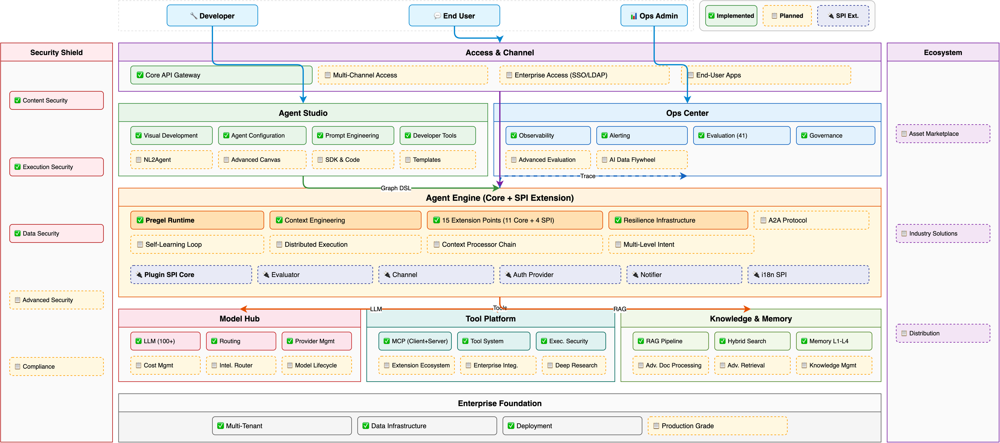

# Hecate Architecture

> **Version**: v1.0 | **Status**: Active

Hecate is an open-source, self-hosted, model-agnostic, MCP-first enterprise Agent platform. This document describes the system's architecture, design principles, and component relationships. For implementation details, see the [Engine Design](engine-design.md) and [Core Concepts](concepts.md) documents.

---

## Overview

Hecate enables enterprises to build, orchestrate, and run AI Agent applications on their own infrastructure. The system is organized into five layers, each with clear responsibilities and well-defined interfaces to adjacent layers.



> **Legend**: ✅ Green = Implemented | 📋 Yellow dashed = Planned | 🔌 Indigo = SPI Extension
>
> Security Shield (left sidebar) and Ecosystem (right sidebar) are cross-cutting concerns that span all platform layers. The architecture follows a **Core vs Pluggable** principle: native first-class capabilities (security, multi-tenant, local-deployment, basic evaluation) are built into Core; extension capabilities (channels, evaluators, auth providers, notifiers, i18n) are pluggable via SPI extension points within the Engine layer.

**15 pluggable extension points** — 11 Core + 4 SPI:

**Core Extension Points (11)** — engine-level extensibility:

| Extension Point | Purpose |
|-----|---------|
| `EnginePort` | Service-to-engine adapter (LLM, tools, knowledge, checkpoint) |
| `Worker` / `WorkerPool` | Node execution dispatch |
| `CheckpointStore` | State persistence and recovery |
| `EventStore` | Append-only event logging with replay |
| `ContextEngine` | Message selection, compression, token estimation |
| `SchedulerStrategy` | Node scheduling (FIFO default, pluggable) |
| `EvictionPolicy` | Channel memory management |
| `OptimizationPass` | Graph optimization (dead node elimination, parallel detection) |
| `ConflictResolver` | Concurrent channel update resolution |
| `Guardrail Hooks (×4)` | Pre/Post LLM/Tool interception |

**SPI Extension Points (4)** — pluggable extension interfaces (📋 Planned):

| Extension Point | Purpose |
|-----|---------|
| `Evaluator` | Evaluator interface; 40+ built-in evaluators as `BuiltinEvaluator` |
| `Channel` | Channel adapter; REST/WS/CLI as `BuiltinChannel` |
| `AuthProvider` | Auth provider; JWT/APIKey as `BuiltinAuthProvider` |
| `Notifier` | Notifier; Email/Webhook as `BuiltinNotifier` |

All SPI extension points depend on `Plugin SPI Core` (PluginRegistry + PluginManifest + PluginLifecycle) for registration and lifecycle management.

The execution engine is Hecate's heart — a self-built Pregel runtime with zero external framework dependencies. It receives compiled Graphs, executes them following the Bulk Synchronous Parallel (BSP) model, manages state through a Channel system, persists snapshots via Checkpoints, and dispatches node execution to a Worker Pool. Fifteen extension points provide pluggable extensibility — 11 for engine internals (scheduling, eviction, optimization, conflict resolution, event sourcing, context management, guardrails) and 4 for platform-level extension (evaluators, channels, auth providers, notifiers).

---

## Design Principles

### Open Over Closed

Hecate supports 100+ LLM providers via LiteLLM, adopts MCP (Model Context Protocol) and A2A (Agent-to-Agent) as first-class integration protocols, and maintains API compatibility with OpenAI's format. No vendor lock-in is the core brand promise.

### Composable Over Monolithic

All external capabilities are integrated via MCP, not hardcoded. The execution engine, memory service, RAG pipeline, and tool system are independently replaceable. The three-layer Agent (Guard→Plan→Sub-Agent) is a preset template, not a constraint — users can customize any orchestration topology.

### Observable Over Black Box

Every request is traced from gateway through execution to response, with a complete Trace→Span→Generation hierarchy. Checkpoint persistence enables "time-travel" debugging. Cost and token usage are tracked per user, agent, and session.

### Security Built-in, Not Bolted-on

Risk levels (LOW/MEDIUM/HIGH/CRITICAL) and approval scopes (once/session/project/global) are modeled on Tool and Agent entities from the start. Four engine-level guardrail hooks (Pre/Post LLM/Tool) provide interception points. Code execution runs in sandboxed containers with network, resource, and filesystem isolation.

### Progressive Complexity

Users don't need to understand all concepts upfront. Complexity increases naturally:

- **Level 0**: Conversation mode — chat directly (like ChatGPT)
- **Level 1**: Three-layer Agent template — one-click Guard→Plan→Sub-Agent
- **Level 2**: Visual canvas — drag-and-drop workflow orchestration
- **Level 3**: Code SDK — full programming control

Each level is backward compatible.

### Developer Experience First

Canvas and SDK are two interfaces to the same system, not separate products. Agent configurations and workflow modifications take effect in real-time. The underlying execution engine is identical regardless of interface.

---

## Layered Architecture

### Gateway Layer

The Gateway Layer is the entry point for all external requests. It exposes two API surfaces: an OpenAI-compatible interface at `/v1/` (for seamless integration with existing tools) and a management API at `/api/` (for Agent/Workflow/Session/Knowledge Base CRUD).

Authentication supports both API Key and JWT (Argon2). Rate limiting is enforced per-key. Streaming responses are delivered via SSE. Multi-channel adaptation supports CLI, web widgets, and programmatic access.

All requests are uniformly wrapped as `ExecutionRequest` objects containing the agent ID, messages, execution configuration, and request context (user info, session ID, permissions). This object flows down through the Orchestration Layer.

### Orchestration Layer

The Orchestration Layer transforms intent into executable plans. Its core responsibility is compiling Graph DSL definitions (JSON) into `CompiledGraph` objects that the Execution Engine can run.

The Graph DSL Compiler performs schema validation, dependency analysis, channel binding, and optimization passes (dead node elimination, parallel branch detection). The layer also manages workflow versioning, preset templates (conversation mode, three-layer Agent), and multi-agent orchestration patterns.

All multi-agent patterns — hierarchical delegation, handoff, pipeline, broadcast, negotiation, debate — are expressed as Graph topologies, not hardcoded paths. This means any pattern can be visualized and edited in the canvas.

Human-in-the-Loop is handled via `interrupt()` (pause execution, return control to user) and `Command` (resume with user input, or redirect execution flow).

### Execution Engine

The Execution Engine is Hecate's core differentiator. It is a self-built runtime that borrows five design patterns from LangGraph (Channel, Checkpoint, Pregel, interrupt/Command, subgraph) without depending on any LangChain code. The sole external dependency is `jsonschema` for DSL validation.

The engine runs compiled Graphs following the Pregel/BSP model: read Channel values → dispatch ready nodes to Worker Pool → await results → write new Channel values → checkpoint state → evaluate conditional edges → repeat until no nodes remain.

Eleven core extension points enable pluggable extensibility:

| Extension Point | Purpose |
|-----|---------|
| `EnginePort` | Service-to-engine adapter (LLM, tools, knowledge, checkpoint) |
| `Worker` / `WorkerPool` | Node execution dispatch |
| `CheckpointStore` | State persistence and recovery |
| `EventStore` | Append-only event logging with replay |
| `ContextEngine` | Message selection, compression, token estimation |
| `SchedulerStrategy` | Node scheduling (FIFO default, pluggable) |
| `EvictionPolicy` | Channel memory management |
| `OptimizationPass` | Graph optimization (dead node elimination, parallel detection) |
| `ConflictResolver` | Concurrent channel update resolution |
| `Guardrail Hooks (×4)` | Pre/Post LLM/Tool interception |

Additionally, 4 SPI extension points (Evaluator, Channel, AuthProvider, Notifier) provide pluggable extension interfaces within the Engine layer — all registered through Plugin SPI Core. These SPI interfaces define the contract between the Engine and the Capability Services layer, enabling third-party extensions without modifying core engine code.

Workers receive read-only Channel snapshots and return results — they never directly modify Channels. This separation keeps the scheduler as the single source of truth for state, while allowing Workers to scale horizontally.

See [Engine Design](engine-design.md) for a deep dive into the Pregel runtime, compiler pipeline, checkpoint system, and streaming modes.

### Capability Services Layer

The Capability Services Layer provides the concrete implementations that the engine calls through the `EnginePort` interface:

- **LLM Routing** — LiteLLM integration supporting 100+ providers with intelligent routing strategies, circuit breaker pattern, A/B testing, and gradual rollout.
- **RAG Pipeline** — Document parsing (Docling) → text chunking → BGE-M3 embedding (dense + sparse) → Qdrant hybrid index → query → reranking → LLM synthesis.
- **Memory System** — Four-level architecture: L1 working memory (named blocks in context window), L2 conversation memory (auto-compression pipeline), L3 user memory (cross-session persistent facts via Mem0-style extraction), L4 knowledge memory (RAG pipeline).
- **Context Engineering** — Six-component pipeline: assembler, evidence tracker, phase detection, token budget governance, provider shaping, and message prioritization.
- **Tool System** — Built-in tools, custom tools (API Schema), and MCP Client/Server for bidirectional tool interoperability.
- **Skill Management** — SKILL.md format with multi-source discovery (system/user/project), on-demand loading, and token budget control.
- **Security** — Engine-level guardrail hooks, PII masking with encryption, structured audit trail, and OTel full-chain tracing.

### Infrastructure Layer

Hecate supports multiple database backends (PostgreSQL, MySQL, SQLite) and multiple vector databases (Qdrant, Chroma). MinIO provides object storage for documents and artifacts. Docker Compose handles single-machine deployment. Observability is provided via OpenTelemetry tracing and structured audit logs.

---

## Request Lifecycle

A typical chat request flows through all five layers:

```
User sends message
    │
    ▼
┌─ Gateway Layer ──────────────────────────────────────────┐
│  1. Authenticate (API Key / JWT)                         │
│  2. Rate limit check                                     │
│  3. Parse request → ExecutionRequest                     │
└──────────────────────────┬───────────────────────────────┘
                           │
    ▼
┌─ Orchestration Layer ────────────────────────────────────┐
│  4. Load Agent definition (persona, model, tools)        │
│  5. Resolve workflow (conversation template / custom)    │
│  6. Compile Graph DSL → CompiledGraph                    │
└──────────────────────────┬───────────────────────────────┘
                           │
    ▼
┌─ Execution Engine ───────────────────────────────────────┐
│  7. Restore state from latest Checkpoint (if resuming)   │
│  8. Pregel superstep loop:                               │
│     a. Read Channel values for ready nodes               │
│     b. Dispatch to Worker Pool                           │
│     c. Workers call Capability Services via EnginePort:  │
│        - LLM invoke (with guardrail hooks)               │
│        - Tool execute (with permission check)            │
│        - Knowledge query (RAG retrieval)                 │
│     d. Collect results, write to Channels                │
│     e. Persist Checkpoint                                │
│     f. Evaluate conditional edges → determine next nodes │
│     g. Stream intermediate results to client             │
│  9. Loop until no ready nodes remain                     │
└──────────────────────────┬───────────────────────────────┘
                           │
    ▼
┌─ Gateway Layer ──────────────────────────────────────────┐
│  10. Assemble final response                             │
│  11. Return to client (streamed or complete)             │
└──────────────────────────────────────────────────────────┘
```

At any point during step 8, a node may call `interrupt()` to pause execution and wait for human input. The Checkpoint system ensures the session can be resumed from exactly that point.

---

## Multi-Tenancy Model

Hecate models tenancy as a three-level hierarchy:

- **Organization** — Top-level tenant boundary. Owns users and workspaces.
- **Workspace** — Isolated environment within an organization. Agents, workflows, knowledge bases, and tools belong to a workspace.
- **User** — Authenticated actor within an organization, with role-based access (admin/editor/viewer).

Tenant isolation is enforced via `workspace_id` foreign keys on 14 data models. This provides data-level isolation without requiring separate database instances per tenant.

---

## Deployment

Hecate runs as a single service in development (via Docker Compose) and can scale horizontally in production. The canonical Docker Compose setup includes:

```
┌─────────────────────────────────┐
│         Hecate Service           │
│  (FastAPI + Uvicorn)            │
└──────┬──────┬──────┬────────────┘
       │      │      │
       ▼      ▼      ▼
┌──────────┐ ┌──────────┐ ┌──────────┐
│PostgreSQL│ │ Qdrant   │ │  MinIO   │
│  (16)    │ │(vectors) │ │(objects) │
└──────────┘ └──────────┘ └──────────┘
```

For production deployments, each infrastructure component can be replaced with managed equivalents (e.g., Amazon RDS, Qdrant Cloud, S3).

---

## Further Reading

| Document | Description |
|----------|-------------|
| [Engine Design](engine-design.md) | Pregel runtime, compiler pipeline, channel system, checkpoint persistence, streaming modes |
| [Core Concepts](concepts.md) | Entity definitions, relationships, data model, storage design |
| [ADR Directory](adr/) | Architecture Decision Records (10 decisions with context and rationale) |
| [Graph DSL Schema](../../src/hecate/engine/graph-dsl.schema.json) | JSON Schema for graph definition (4 node types, 4 channel types) |
| [OpenSpec Specs](../../openspec/specs/) | Feature-level specifications with requirements and scenarios |
| [OpenSpec Archive](../../openspec/changes/archive/) | Completed change proposals with design docs and task tracking |
