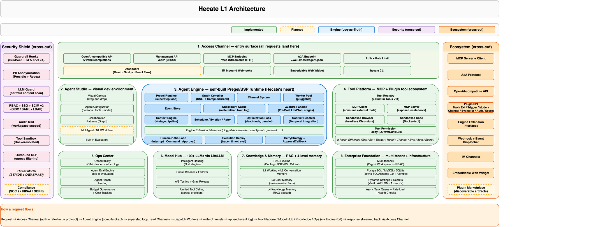

# Hecate Architecture

This document describes the system's architecture, design principles, and component relationships. Per-module implementation details live in the dedicated design documents listed in [Further Reading](#further-reading) below.

---

## Overview

Hecate enables enterprises to build, orchestrate, and run AI Agent applications on their own infrastructure. The system comprises ten modules organized in a layered dependency hierarchy, with Security and Ecosystem as cross-cutting concerns that span all modules.



> **Legend**: ✅ Green = Implemented | 📋 Yellow dashed = Planned
>
> Security Shield (left sidebar) and Ecosystem (right sidebar) are cross-cutting concerns that span all platform modules. Each module in the L1 diagram has a corresponding L2 breakdown — see [Module Architecture](#module-architecture) below.

The execution engine is Hecate's heart — a self-built Pregel runtime with zero external framework dependencies. It receives compiled Graphs, executes them following the Bulk Synchronous Parallel (BSP) model, manages state through a Channel system, persists execution as an **event-sourced log** with checkpoints as materialized caches, supports **Execution Replay** for time-travel debugging, and dispatches node execution to a Worker Pool.

**Engine Extension Interfaces** — engine-level extensibility:

| Extension Point | Purpose |
|-----|---------|
| `EnginePort` | Service-to-engine adapter (LLM, tools, knowledge, checkpoint) |
| `Worker` / `WorkerPool` | Node execution dispatch |
| `CheckpointStore` | Materialized cache of execution state (log-replay fold); discardable |
| `EventStore` | Append-only execution event log — the source of truth, with replay |
| `ContextEngine` | Message selection, compression, token estimation |
| `SchedulerStrategy` | Node scheduling (FIFO default, pluggable) |
| `EvictionPolicy` | Channel memory management |
| `OptimizationPass` | Graph optimization (dead node elimination, parallel detection) |
| `ConflictResolver` | Concurrent channel update resolution (Temporal) |
| `Guardrail Hooks (×4)` | Pre/Post LLM/Tool interception |
| `RetryStrategy` | Retry policies with configurable backoff and predicates |
| `ChannelBehavior` | Channel value semantics (last-value / topic / accumulator) |
| `DecisionSink` | Security/audit decision recording |
| `EventBus` | Publish/subscribe collaboration events |
| `MetricsStore` | Telemetry recording (counters, gauges, histograms) |
| `PolicyLayer` | Policy decision stages composed in `ToolPolicyPipeline` |
| `Session Hooks (×4)` | Session lifecycle interception (start/end/prompt-submit/pre-compact) |
| `SessionStateStore` | Durable session state (summary, memory) |
| `TaskAllocator` | Task-to-agent assignment (dynamic orchestration) |
| `ApprovalCallback` | Human-in-the-loop tool approval |

**Plugin SPI Types** — pluggable extension interfaces implemented as Python base classes (the `Base` suffix follows the `AgentScope` convention; the `abc.ABC` mechanism enforces the contract):

| Type | Base class | Purpose |
|-----|-----|---------|
| `Tool` | `ToolPluginBase` | Callable tools agents can invoke |
| `Extension` | `ExtensionPluginBase` | Runtime interceptors auto-wired into guardrail hooks |
| `Trigger` | `TriggerPluginBase` | Event-driven invocation (webhook / schedule / MQ) |
| `Model` | `ModelPluginBase` | Custom LLM providers |
| `Channel` | `ChannelBase` | External communication channels (incl. notification adapters) |
| `Evaluator` | `EvaluatorBase` | Built-in evaluators covering LLM quality, RAG retrieval, and agent-level assessment |
| `AuthProvider` | `AuthProviderBase` | Authentication methods (JWT/APIKey built-in) |
| `SecretProvider` | `SecretProviderBase` | Secret storage backends |

All SPI extension points depend on `Plugin SPI Core` (PluginRegistry + PluginManifest + PluginLifecycle) for registration and lifecycle management. See the [Extension Points reference](../reference/extension-points.md) for the full inventory with abstract methods and default implementations.

---

## Module Architecture

Each module below corresponds to a block in the [L1 architecture diagram](images/hecate_architecture_l1.png). Detailed L2 architecture diagrams, component breakdowns, and API definitions are in the respective design documents linked below.

### Access Channel

The entry point for all external requests, exposes four API surfaces: 
  - OpenAI-compatible interface at `/v1/` , for seamless integration with existing tools. 
  - Management API at `/api/`,  for Agent/Workflow/Session/Knowledge Base CRUD.     
  - MCP Server endpoint at `/mcp`, for Streamable HTTP transport per the **latest MCP specification** (stateless core; shipped recently in change `mcp-streamable-http`). 
  - A2A endpoint at `/.well-known/agent.json`, for Agent Card discovery + task lifecycle for cross-framework agent communication.

Beyond the HTTP APIs, external entry points include the embeddable web widget at `/embed/chat`, IM inbound webhooks (Feishu, Slack), and the `hecate` CLI. All entry points handle authentication (API Key + JWT with Argon2), rate limiting, quota enforcement, multi-channel adaptation, and inbound IM routing.

All requests are uniformly wrapped as `ExecutionRequest` objects containing the agent ID, messages, execution configuration, and request context (user info, session ID, permissions). This object flows down to the Agent Engine.

> See [Access Channel Design](access-channel-design.md) for L2 architecture, API surfaces, and implementation details.

### Agent Studio

Visual development environment for building and configuring agents. Features a React Flow-based drag-and-drop canvas, agent configurator, prompt management with analytics, workflow builder with multi-agent collaboration patterns, reusable templates, and developer tools (CLI). All multi-agent patterns are expressed as Graph topologies, not hardcoded paths — any pattern can be visualized and edited in the canvas.

Human-in-the-Loop is handled via `interrupt()` (pause execution, return control to user) and `Command` (resume with user input, or redirect execution flow). NL2Agent and code generation are planned.

> See [Agent Studio Design](agent-studio-design.md) for a deep dive.

### Agent Engine

The core differentiator — a self-built Pregel runtime with zero external framework dependencies. Compiles Graph DSL definitions into `CompiledGraph` objects, manages state through a four-type Channel system, persists execution as an **event-sourced log** with checkpoints demoted to materialized caches, and dispatches node execution to a pluggable Worker Pool. 

**Execution Replay** — A first-class debugging primitive built on top of Log-as-Truth. The append-only event log lets any past session be reconstructed for inspection: trace-partitioned timelines, DAG step-through, and fold-to-version time-travel state inspection (`GET /sessions/{id}/replay` and `GET /sessions/{id}/replay/state`). 

The engine runs compiled Graphs following the Pregel/BSP model: read Channel values → dispatch ready nodes to Worker Pool → await results → write new Channel values → append events to the log with `STEP_END` commit → evaluate conditional edges → repeat until no nodes remain. Workers receive read-only Channel snapshots and return results — they never directly modify Channels. 

> See [Engine Design](engine-design.md) for a deep dive.

### Ops Center

Unified administrative control plane consolidating observability, alerting, evaluation, deployment management, cost governance, and compliance into a single operator interface. Provides distributed tracing (Trace→Span→Generation hierarchy via OpenTelemetry), structured logging, metrics collection with TimescaleDB store, and audit logging. The evaluation engine includes a catalogue of built-in evaluators covering LLM quality, RAG retrieval, and agent-level assessment, with dataset management and regression testing support. See [ADR-028](adr/028-observability-evaluation-enhancement.md) for the enhancement roadmap.

> See [Ops Center Design](ops-center-design.md) for L2 architecture, component breakdown, and API definitions.

### Model Hub

LLM integration layer powered by LiteLLM, supporting 100+ providers. Provides intelligent routing (4 strategies), circuit breaker pattern for fault tolerance, A/B testing and gray release for model comparison, unified tool calling across providers, and provider configuration management.

> See [Model Hub Design](model-hub-design.md) for L2 architecture, model catalog, lifecycle management, and governance.

### Tool Platform

MCP-first tool ecosystem with bidirectional support (**latest MCP spec**, stateless core, shipped recently in change `mcp-streamable-http`): MCP Client consumes external tools, MCP Server exposes Hecate as a tool provider. Includes a tool registry, **Docker-isolated execution sandbox** for code execution, **sandboxed headless Chromium browser automation** with per-environment domain allow-lists (fail-closed) and built-in tools covering file/code operations and browser interaction, agent tool system, search tools, and granular tool security policies. See [Tool Platform Design](tool-platform-design.md) and `docs/how-to/browser-automation.md`.

> See [Tool Platform Design](tool-platform-design.md) for L2 architecture, plugin ecosystem, and tool operations.

### Knowledge & Memory

RAG pipeline and multi-level memory system. The RAG pipeline covers document ingestion, chunking, BGE-M3 embedding (dense + sparse), vector storage, and hybrid search. The memory system provides four levels: L1 working memory (named blocks in context window), L2 conversation memory (auto-compression pipeline), L3 user memory (cross-session persistent facts), and L4 knowledge memory (RAG-backed).

> See [Knowledge & Memory Design](knowledge-memory-design.md) for L2 architecture, RAG pipeline, knowledge graph, and memory system.

### Enterprise Foundation

Infrastructure layer providing multi-tenancy (Organization → Workspace → User with data-level isolation via `workspace_id` foreign keys on all tenant-scoped data models), async SQLAlchemy 2.0 database access with Alembic migrations (PostgreSQL, MySQL, SQLite), Pydantic Settings v2, secret management, rate limiting, async task scheduling, Docker Compose deployment, and health checks.

> See [Enterprise Foundation Design](enterprise-foundation-design.md) for L2 architecture, multi-tenancy, security, and deployment infrastructure.

### Security

Cross-cutting security shield spanning all platform layers. Engine-level guardrail hooks (Pre/Post LLM/Tool) provide interception at the four critical points in the execution loop. PII anonymization with encryption protects sensitive data in prompts and responses. LLM Guard scans inputs and outputs for harmful content. RBAC enforces role-based access at the workspace level. A structured audit trail records all security-relevant events.

> See [Security Architecture](security-architecture.md) for L2 architecture, guardrail hooks, and security controls.

### Ecosystem

Integration and extensibility layer. Native MCP support (Client + Server with Streamable HTTP transport, **latest MCP spec · stateless core**, shipped recently), webhook notifications, event dispatcher, and OpenAI-compatible API ensure broad interoperability. A2A Protocol enables cross-framework agent communication — Hecate agents can be discovered and invoked by external platforms, and external agents can be used as sub-agents in Hecate workflows.

> See [Ecosystem Design](ecosystem-design.md) for L2 architecture, marketplace, and protocol integrations.

---

## Design Principles

### Open Over Closed

Hecate supports 100+ LLM providers via LiteLLM, adopts MCP  and A2A as first-class integration protocols, and maintains API compatibility with OpenAI's format. No vendor lock-in is the core brand promise.

### Composable Over Monolithic

All external capabilities are integrated via MCP, not hardcoded. The execution engine, memory service, RAG pipeline, and tool system are independently replaceable. The three-layer Agent (Guard→Plan→Sub-Agent) is a preset template, not a constraint — users can customize any orchestration topology.

### Observable Over Black Box

Every request is traced from gateway through execution to response, with a complete Trace→Span→Generation hierarchy. The execution event log enables "time-travel" debugging — every `STEP_END` commit point is inspectable. Cost and token usage are tracked per user, agent, and session.

### Security Built-in, Not Bolted-on

Risk levels (LOW/MEDIUM/HIGH/CRITICAL) and approval scopes (once/session/project/global) are modeled on Tool and Agent entities from the start. Four engine-level guardrail hooks (Pre/Post LLM/Tool) provide interception points. Code execution runs in sandboxed containers with network, resource, and filesystem isolation.

### Progressive Complexity

Users don't need to understand all concepts upfront. Complexity increases naturally:

- **Level 0**: Conversation mode — chat directly (like ChatGPT)
- **Level 1**: Three-layer Agent template — one-click Guard→Plan→Sub-Agent
- **Level 2**: Visual canvas — drag-and-drop workflow orchestration
- **Level 3**: Code SDK — full programming control

Each level is backward compatible.

### Developer Experience First

Canvas and SDK are two interfaces to the same system, not separate products. Agent configurations and workflow modifications take effect in real-time. The underlying execution engine is identical regardless of interface.

---

## Code Architecture

The modules above are implemented across five code layers with strict dependency rules. These rules ensure the engine remains framework-agnostic and testable in isolation.

### Layer Dependencies

| Layer | Path | May Import | Key Rule |
|-------|------|-----------|----------|
| `engine/` | `src/hecate/engine/` | `jsonschema` only | Zero deps on `services/`, `api/`, `models/`. Sole external exception: `jsonschema` for DSL validation. |
| `services/` | `src/hecate/services/` | `models/`, `engine/ports`, external libs | Depends on engine abstract interfaces only, never on engine implementations. |
| `api/` | `src/hecate/api/` | `services/`, `models/` | Never imports `engine/` directly — routes through services + `EnginePort`. |
| `models/` | `src/hecate/models/` | SQLAlchemy, Pydantic | Pure data definitions (ORM + Pydantic schemas). No business logic. |
| `core/` | `src/hecate/core/` | config, database, DI, rate limiting | Infrastructure shared across all layers. |

The engine layer defines all abstract interfaces ([extension point inventory](../../AGENTS.md#engine-extension-point-inventory)). Services provide concrete implementations. The API layer orchestrates services. This separation keeps the engine testable with lightweight stubs instead of integration dependencies.

### Request Lifecycle

A typical chat request flows through all layers:

```
User sends message
    │
    ▼
┌─ Access Channel ─────────────────────────────────────────┐
│  1. Authenticate (API Key / JWT)                         │
│  2. Rate limit check                                     │
│  3. Parse request → ExecutionRequest                     │
└──────────────────────────┬───────────────────────────────┘
                           │
    ▼
┌─ Agent Studio → Agent Engine ────────────────────────────┐
│  4. Load Agent definition (persona, model, tools)        │
│  5. Resolve workflow (conversation template / custom)    │
│  6. Compile Graph DSL → CompiledGraph                    │
└──────────────────────────┬───────────────────────────────┘
                           │
    ▼
┌─ Agent Engine (Pregel Runtime) ──────────────────────────┐
│  7. Restore state from event log (if resuming):           │
│     load materialized cache + replay log tail            │
│  8. Pregel superstep loop:                               │
│     a. Read Channel values for ready nodes               │
│     b. Dispatch to Worker Pool                           │
│     c. Workers call Capability Services via EnginePort:  │
│        - LLM invoke (with guardrail hooks)               │
│        - Tool execute (with permission check)            │
│        - Knowledge query (RAG retrieval)                 │
│     d. Collect results, write to Channels                │
│     e. Append channel-write events + STEP_END to log     │
│        (single transaction; materialize cache at turn    │
│        end / interrupt / every N supersteps)             │
│     f. Evaluate conditional edges → determine next nodes │
│     g. Stream intermediate results to client             │
│  9. Loop until no ready nodes remain                     │
└──────────────────────────┬───────────────────────────────┘
                           │
    ▼
┌─ Access Channel ─────────────────────────────────────────┐
│  10. Assemble final response                             │
│  11. Return to client (streamed or complete)             │
└──────────────────────────────────────────────────────────┘
```

At any point during step 8, a node may call `interrupt()` to pause execution and wait for human input. The event log commits up to the interrupt point (a commit point), so the session can be resumed from exactly that point by log replay.

---

## Multi-Tenancy Model

Hecate models tenancy as a three-level hierarchy:

- **Organization** — Top-level tenant boundary. Owns users and workspaces.
- **Workspace** — Isolated environment within an organization. Agents, workflows, knowledge bases, and tools belong to a workspace.
- **User** — Authenticated actor within an organization, with role-based access (admin/editor/viewer).

Tenant isolation is enforced via `workspace_id` foreign keys on all tenant-scoped data models. This provides data-level isolation without requiring separate database instances per tenant.

---

## Further Reading

### Module Design Documents

Ordered to match the [Module Architecture](#module-architecture) walkthrough above.

- [Access Channel Design](access-channel-design.md) — API surfaces, authentication, gateway control plane, multi-channel adaptation, zero-trust identity
- [Agent Studio Design](agent-studio-design.md) — Visual canvas, agent configurator, workflow builder, multi-agent collaboration patterns, human-in-the-loop
- [Engine Design](engine-design.md) — Pregel runtime, compiler pipeline, channel system, event-sourced execution state + checkpoint caches, Execution Replay
- [Ops Center Design](ops-center-design.md) — Unified ops console, observability, evaluation engine, budget governance, audit logging
- [Model Hub Design](model-hub-design.md) — LLM integration via LiteLLM (100+ providers), intelligent routing, circuit breaker, A/B testing, gray release
- [Tool Platform Design](tool-platform-design.md) — MCP Client + Server, plugin ecosystem, sandboxed execution, browser automation, tool security policies
- [Knowledge & Memory Design](knowledge-memory-design.md) — RAG pipeline, hybrid search, knowledge graph, four-level memory system
- [Enterprise Foundation Design](enterprise-foundation-design.md) — Multi-tenancy, database access and migrations, configuration, secret management, rate limiting, task scheduling
- [Security Architecture](security-architecture.md) — Guardrail hooks, PII anonymization, LLM Guard, RBAC, structured audit trail
- [Ecosystem Design](ecosystem-design.md) — Native MCP (Client + Server), webhooks, event dispatcher, A2A protocol, marketplace design

### Deep Dives

Sub-domain deep-dives beyond the module-level documents.

- [RAG Pipeline Design](rag-pipeline-design.md) — Document ingestion, chunking, BGE-M3 embedding, hybrid search, RRF fusion, citation system
- [Graph DSL Schema](../../src/hecate/engine/graph-dsl.schema.json) — JSON Schema for graph definition (10 node types, 4 channel types)

### Cross-Cutting References

- [Core Concepts](concepts.md) — Entity definitions, relationships, data model, storage design

### Architecture Decision Records

- [ADR Directory](adr/) — 32 decisions with context and rationale; topic-grouped index at `adr/INDEX.md`

### Project Process

- [OpenSpec Specs](../../openspec/specs/) — Feature-level specifications with requirements and scenarios
- [OpenSpec Archive](../../openspec/changes/archive/) — Completed change proposals with design docs and task tracking
