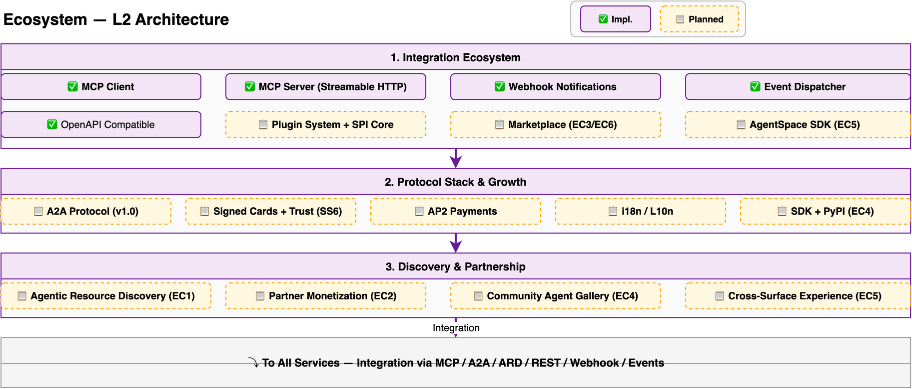

# Ecosystem Design

> Deep dive into Hecate's ecosystem layer: integration protocols, marketplace, partner monetization, agent discovery, community gallery, and cross-surface experience. For a system overview, see [Architecture](architecture.md). For enhancement decisions, see [ADR-027](adr/027-ecosystem-enhancement.md).

---

## Overview

The Ecosystem layer is Hecate's integration and extensibility foundation — connecting agents to external tools, platforms, channels, and communities. It serves five personas:

- **ISV partners** — Build, publish, and monetize agents/tools on the marketplace
- **Application developers** — Discover external capabilities, embed agents in apps across surfaces
- **Community contributors** — Share agents, skills, and traces with the community
- **Enterprise architects** — Govern which agents/tools are approved for organizational use
- **End users** — Discover and install agents from the marketplace or community gallery



1. **Integration Ecosystem** — MCP Client/Server, webhooks, events, OpenAI-compatible API, plugin system, marketplace, AgentSpace SDK
2. **Protocol Stack & Growth** — A2A Protocol, Signed Agent Cards + Trust Verification, AP2 Payments, i18n/L10n, SDK + PyPI
3. **Discovery & Partnership** — Agentic Resource Discovery (ARD), Partner Monetization, Community Agent Gallery, Cross-Surface Experience Layer

---

## Integration Ecosystem (Existing, P1-P3)

### Key Components

| Component | Description |
|-----------|-------------|
| MCP Client | Connect to external MCP servers |
| MCP Server | Expose Hecate as MCP tool provider (Streamable HTTP) |
| Webhook Notifications | Event-driven HTTP callbacks |
| Event Dispatcher | Internal event bus |
| OpenAI-compatible API | REST + WebSocket, `/v1/chat/completions` |
| Plugin System | 6 plugin types, SPI Core, packaging, signing |
| Asset Marketplace | 6 asset types, semantic discovery, governed catalog |

---

## Agentic Resource Discovery (14.1)

### Problem

The agentic web needs a standard way for agents to discover capabilities across organizations — like `robots.txt` but for AI resources. Google + Microsoft + Hugging Face published the ARD specification (June 2026). Hecate's A2A AgentCard discovers individual agents; ARD discovers ALL capability types (agents, skills, MCP servers, tools) at the catalog level.

### Architecture

```
Publishing (outbound — Hecate as discoverable resource):
    Hecate Domain
        │
        └── /.well-known/ai-catalog.json
            ├── agents: [{name, description, capabilities, endpoint, trust}]
            ├── skills: [{name, description, install_url}]
            ├── mcp_servers: [{name, transport, endpoint}]
            └── tools: [{name, api_schema}]

Discovery (inbound — Hecate discovers external resources):
    Agent at runtime
        │
        ▼
    POST /api/v1/discover
        {intent: "I need to transcribe audio files"}
        │
        ▼
    ARD Registry Query
        ├── Query local crawled index
        ├── Query external registries (Google, HF)
        └── Return: matched capabilities + publisher verification
```

### Catalog Format

```json
{
  "schema": "ard/v1",
  "publisher": {
    "domain": "hecate.example.com",
    "verified": true,
    "public_key": "ed25519:..."
  },
  "agents": [...],
  "skills": [...],
  "mcp_servers": [...],
  "tools": [...]
}
```

### Design Principle

ARD is **additive** to A2A. AgentCard handles per-agent discovery (who is this agent, what can it do?). ARD handles catalog-level discovery (what capabilities exist on this domain?). Both use cryptographic verification for publisher identity.

---

## Partner Monetization Infrastructure (12.5)

### Problem

Salesforce AgentExchange ($800M ARR), IBM Agent Connect, and Huawei AI Model Partner Program all demonstrate that a commercial ecosystem requires payment infrastructure. Hecate's Asset Marketplace Operations (6.36) mentions monetization but has no concrete infrastructure.

### Commercial Pipeline

```
Partner registers → Creates product → Customer discovers → Purchases
    │                                                    │
    │     ┌──────────────────────────────────────────────┘
    │     │
    ▼     ▼
    Stripe Charge
        │
        ├── Revenue Split (70% partner / 30% platform)
        │
        ├── Auto-Provisioning (license + activation)
        │
        └── Unified Billing (consolidated invoice)
```

### Partner GTM Console

| Tab | Purpose |
|-----|---------|
| Products | Create/edit agent/tool listings |
| Offers | Define pricing tiers, private offers, discount codes |
| Invoices | Track customer purchases and payment status |
| Payouts | View earnings and Stripe Connect payout schedule |
| Analytics | Install count, revenue trends, customer demographics |

### Revenue Models

| Model | Description | Example |
|-------|-------------|---------|
| Seat-based | Per-user licensing | $10/user/month |
| Usage-based | Per-invocation pricing | $0.01/agent call |
| Consumption | Pay-as-you-go token-based | $0.001/token |
| Flat-rate | Fixed monthly fee | $99/month unlimited |

---

## Semantic Marketplace Discovery (12.0 Enhancement)

### Problem

Marketplace browsing uses keyword/category filters. When users (or agents) describe what they need in natural language, keyword matching misses relevant results.

### Architecture

```
User query: "I need an agent that can analyze financial statements"
    │
    ▼
┌──────────────────────────────────────┐
│  Query Embedding (BGE-M3)             │
│  → 1024-dim vector                     │
└───────────────────┬──────────────────┘
                    │
                    ▼
┌──────────────────────────────────────┐
│  Vector Similarity Search             │
│  cosine_similarity(query_vec,         │
│    listing_embeddings) → top_k        │
└───────────────────┬──────────────────┘
                    │
                    ▼
┌──────────────────────────────────────┐
│  Ranked Results                       │
│  1. Financial Analyst Agent (0.92)   │
│  2. Document Summarizer (0.78)       │
│  3. Data Extraction Tool (0.71)      │
└──────────────────────────────────────┘
```

### Demand Signal Bounties

When a semantic search returns no results or has >3 retries for similar intent, the system creates a **bounty**: a public demand signal visible to potential creators. Bounties show "X users searched for Y" — incentivizing supply-side creation.

---

## Community Agent Gallery (13.14 Enhancement)

### Problem

Hugging Face's tiny-agents collection demonstrates the value of community-contributed agents (`agent.json` format, one-click install). Hecate has PyPI SDK but no community sharing beyond the formal marketplace.

### Agent Package Format

```json
{
  "name": "financial-analyst",
  "version": "1.2.0",
  "description": "Analyzes financial statements and generates reports",
  "system_prompt": "You are a financial analyst...",
  "tools": ["web_search", "execute_code", "dataagent"],
  "knowledge_bases": ["financial-terms"],
  "examples": [
    "Analyze Apple's Q3 2025 earnings",
    "Compare revenue growth of TSLA vs Ford"
  ],
  "author": "community-user",
  "license": "MIT"
}
```

### Gallery Features

| Feature | Description |
|---------|-------------|
| Publish | Upload `agent.json` to community gallery |
| Install | One-click creates agent in user's workspace |
| Fork | Creates editable copy linked to original |
| Trace Gallery | Share anonymized execution traces |
| Harness Registry | Lists compatible runtimes (Hecate, LangGraph, CrewAI) |

---

## Cross-Surface Experience Layer (11.13 Enhancement)

### Problem

Salesforce AXL (Agentforce Experience Layer) defines agent behavior once and deploys natively across all surfaces. Without this, each channel requires separate UI/security/data logic implementation.

### Surface Adapter Architecture

```python
class SurfaceAdapterABC(ABC):
    """Render agent response for a specific surface type."""

    @abstractmethod
    def render(self, response: AgentResponse) -> SurfaceComponent:
        ...

class WebAdapter(SurfaceAdapterABC):
    def render(self, response) -> HTMLComponent: ...

class MobileAdapter(SurfaceAdapterABC):
    def render(self, response) -> AdaptiveCard: ...

class SlackAdapter(SurfaceAdapterABC):
    def render(self, response) -> SlackBlock: ...

class VoiceAdapter(SurfaceAdapterABC):
    def render(self, response) -> SSML: ...
```

### Adaptive Rendering

Agent responses automatically adapt to surface constraints:
- **Voice**: rich text → SSML with natural pauses, no visual elements
- **Mobile**: adaptive cards with touch-friendly UI, minimal scrolling
- **Web**: full rich HTML with interactive components
- **Slack/Teams**: platform-native blocks/cards
- **CLI**: formatted text with ANSI colors

### Design Principle

Agent logic (what to say/do) is **separated** from surface rendering (how to display). Define once, deploy everywhere. Eliminates per-channel UI/security/data rebuild.

---

## Governed Agent Catalog (12.0 Enhancement)

### Problem

IBM Agent Catalog emphasizes governance: agents go through approval before listing. Hecate's marketplace has no governance workflow — anyone can publish.

### Listing Lifecycle

```
Draft → Submitted → Security Scan → Evaluation → Approved → Published
                                              ↓
                                           Rejected (with feedback)
                                              ↓
 Published → Deprecated → Archived
```

### Governance Stages

| Stage | Check | Automated? |
|-------|-------|-----------|
| Security Scan | Plugin Security & Signing (5.13) — static analysis, CVE, secrets | ✅ Automated |
| Evaluation | Run agent against test suite (7.9 Testing Center) | ✅ Automated |
| Approval | Human review of scan + eval results | ⚠️ Manual gate |
| Monitoring | Post-publish health monitoring (8.9a Agent Health) | ✅ Automated |

### Cross-Framework Support

Agents built with any framework (Hecate native, LangGraph, CrewAI, AutoGen, custom) can be listed — standardized manifest wraps framework-specific configs.

---

## Data Freshness Strategy

| Component | Refresh Interval | Data Source |
|-----------|-----------------|-------------|
| ARD Catalog | On publish (event-driven) + daily crawl | Local + external registries |
| Marketplace Search Index | On listing change (event-driven) | Vector store re-embedding |
| Partner Payouts | Daily settlement | Stripe Connect |
| Community Gallery Stats | Real-time | Install/fork counters |
| Surface Adapter Cache | Per-session (cached per surface type) | Agent response rendering |

---

## API Endpoints

### ARD (EC1)

| Method | Path | Description |
|--------|------|-------------|
| GET | `/.well-known/ai-catalog.json` | Published ARD catalog |
| POST | `/api/v1/discover` | Runtime capability discovery |
| POST | `/api/v1/ard/crawl` | Admin: trigger external catalog crawl |

### Partner (EC2)

| Method | Path | Description |
|--------|------|-------------|
| POST | `/api/v1/partner/register` | Register as partner |
| POST | `/api/v1/partner/products` | Create product listing |
| GET | `/api/v1/partner/payouts` | View payout history |
| POST | `/api/v1/marketplace/{id}/purchase` | Customer purchase flow |

### Community (EC4)

| Method | Path | Description |
|--------|------|-------------|
| POST | `/api/v1/community/agents` | Publish community agent |
| POST | `/api/v1/community/agents/{id}/install` | One-click install |
| POST | `/api/v1/community/agents/{id}/fork` | Fork to workspace |
| GET | `/api/v1/community/traces` | Browse Trace Gallery |

---

## Further Reading

- [ADR-027: Ecosystem Enhancement](adr/027-ecosystem-enhancement.md) — Architecture decisions for EC1-EC6
- [Architecture Overview](architecture.md) — System-level architecture
- [ADR-011: A2A Protocol Adoption](adr/011-a2a-protocol-adoption.md) — A2A foundation for ARD
- [ADR-016: Platform SPI Architecture](adr/016-platform-spi-architecture.md) — Plugin SPI foundation
- [Access Channel Design](access-channel-design.md) — Multi-channel architecture (EC5 Cross-Surface integration)
- [Ops Center Design](ops-center-design.md) — Marketplace analytics integration
- [ARD Specification](https://ard-spec.org/) — Open standard reference
