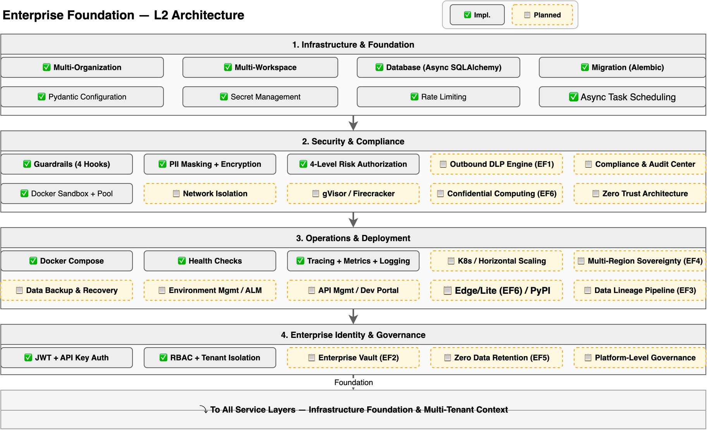

# Enterprise Foundation Design

> Deep dive into Hecate's enterprise infrastructure: multi-tenancy, security, observability, compliance, deployment, data governance, and secret management. For a system overview, see [Architecture](architecture.md). For the architecture decisions behind these enhancements, see [ADR-025](adr/025-enterprise-foundation-enhancement.md).

---

## Overview

The Enterprise Foundation is Hecate's cross-cutting infrastructure layer — providing multi-tenancy, security, observability, compliance, deployment, and governance capabilities that all other layers depend on. It serves five operator personas:

- **Security / Compliance officers** — Configure DLP policies, manage vault integration, audit data lineage, enforce retention rules
- **Platform / SRE engineers** — Deploy multi-region, manage vault credentials, monitor DLP alerts, operate air-gapped environments
- **Enterprise architects** — Design data sovereignty architecture, configure zero-retention providers, plan confidential computing
- **DevOps / Release engineers** — Manage region-pinned deployments, backup/recovery, version upgrades
- **Application developers** — Use vault-backed secrets, trust DLP protection, rely on compliance infrastructure

The Enterprise Foundation follows the same **composition architecture** as Ops Center and Model Hub — extending existing services rather than creating new microservices:



1. **Infrastructure & Foundation** — Multi-org/workspace, async database, Alembic migrations, Pydantic config, secret management, rate limiting, async scheduling
2. **Security & Compliance** — Guardrails (4 hooks), PII masking + encryption, 4-level risk authorization, outbound DLP engine, compliance center, sandbox isolation, confidential computing, zero trust
3. **Operations & Deployment** — Docker Compose, health checks, tracing/metrics/logging, K8s/horizontal scaling, multi-region sovereignty, backup/recovery, ALM pipeline, API management, edge/lite, data lineage
4. **Enterprise Identity & Governance** — JWT + API Key auth, RBAC + tenant isolation, enterprise vault, zero data retention, platform-level governance

---

## Infrastructure & Foundation (Existing, P1-P2)

### Key Components

| Component | File |
|-----------|------|
| Multi-Org/Workspace | `models/org.py`, `models/workspace.py` |
| Async Database | `core/database.py` (SQLAlchemy 2.0) |
| Alembic Migrations | `alembic/` |
| Pydantic Config | `core/config.py` (pydantic-settings) |
| Secret Management | `core/config.py` (Fernet encryption) |
| Rate Limiting | `core/rate_limit.py` |
| Async Task Scheduling | `services/scheduler.py` |
| Health Checks | `api/health.py` |

---

## Outbound DLP Engine (9.10)

### Problem

AI agents process sensitive data at machine speed — reading documents, executing tools, calling APIs, and passing results to external LLM providers. Traditional DLP monitors human egress points (email, file transfers); agent DLP must intercept **machine-speed data flows** at the execution pipeline level. Hecate has inbound PII masking (9.1/9.5) but no outbound DLP — sensitive data flows unchecked to external LLM providers.

### Architecture

```
Agent Execution Pipeline
    │
    ▼
┌──────────────────────────────────────────────────────┐
│  Scan Point 1: Pre-LLM                                │
│  ┌────────────────────────────────────────────────┐  │
│  │ Pattern Matcher: API keys, PII, source code    │  │
│  │ Checksum validation: Luhn (credit card),       │  │
│  │   AKIA format (AWS key), AIza format (Google)  │  │
│  │ Action: REDACT → [API_KEY_REDACTED]            │  │
│  │         BLOCK → withhold request               │  │
│  └────────────────────────────────────────────────┘  │
│  Plugs into: PreLLMHook (existing Guardrail system)   │
└──────────────────────────────────────────────────────┘
    │ (sanitized request → LLM provider)
    ▼
┌──────────────────────────────────────────────────────┐
│  Scan Point 2: Post-Tool                              │
│  ┌────────────────────────────────────────────────┐  │
│  │ Pattern Matcher: tool output contents          │  │
│  │ Database dumps, file contents, API responses   │  │
│  │ Action: REDACT or BLOCK                        │  │
│  └────────────────────────────────────────────────┘  │
│  Plugs into: PostToolHook (existing Guardrail system) │
└──────────────────────────────────────────────────────┘
    │ (sanitized result → context window)
    ▼
┌──────────────────────────────────────────────────────┐
│  Scan Point 3: Pre-Memory                             │
│  ┌────────────────────────────────────────────────┐  │
│  │ Pattern Matcher: data before persistence       │  │
│  │ Memory store, vector DB embedding payload      │  │
│  │ Prevents PII from entering long-term storage   │  │
│  │ Action: REDACT or BLOCK                        │  │
│  └────────────────────────────────────────────────┘  │
│  Plugs into: Memory Service pre-write hook            │
└──────────────────────────────────────────────────────┘
```

### Pattern Library

| Category | Patterns | Validation |
|----------|----------|-----------|
| API Keys | AWS (`AKIA...`), Google (`AIza...`), Azure, Stripe (`sk_live_...`), GitHub (`ghp_...`) | Format regex + length check |
| PII | SSN (`XXX-XX-XXXX`), Credit Card (Luhn checksum), Passport, Phone | Checksum + regex |
| Source Code | Python (`def `/`class `), Java (`public class`), Go (`func `), SQL (`SELECT `) | Language fingerprints |
| Custom | Org-specific patterns (project codes, employee IDs) | Admin-configured regex |

### Enforcement Modes

| Mode | Behavior | Use Case |
|------|----------|----------|
| **Redact** | Replace matched content with `[TYPE_REDACTED]` token; agent continues with sanitized data | Default — minimal disruption |
| **Block** | Withhold entire payload; agent receives error and must try different approach | High-sensitivity data |

### Cross-Request Entropy Tracking

Maintains a sliding window (default: 100 requests, 5 minutes) of outbound payloads per session. Computes accumulated Shannon entropy. Flags when entropy exceeds threshold — indicates potential slow-drip exfiltration (secret split across multiple requests).

### API Endpoints

| Method | Path | Description |
|--------|------|-------------|
| GET | `/api/v1/dlp/policies` | List DLP policies per workspace |
| PUT | `/api/v1/dlp/policies/{workspace_id}` | Update DLP configuration |
| GET | `/api/v1/dlp/violations` | List DLP violations with filtering |
| POST | `/api/v1/dlp/patterns` | Add custom DLP pattern |
| GET | `/api/v1/dlp/stats` | DLP scan statistics (matched/blocked/redacted counts) |

---

## Enterprise Vault Integration (10.8)

### Problem

Hecate uses Fernet symmetric encryption for secrets — adequate for development but insufficient for enterprise. HashiCorp Vault now has native AI agent support (Agent Registry, OAuth resource server, dynamic secrets). Enterprise deployments require vault integration for audit compliance, dynamic credential rotation, and least-privilege access.

### SecretProviderABC

```python
class SecretProviderABC(ABC):
    """Abstract base for secret management backends."""

    @abstractmethod
    async def get_secret(self, key: str, agent_id: str) -> str:
        """Retrieve a secret with agent-scoped access."""
        ...

    @abstractmethod
    async def put_secret(self, key: str, value: str, agent_id: str) -> None:
        """Store a secret with agent-scoped access."""
        ...

    @abstractmethod
    async def rotate_secret(self, key: str) -> str:
        """Trigger rotation and return new value."""
        ...

    @abstractmethod
    async def audit_trail(self, key: str) -> list[AuditEntry]:
        """Get access history for a secret."""
        ...
```

### Vault Integration Flow (HashiCorp 2026 Pattern)

```
Agent requests secret
        │
        ▼
┌───────────────────────────────────────────────┐
│  1. Agent presents OAuth 2.0 JWT              │
│     (issued by platform identity provider)     │
└───────────────────┬───────────────────────────┘
                    │
                    ▼
┌───────────────────────────────────────────────┐
│  2. Vault validates JWT via OAuth resource     │
│     server config profile                      │
│     - Extracts iss claim                       │
│     - Verifies signature                       │
│     - Checks audience + expiration             │
│     - Requires authorization_details claim     │
└───────────────────┬───────────────────────────┘
                    │
                    ▼
┌───────────────────────────────────────────────┐
│  3. Vault resolves to Identity entity          │
│     Checks Agent Registry enrollment           │
│     Evaluates policy + authorization ceiling   │
└───────────────────┬───────────────────────────┘
                    │
                    ▼
┌───────────────────────────────────────────────┐
│  4. Vault issues dynamic, short-lived cred     │
│     - TTL: 1h default (configurable)           │
│     - Scoped to requested resource             │
│     - Logged with X-Correlation-ID             │
└───────────────────────────────────────────────┘
```

### Design Principle

Agents never see static credentials. Every secret is dynamic, scoped, time-limited, and audit-logged. Secret rotation is transparent — agents auto-refresh on cache expiry. Local cache has bounded TTL (default: 55 minutes for 1-hour vault leases).

---

## Data Lineage Pipeline (6.21 Enhancement)

### Problem

Decision Lineage (6.21) tracks "who decided what based on what data version" but doesn't trace the full RAG transformation chain. Compliance queries like "Where did this answer come from? Show me the exact document passage" require end-to-end data provenance from source document through parser, chunker, embedder, vector store, retrieval, to agent response.

### Lineage Chain

```
Source Document
  │ hash, version, upload_time, uploader
  ▼
Parser Output
  │ format, pages, metadata_extracted, parse_version
  ▼
Chunker Output
  │ chunk_id, offset, chunk_text_hash, chunk_strategy
  ▼
Embedding
  │ model_name, dimension, vector_hash, embed_version
  ▼
Vector Store Entry
  │ collection, point_id, stored_at, payload_metadata
  ▼
Retrieval Result
  │ query_text, similarity_score, rank, retrieved_at
  ▼
Agent Response
  │ response_text, citations[], session_id, agent_id
  ▼
Decision Lineage Entry
  │ user, action, timestamp, data_version, response_ref
```

Each step is an immutable record with input hash → params → output hash. The chain enables forward tracing (what responses cite this document?) and backward tracing (what source produced this answer?).

---

## Multi-Region Data Sovereignty (13.6 Enhancement)

### Problem

GDPR Article 44, China's PIPL, India's DPDP, and UAE's PDPL require data to stay within jurisdictional boundaries. Contractual promises about data location are insufficient — enterprises need architectural guarantees. Multiple competitors (AgentAnywhere, BLACKBOX, ElixirData) offer region-pinned deployments.

### Region Configuration

```yaml
regions:
  eu-west:
    database: postgresql+asyncpg://eu-db.internal:5432/hecate
    vector_store: qdrant://eu-qdrant.internal:6333
    log_stream: eu-elasticsearch.internal
    llm_providers: [openai-eu, azure-eu, mistral-eu]
    data_residency: strict
    backup_targets: [eu-s3-backup.internal]
  us-east:
    database: postgresql+asyncpg://us-db.internal:5432/hecate
    vector_store: qdrant://us-qdrant.internal:6333
    llm_providers: [openai-us, anthropic-us]
    data_residency: strict
    backup_targets: [us-s3-backup.internal]
```

### Cross-Region Policy Gate

Any cross-region data movement requires explicit policy approval:
```python
class CrossRegionTransferPolicy:
    source_region: str
    target_region: str
    data_types: list[str]  # ["agent_config", "evaluation_results", ...]
    approval_required: bool
    approved_by: str | None
    auto_expire: datetime
```

Default: **block all cross-region transfers**. Administrators whitelist specific scenarios.

---

## Zero Data Retention Policy (6.8 Enhancement)

### Problem

Salesforce Trust Layer enforces zero data retention agreements with LLM providers — customer data is never persisted or used for training by the provider. Hecate has no mechanism to enforce or audit provider-level retention behavior.

### Provider Retention Declaration

```python
class ProviderRetentionPolicy:
    provider_name: str           # "openai", "anthropic", "azure"
    retention_mode: str          # "zero" | "limited" | "full"
    retention_period_hours: int  # 0 for zero
    training_allowed: bool
    audit_logging: bool
    verified_date: datetime      # When policy was last verified
    verification_method: str     # "contract" | "api_header" | "self_attestation"
```

### Enforcement Flow

1. **Workspace data classification**: Each workspace declares sensitivity level (public/internal/confidential/restricted)
2. **Provider routing**: When agent invokes LLM, platform checks if provider's retention policy satisfies workspace's classification
3. **Block if mismatch**: If workspace is "confidential" and provider is "full" retention, request blocked with audit entry
4. **Audit trail**: Every LLM request logs: provider, retention mode, data classification, decision (allow/block)

---

## Confidential Computing Mode (13.16 Enhancement)

### Problem

Defense, healthcare, and financial deployments require zero outbound data flow. Huawei AgentArts offers HYOK (Hold Your Own Key) and data capsules. Palantir offers confidential computing with NVIDIA. Multiple platforms (AiSOC, BLACKBOX) offer air-gapped deployment with local models.

### Three Trust Tiers

| Tier | LLM Provider | Encryption | Data Flow | Use Case |
|------|-------------|-----------|-----------|----------|
| **Standard** (default) | External (OpenAI, Anthropic) | Platform-managed keys | Outbound allowed | General enterprise |
| **Confidential** (HYOK) | External with zero-retention | Customer-managed keys (HYOK) | Outbound with DLP | Regulated industries |
| **Air-Gapped** | Local (Ollama sidecar) | Customer-managed keys | Zero outbound | Defense/classified |

### Air-Gapped Configuration

```yaml
airgapped: true
# Refuses all outbound calls — no LLM provider, no telemetry, no updates
llm:
  provider: ollama
  endpoint: http://localhost:11434
  model: llama3.3:70b
embedding:
  provider: local
  model: bge-m3
  dimension: 1024
database: sqlite+aiosqlite:///hecate.db
vector_store: chroma  # in-process, no external service
# Curated model weights shipped with deployment
model_weights:
  - llama3.3:70b
  - bge-m3
  - qwen2.5-coder:32b
```

---

## Data Freshness Strategy

| Component | Refresh Interval | Data Source |
|-----------|-----------------|-------------|
| DLP Pattern Cache | 5 min | Pattern library DB |
| DLP Violation Events | Real-time | Scan intercepts |
| Vault Secret Cache | 55 min (5 min before lease expiry) | Vault lease TTL |
| Vault Audit Log | Real-time (streamed) | Vault audit devices |
| Data Lineage Records | On each pipeline step (event-driven) | Pipeline transforms |
| Region Health | 30s | Region health check endpoints |
| Provider Retention Status | On provider config change | Provider API + contracts |

---

## API Endpoints

### DLP Engine (EF1)

| Method | Path | Description |
|--------|------|-------------|
| GET | `/api/v1/dlp/policies` | List DLP policies |
| PUT | `/api/v1/dlp/policies/{workspace_id}` | Update DLP config |
| GET | `/api/v1/dlp/violations` | List violations |
| POST | `/api/v1/dlp/patterns` | Add custom pattern |

### Vault Integration (EF2)

| Method | Path | Description |
|--------|------|-------------|
| GET | `/api/v1/secrets/{key}` | Get secret metadata (not value) |
| POST | `/api/v1/secrets/{key}` | Store secret |
| POST | `/api/v1/secrets/{key}/rotate` | Trigger rotation |
| GET | `/api/v1/secrets/{key}/audit` | Get access audit trail |

### Data Lineage (EF3)

| Method | Path | Description |
|--------|------|-------------|
| GET | `/api/v1/lineage/{response_id}` | Trace response → source |
| GET | `/api/v1/lineage/document/{doc_id}` | Trace document → all responses |
| GET | `/api/v1/lineage/chunk/{chunk_id}` | Trace chunk → responses |

---

## Further Reading

- [ADR-025: Enterprise Foundation Enhancement Architecture](adr/025-enterprise-foundation-enhancement.md) — Architecture decisions for EF1-EF6
- [Architecture Overview](architecture.md) — System-level architecture
- [Security Architecture](security-architecture.md) — Guardrails, PII masking, sandbox execution, audit trail
- [Ops Center Design](ops-center-design.md) — Compliance & Audit Center integration
- [ADR-008: Security via Hooks](adr/008-security-via-hooks.md) — Guardrail Hooks foundation for DLP
- [ADR-018: Zero Trust Identity Architecture](adr/018-zero-trust-identity-architecture.md) — Identity and auth foundation
- [HashiCorp Vault AI Agent Support](https://developer.hashicorp.com/vault/docs/concepts/native-ai-agent-support) — Vault Agent Registry reference
