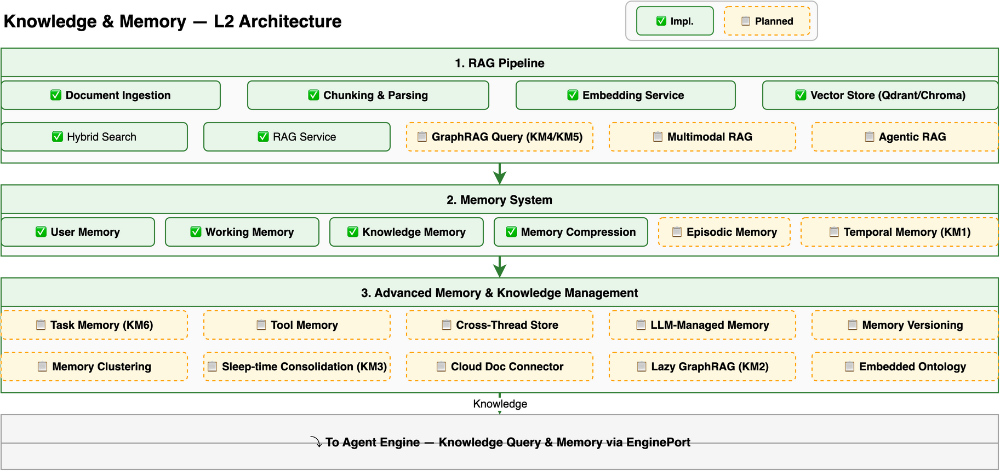

# Knowledge & Memory Design

> Deep dive into Hecate's knowledge management and memory system: RAG pipeline, knowledge graph, ontology system, and multi-level memory architecture. For a system overview, see [Architecture](architecture.md). For engine details, see [Engine Design](engine-design.md). For the architecture decisions behind these enhancements, see [ADR-024](adr/024-knowledge-memory-enhancement.md).

---

## Overview

Hecate's Knowledge & Memory system provides agents with the ability to ingest, store, retrieve, and reason over enterprise knowledge. The system is built on three pillars:

1. **RAG Pipeline** — Document ingestion, embedding, and retrieval
2. **Knowledge Graph** — Structured entity/relationship modeling with ontology extensions
3. **Memory System** — Multi-level agent memory (L1-L4 + advanced memory types)



---

## RAG Pipeline

### Ingestion Pipeline

```
Document → Parser → Chunker → Embedding → Vector Store
```

- **Document Parser** (`parser.py`): Docling-based parsing for PDF, DOCX, MD, TXT, HTML
- **Text Chunker** (`chunker.py`): Fixed-size chunking (1000 chars default, 200 overlap) with sentence-boundary awareness
- **Embedding Service** (`embedding.py`): BGE-M3 model producing dense (1024-dim) + sparse (lexical) vectors
- **Vector Store** (`vector_store.py`): Pluggable abstraction (Qdrant, Chroma) with RRF fusion fallback

### Retrieval Pipeline

```
Query → Embedding → [Dense Search + Sparse Search] → RRF Fusion → Results → Citations
```

- **Hybrid Search** (`searcher.py`): Combines dense (cosine similarity, weight 0.7) and sparse (BM25, weight 0.3) retrieval
- **RRF Fusion** (`vector_store.py`): Reciprocal Rank Fusion with k=60 for combining results
- **Citations** (`types.py`): OpenAI-compatible citation format with source tracking

### Planned Enhancements

| Feature | Description |
|---------|-------------|
| GraphRAG Query Engine | Global/Local/Hybrid search using knowledge graph |
| Agentic RAG | Iterative retrieval with query reformulation |
| Multimodal RAG | Image, audio, video content processing |
| Cloud Document Connector | Block structuring, AI preprocessing for cloud docs |

---

## Knowledge Graph

### Core Concepts

The Knowledge Graph models entities and their relationships:

- **Entity**: A real-world object (person, place, concept) with properties
- **Relationship**: A typed connection between two entities
- **Property**: Key-value metadata on entities or relationships
- **Community**: A cluster of densely connected entities (via Leiden algorithm)

### Planned Components

| Feature | Description |
|---------|-------------|
| Knowledge Graph Construction | LLM-based entity/relationship extraction from documents |
| Graph Database Integration | GraphStore ABC with Neo4j + in-memory backends |
| Community Detection | Leiden algorithm + community summaries |
| Knowledge Graph Visualization | Interactive graph browser with node expand/collapse |
| Knowledge Graph UI Editor | Visual graph maintenance UI |

---

## Ontology System

The Ontology System extends the Knowledge Graph with formal schema definitions and executable actions.

### Ontology Schema

- **Class Hierarchies**: Inheritance (e.g., `Employee` is-a `Person`)
- **Property Constraints**: Domain, range, cardinality validation
- **Relationship Types**: Typed connections with constraints
- **Schema Format**: JSON Schema definition aligned with KG Construction

### Ontology Actions

Actions define operations on ontology objects:

- **Simple Actions**: Update a single property value
- **Compound Actions**: Modify multiple objects in one transaction
- **External Actions**: Write back to source systems
- **LLM-Backed Actions**: Use LLM to determine action parameters

Execution modes: Manual (human approval), Automatic (direct execution), Conditional (on conditions met)

### Ontology Augmented Generation (OAG)

OAG evolves RAG by combining retrieval + logic + actions:

```
Query → Retrieval (RAG) + Logic (Rules/ML) + Actions (Write-Back) → Response
```

### Planned Components

| Feature | Description |
|---------|-------------|
| Ontology Schema Definition | Class hierarchies, property constraints, relationship types |
| SHACL Validation | W3C SHACL-based graph data quality validation |
| Ontology Import/Export | OWL 2/RDF/JSON-LD format support |
| Ontology Versioning | Version snapshots, diff, backward compatibility |
| Ontology Action System | Actions for modifying objects, Agent executes via Action Tool |
| Decision Lineage | Record who decided what based on which data version |
| OAG | RAG + Logic + Actions complete closed loop |

---

## Memory System

### Architecture Overview

```
┌─────────────────────────────────────────────────┐
│              Agent Context Window                │
│  ┌───────────────────────────────────────────┐  │
│  │ L1 Working Memory (MemoryBlock)           │  │
│  │ persona / user_profile / domain_context   │  │
│  └───────────────────────────────────────────┘  │
│  ┌───────────────────────────────────────────┐  │
│  │ L2 Conversation Memory                    │  │
│  │ snip → microcompact → autocompact         │  │
│  │ Memory Pressure Alert (4.17)              │  │
│  └───────────────────────────────────────────┘  │
├─────────────────────────────────────────────────┤
│              Persistent Storage                  │
│  ┌──────────┐ ┌──────────┐ ┌──────────────────┐│
│  │ L3 User  │ │ Task     │ │ Tool Memory      ││
│  │ Memory   │ │ Memory   │ │                  ││
│  └──────────┘ └──────────┘ └──────────────────┘│
│  ┌──────────┐ ┌──────────┐ ┌──────────────────┐│
│  │ L4 Know  │ │ Conv     │ │ Cross-Thread     ││
│  │ Memory   │ │ Recall   │ │ Store            ││
│  └──────────┘ └──────────┘ └──────────────────┘│
├─────────────────────────────────────────────────┤
│              Memory Management                  │
│  • LLM-Managed Memory (4.16)                   │
│  • Self-Editing Memory (4.19)                   │
│  • Multi-Step Retrieval (4.20)                  │
│  • Memory Versioning (4.24)                     │
│  • Auto-Integration (4.5)                       │
└─────────────────────────────────────────────────┘
```

### Memory Levels

| Level | Type | Scope | Implementation |
|-------|------|-------|----------------|
| **L1** | Working Memory | Current session | Named blocks in context window (MemoryBlock) |
| **L2** | Conversation Memory | Current session | Auto-compression pipeline (snip/microcompact/autocompact) |
| **L3** | User Memory | Cross-session | Persistent facts with vector retrieval |
| **L4** | Knowledge Memory | Cross-session | RAG-backed knowledge archive |

### Advanced Memory Types

| Type | Description |
|------|-------------|
| Task Memory | Learn from task execution trajectories (success/failure patterns) |
| Tool Memory | Record tool usage experience (parameter tuning, best practices) |
| Cross-Thread Store | Independent store for cross-session user preferences and shared knowledge |
| Episodic Memory | Scenario-based memory for conversation context |

### Memory Management Features

| Feature | Description |
|---------|-------------|
| LLM-Managed Memory | Agent autonomously decides when to store/retrieve/evict memories |
| Memory Pressure Alert | Context threshold notification to LLM for memory consolidation |
| Self-Editing Memory | Agent can overwrite/correct stored memories |
| Multi-Step Retrieval | Function chaining for complex memory queries |
| Memory Versioning | Version snapshots, diff, rollback capability |
| Memory Importance Scoring | Score memories by access frequency, time decay, semantic relevance |
| Multi-Signal Fusion Retrieval | Combine vector similarity + time decay + importance + frequency |
| Conversation Recall Storage | Semantic search over conversation history |
| Memory Clustering | Clustering and graph-structured memory organization |

---

## Temporal Memory & Reasoning (3.5.13)

### Problem

Hecate's memory system stores facts without temporal metadata. Queries like "Where did the user live before SF?" or "What was the project status last month?" cannot be answered correctly because the system has no concept of when facts were valid or when they were superseded. Mem0 v2.0 reports +29.6 benchmark points from adding temporal reasoning.

### Architecture

```
Memory Store
    │
    ▼
┌──────────────────────────────────────────────────┐
│  Temporal Metadata Enrichment                    │
│  Each memory record gains:                       │
│    valid_from: datetime                           │
│    valid_to: datetime | None (None = current)    │
│    superseded_by: UUID | None                     │
│    temporal_confidence: float (0-1)               │
└──────────────────────────────────────────────────┘
    │
    ▼
┌──────────────────────────────────────────────────┐
│  Temporal Query Intent Extraction                 │
│  Query → Temporal intent classification:          │
│    PRESENT → rank valid_to=None highest           │
│    PAST    → rank superseded facts by valid_to    │
│    COMPARISON → diff facts across time periods    │
└──────────────────────────────────────────────────┘
    │
    ▼
┌──────────────────────────────────────────────────┐
│  Temporal Retrieval Ranking                       │
│  Fuse: semantic score × temporal relevance ×     │
│  importance score                                 │
└──────────────────────────────────────────────────┘
```

### Fact Supersession

When a new fact contradicts an existing one:
1. Old fact: `valid_to = now`, `superseded_by = new_id`
2. New fact: `valid_from = now`, `valid_to = None`
3. Both preserved — query intent determines which surfaces

ADD-only semantics (Mem0 v2.0 pattern): memories accumulate, nothing is overwritten.

### Data Model

```python
class TemporalMetadata:
    valid_from: datetime
    valid_to: datetime | None       # None = currently valid
    superseded_by: UUID | None      # Link to replacement fact
    temporal_confidence: float      # 0-1, decays for fast-changing domains
```

---

## Lazy GraphRAG (3.5.14)

### Problem

Full GraphRAG requires upfront entity extraction, relationship inference, community detection, and community summary generation for the entire corpus. For large enterprise deployments (>100K pages), this is cost-prohibitive. Microsoft LazyGraphRAG runs at ~0.1% of full GraphRAG indexing cost while matching quality at ~4% of query cost.

### Progressive Enrichment Pipeline

```
Stage 0 (Initial Index — ~0.1% of full GraphRAG cost):
  Document → Lightweight NER (spaCy) → Concept Hash → Flat Entity Index
  No community detection. No LLM-extracted relationships.

Stage 1 (Query-triggered — per-subgraph):
  Query → Entity Lookup → Subgraph Expansion
  → On-demand LLM relationship extraction for query neighborhood
  → On-demand mini-community summary

Stage 2 (Progressive enrichment — background):
  Frequently-queried subgraphs → full community summaries
  Popular paths converge toward full GraphRAG quality
  Cold paths remain at Stage 0/1 (cost-appropriate)
```

### Enrichment State Tracking

```python
class SubgraphEnrichmentState:
    subgraph_hash: str          # Hash of entity set
    enrichment_level: int       # 0=NER-only, 1=on-demand, 2=full-community
    query_count: int            # How many queries touched this subgraph
    last_enriched_at: datetime
    community_summary: str | None
```

### Design Principle

Cost is proportional to usage. Cold corpora stay cheap; hot subgraphs converge to full GraphRAG quality. Enrichment is idempotent and incremental.

---

## Sleep-time Memory Consolidation (4.5 Enhancement)

### Problem

Memory Integration (4.5) performs basic background deduplication and forgetting, but lacks scheduled synthesis. Letta's sleep-time compute and Perplexity Brain's overnight synthesis demonstrate that batch memory review during idle periods produces higher-quality "learned context" for the next session.

### Consolidation Cycle

```
Trigger (configurable schedule, default: 02:00 daily)
    │
    ▼
┌─────────────────────────────────────────────┐
│  Consolidation Subagent (background)         │
│  1. Review conversation history              │
│     (since last consolidation)               │
│  2. Extract durable facts                    │
│  3. Score by importance + novelty            │
│  4. Update memory blocks                     │
│     (add new, supersede old with temporal)   │
│  5. Clean up stale entries                   │
│     (low importance + old + unused)          │
│  6. Produce "learned context" diff           │
└─────────────────────────────────────────────┘
    │
    ▼
┌─────────────────────────────────────────────┐
│  Memory Store (atomic write)                 │
│  + ConsolidationLog (audit trail)            │
└─────────────────────────────────────────────┘
```

### Subagent Isolation

The consolidation subagent has write access to memory store but cannot execute tools or call LLMs beyond the consolidation prompt. This prevents uncontrolled side effects.

---

## DRIFT Search Mode (3.5.4 Enhancement)

### Problem

GraphRAG Query Engine (3.5.4) has three modes: Global (community summaries), Local (entity neighborhood), Hybrid (vector + graph fusion). Microsoft GraphRAG's DRIFT search combines entity fanout with community context, providing focused multi-hop reasoning that neither pure Local nor pure Global can achieve.

### DRIFT Algorithm

1. Extract topic entities from query
2. Fan out to entity neighbors (like Local Search)
3. At each hop, check if neighbors belong to a community (like Global Search)
4. If community has a summary, include it in context
5. Prune branches outside query-relevant communities
6. Continue until sufficient context or max depth reached

### Search Mode Comparison

| Mode | Strategy | Best For |
|------|----------|----------|
| Global | Community summary map-reduce | Holistic corpus questions |
| Local | Entity neighborhood traversal | Specific entity questions |
| Hybrid | Vector + graph fusion | General-purpose queries |
| **DRIFT** | **Entity fanout + community pruning** | **Multi-hop with community awareness** |

---

## Schema-Aware Graph Traversal (3.5.10 Enhancement)

### Problem

Standard GraphRAG traversal uses semantic similarity to guide search. In dense enterprise KGs, high-degree attribute nodes ("semantic supernodes" like `Status: Active` connected to 10,000 entities) cause uncontrolled search expansion. SCAIR (ACL 2026) demonstrates that schema constraints must prune the search space BEFORE semantic scoring.

### Structure-First Retrieval

```
Query → Extract topic entities
    │
    ▼
┌──────────────────────────────────────────┐
│  SHACL Shape Lookup                       │
│  For each entity type, retrieve:          │
│    - Allowed outgoing relationship types  │
│    - Cardinality constraints              │
│    - Property domains/ranges              │
└──────────────────────────────────────────┘
    │
    ▼ (only schema-valid paths traversed)
┌──────────────────────────────────────────┐
│  Traversal Guards                         │
│  Block: paths to high-degree attribute    │
│    nodes unless explicitly queried        │
│  Allow: paths through typed relationships │
│    matching query intent                  │
└──────────────────────────────────────────┘
    │
    ▼
┌──────────────────────────────────────────┐
│  Semantic Scoring (post-traversal)        │
│  Score remaining schema-valid paths       │
└──────────────────────────────────────────┘
```

---

## Work Context Graph (4.21 Enhancement)

### Problem

Task Memory (4.21) records task execution trajectories but as flat records. Perplexity Brain (June 2026) demonstrates that a structured work memory graph — tracking what worked, what failed, corrections made, and source reliability — improves task correctness by 25% and reduces cost by 13%.

### Work Memory Graph Structure

```
                    ┌──────────┐
            ┌──────│ Method A │────── success_rate: 0.8
            │       └──────────┘       usage_count: 15
            │                │         last_used: 2026-07-01
            │         ┌──────┘
            ▼         ▼
    ┌──────────┐  ┌──────────┐
    │ Outcome  │  │Correction│────── user_correction_count: 3
    │ Success  │  │ "Use B"  │
    └──────────┘  └──────────┘
            │         │
            │  ┌──────┘
            ▼  ▼
    ┌──────────┐
    │ Method B │────── success_rate: 0.95 (improved after correction)
    └──────────┘       usage_count: 22
```

### Node Types

| Type | Purpose | Key Fields |
|------|---------|-----------|
| **method** | An approach tried for a task | success_rate, usage_count, last_used_at |
| **outcome** | Result of applying a method | success/fail, quality_score |
| **correction** | User feedback correcting agent's approach | correction_count, corrected_at |
| **source** | Information source used | reliability (0-1), last_verified |
| **pattern** | Recurring task pattern | frequency, typical_methods |

### Self-Improving Cycle

1. **Task starts**: Query graph for similar past tasks → retrieve methods, outcomes, corrections
2. **Task executes**: Record methods tried, outcomes, corrections in real-time
3. **Task completes**: Update node scores (success_rate, usage_count, source_reliability)
4. **Next task**: Graph is richer → better starting context

---

## Integration with Agent Engine

The Knowledge & Memory system integrates with the Agent Engine through:

- **EnginePort.knowledge_query()**: RAG retrieval during LLM execution
- **EnginePort.memory_store/retrieve()**: Memory operations during agent execution
- **ContextEngine**: Context assembly with memory and knowledge retrieval
- **Guardrail Hooks**: Security filtering on retrieved content

---

## Further Reading

| Document | Description |
|----------|-------------|
| [ADR-024: Knowledge & Memory Enhancement](adr/024-knowledge-memory-enhancement.md) | Architecture decisions for KM1-KM6 |
| [Architecture](architecture.md) | System overview, module architecture |
| [RAG Pipeline Design](rag-pipeline-design.md) | RAG pipeline deep dive |
| [Engine Design](engine-design.md) | Pregel runtime, worker pool |
| [ADR-017: Knowledge Graph Architecture](adr/017-knowledge-graph-architecture.md) | GraphStore ABC and community detection |
| [ADR-014: Ontology Action System](adr/014-ontology-action-system.md) | Action system for ontology |
| [ADR-015: OAG](adr/015-ontology-augmented-generation.md) | Ontology-Augmented Generation |
| [ADR-006: Four-Level Memory](adr/006-four-level-memory.md) | L1-L4 memory architecture |
