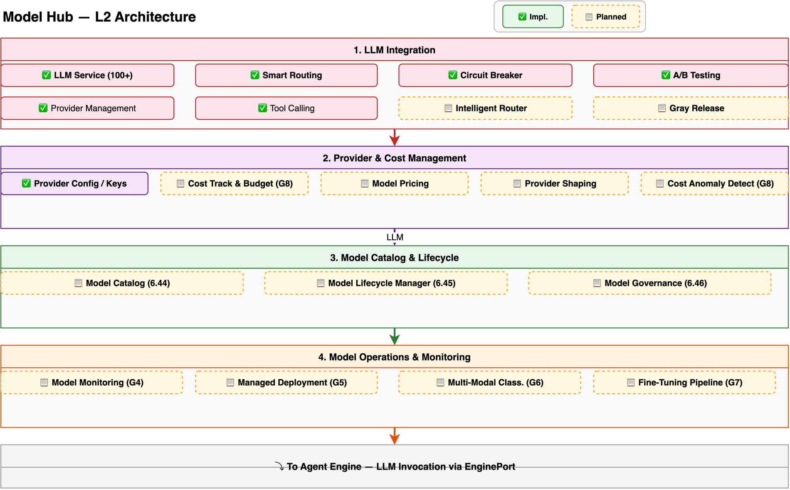

# Model Hub Design

> Deep dive into Hecate's model management layer: LLM integration, model catalog, lifecycle management, governance, monitoring, deployment, fine-tuning, and cost management. For a system overview, see [Architecture](architecture.md). For the architecture decisions behind these enhancements, see [ADR-022](adr/022-model-hub-enhancement.md).

---

## Overview

Model Hub is Hecate's unified model management layer — the primary interface for discovering, configuring, deploying, governing, and monitoring AI models at enterprise scale. It serves five operator personas:

- **ML / AI engineers** — Discover models, configure providers, test model connectivity, compare performance
- **Platform / SRE engineers** — Manage model lifecycle, monitor health, deploy self-hosted models, manage costs
- **Compliance / Risk officers** — Review model risk, enforce governance policies, generate compliance reports
- **FinOps / Cost analysts** — Track model spending, manage budgets, generate chargeback reports
- **Application developers** — Browse available models, select appropriate model for agent configuration, test via playground

The Model Hub follows the same **composition architecture** as the Ops Center — it is not a new microservice but a set of services and presentation layers that extend the existing LLM integration layer:



1. **LLM Integration** — Runtime layer: 100+ providers via LiteLLM, intelligent routing (4 strategies), circuit breaker, A/B testing, gray release, provider management, tool calling
2. **Provider & Cost Management** — Provider configuration and key management, cost tracking, model pricing, provider shaping, cost anomaly detection
3. **Model Catalog & Lifecycle** — Browseable model catalog, versioned lifecycle manager, model governance with approval workflows
4. **Model Operations & Monitoring** — Model health monitoring, managed deployment, multi-modal classification, fine-tuning pipeline
5. **Downstream** — LLM invocation flows to Agent Engine via EnginePort

---

## LLM Integration (Existing, P1-P2)

The LLM Integration layer is Hecate's runtime model access foundation, built on LiteLLM with 100+ provider support.

### Architecture

```
AgentConfig (model + provider)
        │
        ▼
  EnginePort.llm_invoke()
        │
        ▼
  ┌─────────────────────────────────────────────┐
  │              LLM Service                     │
  │  ┌──────────┐  ┌──────────┐  ┌──────────┐  │
  │  │ LiteLLM  │→│ Fallback  │→│ Circuit  │  │
  │  │ Router   │  │ Chain    │  │ Breaker  │  │
  │  └──────────┘  └──────────┘  └──────────┘  │
  │  ┌──────────┐  ┌──────────┐  ┌──────────┐  │
  │  │ A/B Test │  │ Gray     │  │ Tool     │  │
  │  │ Splitter │  │ Release  │  │ Calling  │  │
  │  └──────────┘  └──────────┘  └──────────┘  │
  └─────────────────────────────────────────────┘
        │
        ▼
  ┌─────────────────────────────────────────────┐
  │         Provider ABC (per adapter)           │
  │  OpenAI │ Anthropic │ Google │ Azure │ ...  │
  └─────────────────────────────────────────────┘
```

### Key Components

| Component | File |
|-----------|------|
| LLM Service | `services/llm/service.py` |
| ModelRouter | `services/llm/routing.py` |
| Circuit Breaker | `services/llm/circuit_breaker.py` |
| A/B Testing | `services/llm/ab_testing.py` |
| Provider CRUD | `services/llm/provider.py` |

### Model Database Schema

```python
# Provider configuration
class ModelProviderModel(Base):
    __tablename__ = "model_providers"
    id: int           # PK
    name: str         # Provider key (e.g., "openai")
    display_name: str # Human-readable
    api_key_encrypted: str  # Fernet-encrypted
    base_url: str
    config: dict      # Provider-specific config
    is_enabled: bool
    status: str       # unconfigured → configured → removed

# Model registry
class ModelRegistryModel(Base):
    __tablename__ = "model_registry"
    id: int           # PK
    provider_id: int  # FK → model_providers
    model_id: str     # Provider model ID (e.g., "gpt-4o")
    model_type: str   # Chat, Embedding, Completion, Rerank
    capabilities: dict
    config: dict
    version: str
```

### Routing Strategies

| Strategy | Behavior | Use Case |
|----------|----------|----------|
| COST | Selects cheapest model meeting constraints | Cost-sensitive workloads |
| LATENCY | Selects fastest model | Real-time applications |
| CAPABILITY | Selects most capable model | Complex reasoning tasks |
| BALANCED | Weighted score across cost/latency/capability | Default, general purpose |

---

## Provider & Cost Management (Existing + G8 Enhancement)

### Provider Configuration

Provider management covers the full lifecycle of model provider setup and maintenance:

- **Multi-auth support** — 7 auth methods: API-Key, AK/SK, App-code, custom Header, IAM, HMAC, no-auth
- **Provider info enhancement** — Bilingual names, custom icons, descriptions, auth status indicators
- **Key security** — KMS-encrypted storage, rotation support, masked display
- **Auth state lifecycle** — unconfigured → configured → removed
- **UI redesign** — Three-level page structure: provider card list → provider details → model details + testing

### Cost Management (G8 Enhancement)

Extends Cost Tracking (6.4) with per-model and per-workspace budget controls:

**New models**:
```python
class ModelCostBudget(Base):
    """Per-model cost budget policy."""
    __tablename__ = "model_cost_budgets"
    id: int
    model_id: str
    workspace_id: int
    monthly_limit_hard: Decimal  # Hard cap — blocks usage when exceeded
    monthly_limit_soft: Decimal  # Soft cap — alerts when exceeded
    alert_threshold: Decimal     # Alert at % of limit (e.g., 0.80 = 80%)
    notify_channels: list[str]   # Slack, Email, Webhook

class CostAnomalyRule(Base):
    """Anomaly detection rule for model costs."""
    __tablename__ = "cost_anomaly_rules"
    id: int
    model_id: str
    metric: str              # daily_spend, avg_cost_per_token, monthly_total
    deviation_threshold: float  # e.g., 2.0 = 2 standard deviations
    evaluation_window_days: int # Rolling window for baseline
    enabled: bool
```

**Integration with Ops Center Budget Management (10.7)**:
- Model budgets are a specialization of workspace budgets
- `WorkspaceBudget` has optional `model_id` field — when set, applies specifically to that model
- Aggregation queries roll up model budgets to workspace and org levels

---

## Model Catalog & Lifecycle (NEW — G1/G2/G3)

### Model Catalog (6.44/G1)

Browseable/searchable catalog that aggregates model metadata from providers.

**CatalogEntryModel**:
```python
class CatalogEntryModel(Base):
    """Curated model catalog entry."""
    __tablename__ = "model_catalog_entries"
    id: int
    provider: str              # Provider key (e.g., "openai", "anthropic")
    model_id: str              # Provider model ID
    display_name: str          # Human-readable name
    description: str           # Model description
    category: str              # Chat, Embedding, Image, Video, Audio, Code
    capabilities: list[str]    # Function calling, streaming, vision, structured_output
    token_window: int          # Max context tokens
    max_output_tokens: int
    pricing_input: Decimal     # Per 1K input tokens
    pricing_output: Decimal    # Per 1K output tokens
    latency_tier: str          # fast, medium, slow
    quality_score: Decimal     # Aggregate quality score (0-1)
    documentation_url: str
    is_enabled_for_use: bool   # Can be activated by admins
    is_builtin: bool           # Seed entry vs custom entry
```

**Catalog data sources**:
1. **Built-in seed data** — 200+ curated models shipped with Hecate
2. **Provider API discovery** — Auto-fetch from provider model listing endpoints
3. **Custom entries** — Admin-defined private models

**Catalog UI views**:

| View | Description |
|------|-------------|
| Browse Grid | Card grid with category filters, search, sort by cost/latency/quality |
| Model Detail | Full model info: capabilities, pricing, benchmarks, docs, activation button |
| Provider Comparison | Side-by-side comparison of selected models |
| Quick Enable | One-click activation adds model to workspace available models |

### Model Lifecycle Manager (6.45/G2)

State machine for model registry entries:

```
                      ┌─────────────┐
                      │  REGISTERED  │
                      └──────┬──────┘
                             │ promote(dev)
                             ▼
                      ┌─────────────┐
                      │  STAGED(dev)│
                      └──────┬──────┘
                             │ promote(staging)
                             ▼
                      ┌─────────────┐
                      │STAGED(staging)
                      └──────┬──────┘
                             │ approve
                             ▼
                      ┌─────────────┐
                      │  APPROVED   │
                      └──────┬──────┘
                             │ deploy
                             ▼
                      ┌─────────────┐
                      │  DEPLOYED   │
                      └──────┬──────┘
                             │ schedule_deprecation
                             ▼
                      ┌─────────────┐
                      │ DEPRECATED  │
                      └──────┬──────┘
                             │ auto-sunset
                             ▼
                      ┌─────────────┐
                      │   SUNSET    │
                      └─────────────┘

Rollback: DEPRECATED → APPROVED or DEPLOYED → STAGED via re-promotion
```

**LifecycleLogModel**:
```python
class LifecycleLogModel(Base):
    """Audit trail for model lifecycle transitions."""
    __tablename__ = "model_lifecycle_logs"
    id: int
    model_registry_id: int  # FK
    from_state: str
    to_state: str
    actor: str              # User or system
    reason: str
    metadata: dict          # Additional context (approval ref, test results)
    created_at: datetime
```

### Model Governance (6.46/G3 — P5)

Policy enforcement layer wrapping the Lifecycle Manager:

**Approval workflows**:
- Single approval — one authorized user approves transition
- Multi-party approval — N-of-M required approvers
- Auto-approval — Policy-based (e.g., "all tests pass, latency < 2s")

**Risk scoring**:
- Composite score (0-100) from weighted factors:
  - Provider reliability score (40%) — historical uptime, incident frequency
  - Bias scan results (20%) — fairness metrics across demographic groups
  - Performance benchmarks (20%) — quality vs reference models
  - Data privacy classification (20%) — training data sensitivity

**Compliance documentation**:
- Auto-generated model cards following Google Model Cards format:
  - Model details (name, version, type)
  - Intended use (primary use cases, out-of-scope uses)
  - Factors (relevant groups, instrumentation)
  - Metrics (performance, fairness, robustness)
  - Training data (sources, preprocessing)
  - Ethical considerations

**Integration**:
- Governance policies stored in `GovernancePolicyModel` — shared with Compliance Center (9.9)
- Approval decisions logged in `DecisionLineageModel` (6.21)
- Model cards exportable for regulatory submissions

---

## Model Operations & Monitoring (NEW — G4/G5/G6/G7)

### Model Monitoring Dashboard (G4)

Presentation layer within the Model Management Console (O10):

**Data sources**: Existing OpenTelemetry trace spans, filtered by `model_id` attribute.

**Dashboard widgets**:
| Widget | Description | Refresh |
|--------|-------------|---------|
| Latency Trend | P50/P95/P99 latency by model over time | 30s |
| Error Rate | Error rate (%) by model, by error category | 30s |
| Cost Trend | Daily/weekly/monthly cost by model | 5min |
| Model Health Score | Composite score: availability (40%) + latency (30%) + error rate (30%) | 30s |
| Drift Alerts | Threshold-based alerts on metric deviation from rolling baseline | 1min |
| Quality Regression | Comparison of current vs previous period metrics | 1h |

**Alert rules** (shared with Ops Center Alerting 8.6):
```python
# Example drift alert rule
{
    "model_id": "gpt-4o",
    "metric": "avg_latency_ms",
    "condition": "rolling_7d_avg * 1.5",  # 50% increase from baseline
    "severity": "warning",
    "notify": ["slack:ops-alerts"]
}
```

### Managed Model Deployment (G5/6.5 Enhancement)

Extends Self-Hosted Inference with a deployment workflow:

**DeploymentConfigModel**:
```python
class DeploymentConfigModel(Base):
    """Configuration for a managed model deployment."""
    __tablename__ = "model_deployment_configs"
    id: int
    model_registry_id: int   # FK
    runtime: str             # vllm, ollama, hf_endpoint, custom
    model_artifact: str      # HF model ID, S3 path, Docker image
    health_check: dict       # {endpoint, expected_response, interval, threshold}
    auto_scaling: dict       # {min_replicas, max_replicas, target_cpu, target_memory}
    resource_limits: dict    # {cpu, memory, gpu}
    env_vars: dict           # Environment variables for runtime
    created_at: datetime
    updated_at: datetime
```

**Deployment workflow**:
1. Register model artifact (HF hub, S3, Docker)
2. Configure health check probe
3. Set auto-scaling parameters
4. Deploy → health check → auto-scale → monitor
5. Zero-downtime updates for version changes

### Multi-Modal Model Classification (G6/6.11 Enhancement)

Extended `ModelClassification` enum:

```python
class ModelClassification(str, Enum):
    CHAT = "chat"
    EMBEDDING = "embedding"
    COMPLETION = "completion"
    RERANK = "rerank"
    # New multi-modal classifications (G6)
    IMAGE_GENERATION = "image_generation"    # DALL-E, Stable Diffusion, Midjourney
    VIDEO_GENERATION = "video_generation"    # Sora, Runway, Pika
    AUDIO_GENERATION = "audio_generation"    # ElevenLabs, Whisper, MusicGen
    CODE_GENERATION = "code_generation"      # Codex, Code Llama, Qwen Coder
```

Classification changes are metadata-only — the LLM Service invocation layer remains unchanged. Multi-modal support depends on provider API capabilities.

### Fine-Tuning Pipeline (G7/6.6 Enhancement)

End-to-end fine-tuning workflow:

**FinetuningJobModel**:
```python
class FinetuningJobModel(Base):
    """Tracking for a fine-tuning job."""
    __tablename__ = "model_finetuning_jobs"
    id: int
    base_model_id: str         # Foundation model to tune
    dataset_id: int            # FK → dataset model
    hyperparameters: dict      # {learning_rate, epochs, batch_size, lora_r, ...}
    provider: str              # openai, vertex_ai, hf, vllm, custom
    status: str                # queued, running, completed, failed, cancelled
    progress: float            # 0.0 - 1.0
    metrics: dict              # {final_loss, eval_accuracy, ...}
    output_model_id: str       # Resulting tuned model registry ID
    created_at: datetime
    completed_at: datetime
    created_by: str
```

**Pipeline stages**:

```
Dataset Management → Training Config → Job Submission → Progress Monitor → Evaluation → Deployment
       │                    │               │                  │               │            │
       │                    │               │                  │               │            │
  Upload/version/    Select base model,  Submit to          Real-time       Auto-eval    One-click
  preview/pre-split  set hyperparams    provider API        loss/accuracy   on test set  promote to
                                                             curves                       production
```

---

## Data Freshness Strategy

| Component | Refresh Interval | Data Source |
|-----------|-----------------|-------------|
| Model Catalog | On provider change (event-driven) + daily refresh | CatalogEntryModel + Provider API discovery |
| Provider Status | Real-time (health check) | Provider API connectivity test |
| Cost Tracking | Per-request (token usage) + hourly aggregation | Trace spans → TimescaleDB |
| Model Health Metrics | 30s | OpenTelemetry traces → TimescaleDB continuous aggregates |
| Lifecycle State | On transition (event-driven) | LifecycleLogModel |
| Governance Status | On approval/review (event-driven) | GovernancePolicyModel |
| Fine-Tuning Progress | 10s during training | FinetuningJobModel + provider webhook |

---

## API Endpoints

### Model Catalog (G1)

| Method | Path | Description |
|--------|------|-------------|
| GET | `/api/v1/model-catalog` | List catalog entries with search/filter/sort |
| GET | `/api/v1/model-catalog/{id}` | Get catalog entry detail |
| GET | `/api/v1/model-catalog/compare` | Compare multiple models |
| POST | `/api/v1/model-catalog/{id}/activate` | Activate model for workspace |
| POST | `/api/v1/model-catalog/seed` | Admin: trigger seed data refresh |

### Lifecycle Manager (G2)

| Method | Path | Description |
|--------|------|-------------|
| GET | `/api/v1/model-lifecycle/{model_id}` | Get lifecycle state |
| POST | `/api/v1/model-lifecycle/{model_id}/promote` | Promote to next state |
| POST | `/api/v1/model-lifecycle/{model_id}/schedule-deprecation` | Schedule deprecation |
| GET | `/api/v1/model-lifecycle/{model_id}/history` | Get lifecycle audit trail |

### Model Governance (G3 — P5)

| Method | Path | Description |
|--------|------|-------------|
| GET | `/api/v1/model-governance/{model_id}/risk-score` | Get risk assessment |
| POST | `/api/v1/model-governance/{model_id}/approve` | Approve deployment |
| GET | `/api/v1/model-governance/{model_id}/model-card` | Generate model card |
| GET | `/api/v1/model-governance/policies` | List governance policies |

### Model Deployment (G5)

| Method | Path | Description |
|--------|------|-------------|
| POST | `/api/v1/model-deployment` | Create deployment config |
| GET | `/api/v1/model-deployment/{id}` | Get deployment status |
| POST | `/api/v1/model-deployment/{id}/deploy` | Trigger deployment |
| POST | `/api/v1/model-deployment/{id}/rollback` | Rollback deployment |

### Fine-Tuning (G7)

| Method | Path | Description |
|--------|------|-------------|
| POST | `/api/v1/finetuning/datasets` | Upload training dataset |
| GET | `/api/v1/finetuning/datasets/{id}` | Preview dataset |
| POST | `/api/v1/finetuning/jobs` | Create fine-tuning job |
| GET | `/api/v1/finetuning/jobs/{id}` | Get job status + progress |
| POST | `/api/v1/finetuning/jobs/{id}/cancel` | Cancel running job |

---

## Further Reading

- [ADR-022: Model Hub Enhancement Architecture](adr/022-model-hub-enhancement.md) — Architecture decisions for G1-G8
- [Architecture Overview](architecture.md) — System-level architecture
- [Engine Design](engine-design.md) — Pregel runtime and execution engine
- [Security Architecture](security-architecture.md) — Guardrails, PII masking, sandbox execution, audit trail for model governance integration
- [Ops Center Design](ops-center-design.md) — Shared composition pattern; Model Monitoring (G4) and Cost Management (G8) integrate with Ops Center dashboards
- [LLM Service Source](https://github.com/xueyufish/hecate/tree/main/src/hecate/services/llm) — Current LLM service implementation
- [Model Routing Source](https://github.com/xueyufish/hecate/tree/main/src/hecate/services/llm/routing.py) — ModelRouter implementation
- [Model Provider Schema](https://github.com/xueyufish/hecate/tree/main/src/hecate/models/) — ORM models for providers and registry
