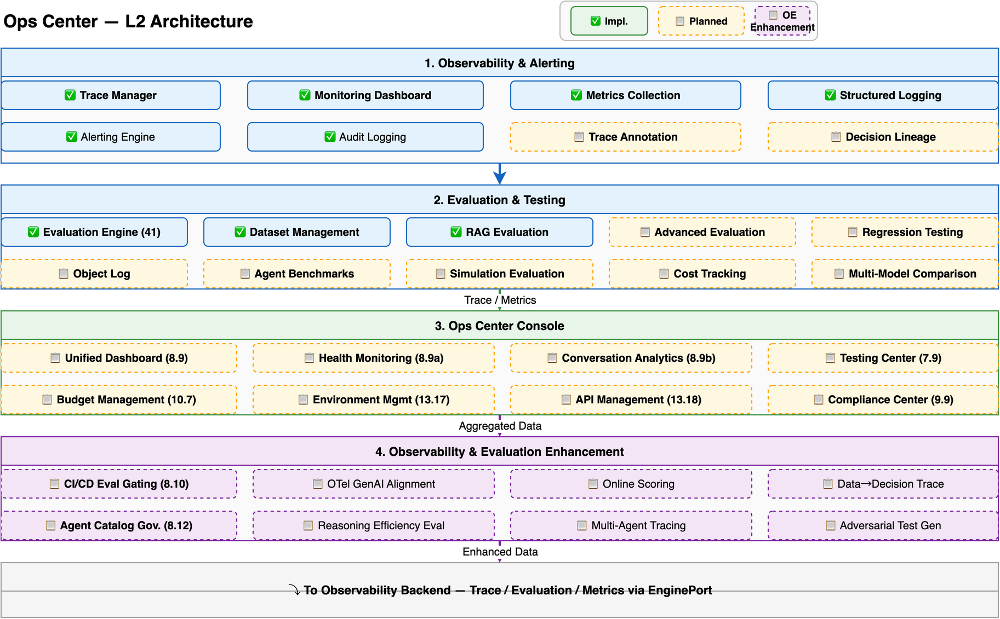

# Ops Center Design

> Deep dive into Hecate's unified administrative control plane: observability infrastructure, agent health monitoring, conversation analytics, testing center, budget governance, environment management, API management, and compliance. For a system overview, see [Architecture](architecture.md). For the architecture decision behind the composition pattern, see [ADR-021](adr/021-ops-center-architecture.md).

---

## Overview

Ops Center is Hecate's unified administrative control plane — the primary interface for monitoring, evaluating, deploying, governing, and auditing AI Agent applications at enterprise scale. It serves four operator personas:

- **SRE / Platform engineers** — Monitor system health, manage incidents, ensure uptime and performance
- **QA / Evaluation engineers** — Run test suites, track quality metrics, detect regressions
- **FinOps / Cost analysts** — Track spending, enforce budgets, generate chargeback reports
- **Compliance / Security officers** — Audit access, enforce policies, generate regulatory reports

The Ops Center follows a **composition architecture** — it is not a new microservice but a presentation and aggregation layer that composes data from existing backend services into a single operator console:



1. **Backend Services** — Observability (tracing, monitoring, metrics, logging), Evaluation (41 evaluators, datasets, regression), Deployment (canary, environments), Cost (token tracking, budget), Security (audit, compliance), and Management (API keys, webhooks)
2. **Ops Center Gateway** — Aggregation API layer that provides composite endpoints, RBAC filtering at request level, and viewport data assembly across multiple services
3. **Admin Console** — React-based frontend with role-based dashboard personalization, widget registry, and per-component data freshness strategies

Each Ops Center component is independently developed and scaled — the Testing Center can evolve without affecting Health Monitoring, and a bug in Budget Management cannot break Conversation Analytics. The Gateway enforces consistent pagination, filtering, and RBAC across all views.

### Data Freshness Strategy

Different operational views have different latency requirements. The Gateway applies per-component refresh strategies:

| Component | Refresh Interval | Rationale |
|-----------|-----------------|-----------|
| Agent Health Monitoring | 30s | Near-real-time health status for incident response |
| Unified Dashboard | 30s | Live operational overview for NOC displays |
| Alerting | Real-time (push) | Incidents require immediate notification |
| Conversation Analytics | 5min | Trend analysis tolerates slight delay |
| Testing Center | On-demand | Test runs are operator-triggered |
| Budget Management | 1h | Cost aggregation is batch-processed |
| Compliance & Audit | 1h | Regulatory reporting is non-urgent |

---

## Observability Foundation

The Ops Center builds on Hecate's P3 observability infrastructure — a full-stack tracing, monitoring, and logging system that provides the data backbone for all operational views.

### Full-Chain Tracing

Every agent execution produces a hierarchical trace structure following OpenTelemetry conventions:

```
Trace (single request/workflow run)
  └── Span (node execution)
       ├── LLM Generation (model call with prompt/response)
       ├── Tool Call (tool execution with args/result)
       └── Sub-Span (child node or sub-agent)
```

Traces are stored in TimescaleDB with hypertable partitioning for time-range query performance. Each trace captures:

- **Trace ID + Span ID hierarchy** — Parent-child relationships across the full execution chain
- **Latency breakdown** — Per-node duration with p50/p90/p99 percentiles
- **Token consumption** — Input/output tokens per LLM call, aggregated per trace
- **Error context** — Exception type, message, stack trace, and recovery action
- **Channel state snapshots** — Channel values at each BSP superstep barrier

### Metrics Collection

Structured metrics are collected per-agent, per-workflow, and per-organization:

| Metric Category | Examples | Storage |
|----------------|----------|---------|
| **Performance** | Request latency, time-to-first-token, node execution time | TimescaleDB |
| **Quality** | Evaluation pass rate, hallucination rate, user satisfaction | TimescaleDB |
| **Cost** | Token usage, dollar cost per request, daily spend | PostgreSQL |
| **Volume** | Request count, active sessions, concurrent executions | TimescaleDB |
| **Error** | Error rate by type, retry count, circuit breaker trips | TimescaleDB |

Metrics support dimensional filtering (by org, workspace, agent, model, channel) and configurable aggregation windows (1min, 5min, 1h, 1d).

### Structured Logging

All system events emit structured JSON logs with consistent fields:

```json
{
  "timestamp": "2026-07-01T12:00:00Z",
  "level": "INFO",
  "trace_id": "abc123",
  "span_id": "def456",
  "org_id": "org-001",
  "workspace_id": "ws-001",
  "agent_id": "agent-001",
  "event": "llm.invoke",
  "model": "gpt-4o",
  "tokens_in": 1200,
  "tokens_out": 350,
  "duration_ms": 850
}
```

Logs are correlated with traces via `trace_id` and `span_id`, enabling seamless navigation between log entries and trace timelines.

---

## Unified Dashboard

### Ops Center Dashboard (8.9)

The Dashboard is the landing page for all operations personnel — a single-screen overview that answers "is everything OK?" at a glance. It aggregates data from all backend services into configurable widgets:

| Widget | Data Source | Purpose |
|--------|------------|---------|
| **System Health Summary** | Observability | Aggregate health status across all agents (green/yellow/red) |
| **Active Alert Counter** | Alerting Engine | Count and severity distribution of active alerts |
| **Evaluation Pass Rate** | Evaluation Engine | Pass/fail rate trend over selected time window |
| **Cost Trend Graph** | Cost Service | Daily/weekly cost with forecast projection |
| **Deployment Status** | Deployment Service | Current deployment activity and canary progress |
| **Recent Audit Events** | Audit Logging | Latest security-relevant actions |

The dashboard supports **role-based personalization** — an SRE sees health and alert widgets prominently, while a FinOps analyst sees cost and budget widgets first. Widget layout is persisted per user.

### Custom Dashboard Builder (O8)

Beyond the default dashboard, operators can create custom dashboards via a drag-and-drop widget editor:

- **Widget Registry** — Select from available metric widgets: time series, bar chart, gauge, heatmap, counter, table
- **Metric Configuration** — Choose metric source, aggregation function (avg/sum/max/p99), grouping dimension, and time window
- **Layout Editor** — Drag widgets onto a grid, resize, and arrange into multi-row layouts
- **Sharing** — Save custom dashboards as personal or shared (role-visible) configurations
- **Auto-refresh** — Per-widget refresh interval configuration

This enables teams to build NOC-style wall displays, executive summaries, or troubleshooting-focused views tailored to their workflows.

---

## Agent Health Monitoring

### Agent Health Monitoring Dashboard (8.9a)

Per-agent health monitoring provides a fleet-level view of all deployed agents with drill-down capability for root cause analysis. The dashboard answers two questions: "which agents need attention?" and "why is this agent unhealthy?"

### Health Metrics

Each agent is scored on five health dimensions:

| Metric | Formula | Healthy Threshold |
|--------|---------|-------------------|
| **Uptime** | Successful executions / total executions (rolling 1h) | ≥ 99.5% |
| **Error Rate** | Failed executions / total executions (rolling 1h) | ≤ 1% |
| **Average Latency** | Mean time-to-completion (rolling 1h) | ≤ SLA target |
| **Escalation Rate** | Human escalation count / total sessions | ≤ 5% |
| **User Satisfaction** | Average CSAT/NPS score from trace annotations | ≥ 4.0/5.0 |

An overall **health score** is computed as a weighted combination of these metrics, with configurable weights per agent or per agent category. The health status indicator (🟢 healthy / 🟡 warning / 🔴 critical) is derived from threshold breaches.

### Fleet Overview

The fleet view presents all agents in a filterable, sortable table:

- **Filtering** — By health status, workspace, agent type, model provider, or custom tags
- **Sorting** — By health score, error rate, latency, or request volume
- **Bulk actions** — Acknowledge warnings, silence alerts, or trigger eval runs for selected agents
- **Trend sparklines** — Mini time-series charts inline in each row showing 24h trend

### SLA Breach Detection

Configurable SLA rules trigger automated alerts when breached:

```yaml
sla_rule:
  agent_id: "customer-service-agent"
  metrics:
    uptime: { threshold: 99.9%, window: 5min }
    latency_p99: { threshold: 2000ms, window: 5min }
  actions:
    - create_incident
    - notify_channel: "#ops-oncall"
    - escalate_to: "sre-team"
```

SLA breaches create incidents in the Alerting system and can auto-escalate based on severity and duration.

### Drill-Down to Traces

Clicking any agent in the fleet view drills down to:

- **Recent sessions** — List of recent conversation/executions with quality scores
- **Trace timeline** — Visual execution timeline with node-level latency breakdown
- **Error log** — Recent errors with stack traces and recovery actions
- **Health history** — Time-series chart of health scores over configurable windows (1h/24h/7d/30d)

---

## Conversation Analytics

### Conversation Analytics & Quality Scoring (8.9b)

Conversation analytics provides visibility into customer-facing agent interactions — answering "are our agents doing a good job?" and "where do we need to improve?"

### Session Volume and Trends

- **Volume trends** — Daily/weekly conversation count with growth rate indicators
- **Peak hour analysis** — Heatmap showing conversation volume by hour-of-day and day-of-week
- **User growth** — Unique user count trend with new vs. returning breakdown
- **Channel distribution** — Conversation volume split by access channel (Web, API, IM, CLI)

### Quality Score Computation

Each conversation receives an automated quality score computed from three dimensions:

| Dimension | Evaluation Method | Score Range |
|-----------|------------------|-------------|
| **Relevance** | Did the response address the user's question? | 0.0 – 1.0 |
| **Helpfulness** | Did the response solve the user's problem? | 0.0 – 1.0 |
| **Completeness** | Did the response cover all aspects of the query? | 0.0 – 1.0 |

The composite quality score is a weighted average (configurable per agent). Scores are computed by LLM-based evaluators (part of the 41 built-in evaluators) running asynchronously after conversation completion.

### User Satisfaction Tracking

Satisfaction data is collected from two sources:

- **Explicit feedback** — Thumbs up/down or star ratings collected via Trace Annotation (6.18)
- **Implicit signals** — Sentiment analysis of user messages, rephrasing frequency, session length

The satisfaction trend chart overlays both signals to identify divergence between what users say and what their behavior indicates.

### Root Cause Analysis

Low-quality conversations are flagged for review. The RCA view provides:

- **Conversation replay** — Step-by-step playback of the conversation with turn-level quality scores
- **Topic clustering** — Auto-grouped conversations by intent/topic, highlighting clusters with systematically low scores
- **Agent comparison** — Side-by-side quality comparison across agent configurations or model versions
- **Improvement suggestions** — AI-generated recommendations for prompt adjustments or knowledge base gaps

---

## Evaluation & Testing Center

### Evaluation Engine

The Ops Center leverages Hecate's 41 built-in evaluators covering three assessment domains:

| Domain | Evaluators | Purpose |
|--------|-----------|---------|
| **LLM Quality** | Faithfulness, Answer Relevance, Coherence, Fluency, Toxicity | Assess response quality |
| **RAG Retrieval** | Context Precision, Context Recall, Context Relevancy, Faithfulness | Assess retrieval effectiveness |
| **Agent-Level** | Tool Selection Accuracy, Task Completion, Trajectory Efficiency, Goal Achievement | Assess end-to-end agent performance |

Evaluators are pluggable via the `EvaluatorABC` SPI (7.2-abc) — custom evaluators can be registered without code changes to the engine.

### Testing Center / Sandbox (7.9)

The Testing Center provides a dedicated UI for systematic agent testing — moving beyond ad-hoc evaluation to structured, repeatable test suites:

```
Production Traces ──┐
                    ├──→ Test Suite ──→ Batch Run ──→ Results Comparison
Synthetic Data ─────┘                        │
                                              ▼
                                    Regression Detection
```

**Test Suite Management:**
- **Create from production** — Select high-value or problematic traces to build regression test suites
- **Create from synthetic data** — Generate test cases via LLM-based data augmentation
- **Versioning** — Test suites are versioned with diff comparison between versions
- **Shared suites** — Organization-level test suites shared across workspaces

**Batch Testing:**
- **Multi-configuration runs** — Execute the same test suite across multiple agent configurations, model versions, or prompt versions simultaneously
- **Parallel execution** — Tests run in parallel with configurable concurrency limits
- **Sandboxed execution** — All test runs execute in isolated sandboxes — no production data is affected

**Side-by-Side Comparison:**
- Results from different configurations are displayed in a comparison matrix
- Per-test-case pass/fail/warning status with score differences highlighted
- Statistical significance indicators for quality differences

**Regression Detection:**
- Automated comparison of new test runs against a designated baseline
- Pass/fail threshold configurable per test case or per evaluator
- Trend charts showing quality drift over time across test run iterations

---

## Alerting & Incident Management

### Alerting Engine (8.6)

The Alerting Engine monitors metrics and traces in real-time, firing alerts when thresholds are breached or anomaly patterns are detected:

| Alert Type | Trigger | Example |
|-----------|---------|---------|
| **Threshold** | Metric crosses static threshold | Error rate > 5% for 3 consecutive minutes |
| **Anomaly** | ML-based deviation from baseline | Latency 3σ above rolling 7-day average |
| **Composite** | Multiple condition combination | Error rate > 3% AND user satisfaction < 3.5 |
| **SLA** | SLA rule breach | Uptime < 99.9% over 5-minute window |

Alerts route through the `NotifierABC` SPI (8.6-abc) — supporting Email, Webhook, Slack, and custom notification channels.

### Incident & Alert Management Console (O9)

The Incident Console (planned enhancement to 8.6) provides a structured workflow for managing alerts from detection to resolution:

```
Alert Fired → Incident Created → Triage → Investigate → Resolve → Postmortem
     │              │                │           │            │          │
     ▼              ▼                ▼           ▼            ▼          ▼
   Notify       Auto-assign      Acknowledge  Root Cause   Close     Document
                 based on         / Snooze     Analysis    Incident   RCA
                 on-call roster
```

- **Incident lifecycle** — `detected → acknowledged → investigating → resolved → closed`
- **On-call routing** — Auto-assignment based on rotation schedules and severity
- **Snooze / acknowledge** — Operators can snooze non-critical alerts or acknowledge ownership
- **Correlation** — Related alerts are grouped into a single incident to prevent alert fatigue
- **Postmortem** — Structured RCA template linked to traces, metrics, and timeline for resolved incidents

---

## Cost & Budget Governance

### Cost Dashboard (8.3)

The Cost Dashboard provides visibility into platform spending at multiple granularities:

- **Per-request cost** — Token consumption × model price for each LLM call, aggregated per trace
- **Per-agent cost** — Daily/weekly/monthly spend per agent with trend charts
- **Per-org / per-workspace cost** — Hierarchical cost breakdown for chargeback
- **Model cost comparison** — Cost distribution across model providers, highlighting cost-optimization opportunities
- **Cost anomaly detection** — Unexpected spending spikes flagged for review

### Budget Management & Cost Governance (10.7)

Budget Management extends the Cost Dashboard with enforcement and governance capabilities:

| Capability | Description |
|-----------|-------------|
| **Spending Limits** | Per-org, per-workspace, and per-agent budget caps with configurable time periods (daily/monthly/quarterly) |
| **Hard / Soft Caps** | Hard cap denies execution when budget exceeded; soft cap issues warning only |
| **Budget Alerts** | Automated notifications at configurable thresholds (50%, 80%, 90%, 100%) |
| **Cost Forecasting** | ML-based projection of end-of-period spend based on current usage velocity |
| **Chargeback Reports** | Cost allocation reports per org/workspace/agent, exportable as CSV/PDF |
| **Pre-Paid Credits** | Credit pool system with auto-top-up thresholds and balance tracking |

Budget enforcement integrates with Quota Management (10.4) — when a hard cap is hit, the quota system denies new execution requests with a clear "budget exceeded" error, rather than silently failing.

---

## Environment Management & ALM

### Environment Management & ALM Pipeline (13.17)

Environment Management brings structured application lifecycle management to Hecate — ensuring agents move safely from development to production with full audit trails.

### Environment Model

```
┌──────────┐     promote      ┌──────────┐     promote      ┌──────────┐
│   DEV    │ ───────────────→ │ STAGING  │ ───────────────→ │   PROD   │
│          │   (auto / fast)  │          │  (approval gate) │          │
│ Build &  │                  │ Integration│                 │ Live     │
│ Unit Test│                  │ & E2E Test │                 │ Traffic  │
└──────────┘                  └──────────┘                  └──────────┘
      │                             │                             │
      └─────────────────────────────┴─────────────────────────────┘
                          Configuration Drift Detection
                          (automated comparison across environments)
```

Each environment is a fully isolated deployment with its own:
- Agent configurations (personas, models, tools, knowledge bases)
- Skill and workflow definitions
- Prompt versions and evaluation datasets
- Infrastructure (database, vector store, model endpoints)

### Promotion Workflows

- **DEV → STAGING** — Automatic promotion on successful CI (tests pass, evaluators meet threshold)
- **STAGING → PROD** — Approval-gated promotion requiring sign-off from designated approvers
- **Rollback** — One-click rollback to previous version with state preservation
- **Audit trail** — Every promotion, approval, and rollback is logged with actor, timestamp, and diff

### Solution Packaging

Agent configurations, skills, workflows, and associated resources can be packaged into portable **solution packages** for cross-environment transfer:

- **Export** — Bundle selected agents + dependencies into a versioned solution package
- **Import** — Deploy solution package into target environment with conflict resolution
- **Dependency resolution** — Automatically include referenced knowledge bases, tools, and prompt versions
- **Cross-cluster** — Solution packages are cluster-agnostic, enabling DR replication and multi-region deployment

### Configuration Drift Detection

Automated comparison between environments identifies configuration drift — differences that accumulate over time due to ad-hoc changes:

- **Scheduled scans** — Nightly comparison of agent configs, prompt versions, and skill bindings across environments
- **Drift report** — Detailed diff showing what changed, when, and by whom
- **Remediation** — One-click sync to align staging with production (or vice versa)

---

## API Management & Developer Portal

### API Management & Developer Portal (13.18)

The API Management module provides a centralized interface for developers integrating with Hecate via API — extending the Open API Platform (14.1) with management and self-service capabilities.

### API Key Management

| Capability | Description |
|-----------|-------------|
| **Scoped Permissions** | Keys with role-scoped permissions: read-only, write, admin, or custom scopes |
| **Lifecycle Management** | Create, rotate, revoke keys with expiration policies |
| **Usage Analytics** | Per-key request count, latency distribution, error rate, top endpoints |
| **Rate Limit Configuration** | Per-key rate limits (RPM/TPM) with tier-based templates |
| **IP Allowlisting** | Optional IP CIDR restrictions for enhanced security |

### Developer Portal

Self-service portal for API consumers:

- **Interactive Documentation** — OpenAPI/Swagger UI with "Try it out" functionality
- **Testing Playground** — In-browser API testing with pre-configured authentication
- **SDK Download** — Auto-generated client SDKs for Python, TypeScript, and Go
- **Webhook Configuration** — Register, test, and monitor webhook endpoints
- **API Key Self-Service** — Developers can create and manage their own keys within RBAC-permitted scopes

---

## Compliance & Audit Center

### Compliance Framework (9.6)

Hecate's compliance framework supports multiple regulatory standards:

| Standard | Scope | Key Requirements |
|----------|-------|-----------------|
| **SOC 2** | Security, Availability, Confidentiality | Access controls, audit logging, encryption |
| **GDPR** | Data protection (EU) | Data subject rights, consent management, breach notification |
| **EU AI Act** | AI system risk management | Risk assessment, transparency logging, human oversight |
| **MLPS** | Cybersecurity (China) | Multi-Level Protection Scheme grading and controls |

### Compliance & Audit Center (9.9)

The Compliance & Audit Center (P5) provides a centralized compliance management interface:

**Compliance Posture:**
- **Posture Score** — Aggregate compliance score across all applicable frameworks
- **Control Status** — Per-control pass/fail/warning status with remediation guidance
- **Gap Analysis** — Automated identification of missing controls or policy violations

**Policy Management:**
- **Policy Editor** — Create, view, and edit audit policies via visual UI
- **Policy Templates** — Pre-built policy templates per compliance standard
- **Enforcement Points** — Policies attach to guardrail hooks (Pre/Post LLM/Tool) for real-time enforcement

**Automated Compliance Scanning:**
- **Scheduled scans** — Nightly or on-demand compliance audits across all agents and workflows
- **Violation reports** — Detailed findings with severity, affected resources, and remediation steps
- **Trend tracking** — Compliance posture over time, showing improvement or degradation

**Audit Log Viewer:**
- **Advanced filtering** — By time range, action type, actor, resource, severity
- **Export** — CSV, JSON, PDF export for regulatory submissions
- **Retention management** — Configurable retention policies per log type, with automated archival
- **Tamper evidence** — Append-only audit log with hash chaining for evidentiary integrity

### Audit Logging (8.7)

The audit logging system records all security-relevant actions:

- **Authentication events** — Login, logout, token refresh, failed auth attempts
- **Authorization decisions** — Permission grants, denials, role changes
- **Data access** — Knowledge base reads, model invocations, PII access
- **Configuration changes** — Agent updates, prompt modifications, deployment changes
- **Administrative actions** — User management, key rotation, policy updates

Each audit entry is immutable, timestamped, and includes actor identity, action, resource, and outcome.

### Decision Lineage (6.21)

Decision Lineage extends audit logging with causal tracing — answering "who decided what based on which data version?":

```
Decision Point ──→ Data Version ──→ Model Version ──→ Prompt Version ──→ Actor
     │                                                              │
     └────────────── Outcome + Explanation ─────────────────────────┘
```

This creates a complete provenance chain from data inputs through model and prompt versions to the final decision and its human approver — essential for regulated industries where decision explainability is mandatory.

---

## Observability & Evaluation Enhancement

The following enhancements close gaps identified through competitive analysis of LangSmith, Langfuse, Braintrust, Palantir AIP, Salesforce Agentforce, IBM watsonx.governance, and OpenTelemetry GenAI standards. For architecture decisions behind these enhancements, see [ADR-028](adr/028-observability-evaluation-enhancement.md).

### OTel GenAI Semantic Conventions Alignment (OE2)

Hecate's current tracing uses OpenTelemetry context propagation with custom attribute naming. This enhancement standardizes all Span attributes to the OpenTelemetry GenAI semantic conventions:

| Current Attribute | OTel GenAI Attribute | Description |
|------------------|---------------------|-------------|
| `model` | `gen_ai.request.model` | Model name |
| `operation` | `gen_ai.operation.name` | Operation type (chat, embed, etc.) |
| `agent_id` | `gen_ai.agent.id` | Agent identifier |
| `tokens_total` | `gen_ai.usage.total_tokens` | Total token count |
| `tool_name` | `gen_ai.tool.name` | Tool name for tool call spans |

This alignment ensures seamless interoperability with OTel-compatible backends (Jaeger, Grafana, Datadog, Langfuse) and future-proofs Hecate's tracing against the stabilizing GenAI semantic conventions.

### Production Online Scoring (OE3)

Extends the existing Online/Offline Evaluation Tasks (7.2c) with production traffic scoring:

- **Traffic Sampling** — Configurable sampling rate (default 5%) of production conversations
- **LLM-as-Judge Scoring** — Asynchronous evaluation of sampled conversations using existing evaluators
- **Real-Time Quality Dashboard** — Live quality score trends from production traffic
- **Regression Alerts** — Automated alerts when production quality drops below baseline
- **Feedback Loop** — Production scoring results feed back into evaluation datasets

This catches quality regressions in real-time, complementing offline batch evaluation.

### Data-to-Decision Full-Chain Traceability (OE4)

Extends Decision Lineage (6.21) to ontology-level provenance:

```
Data Source Version → Transformation Logic → Model Version → Prompt Version → Decision Result → Feedback
       │                      │                    │               │                │              │
       ▼                      ▼                    ▼               ▼                ▼              ▼
  Version hash         Pipeline version      Model ID +      Prompt ID +     Decision +      User feedback
  + timestamp          + change log          checkpoint      label           confidence      + satisfaction
```

Every link in the chain is versioned and traceable. Enables compliance queries such as "which data version was used for this decision?" and "what model checkpoint produced this output?" Integrates with Compliance & Audit Center (9.9) for regulatory reporting.

### Conversation Topic Clustering & Systematic Low-Score Analysis (OE5)

Extends Conversation Analytics (8.9b) with automated topic analysis:

- **Topic Clustering** — Auto-group conversations by semantic similarity using embedding-based clustering
- **Low-Score Detection** — Identify topic clusters with systematically low quality scores (below configurable threshold)
- **Root Cause Suggestions** — Generate targeted improvement suggestions per low-scoring cluster: knowledge base gaps, prompt adjustments, tool selection issues
- **Trend Tracking** — Track topic cluster quality over time to measure improvement impact

This shifts quality improvement from global optimization to targeted intervention on the weakest topics.

### Multi-Agent Distributed Tracing (OE6)

Extends W3C Trace Context Propagation (8.1d) with multi-agent visualization:

- **Cross-Agent Trace Correlation** — Trace context propagated via A2A protocol headers across agent boundaries
- **Sub-Agent Execution Timeline** — Visual timeline showing parent agent → sub-agent execution with latency breakdown
- **Cross-Organization Tracing** — Trace visibility across organizational boundaries for federated agent workflows
- **Agent-to-Agent Latency** — Per-hop latency attribution in multi-agent chains

Essential for debugging complex multi-agent workflows where a single user request triggers multiple agent invocations.

### Evaluation Metrics Three-Dimension Structuring (OE8)

Reorganizes the 40+ built-in evaluators (7.2a) into three structured dimensions:

| Dimension | Evaluators | Purpose |
|-----------|-----------|---------|
| **Effectiveness** | Task completion rate, answer accuracy, RAG quality (faithfulness, context recall, relevance) | "Is the agent doing the right thing?" |
| **Efficiency** | Reasoning rounds (superstep count), tool call frequency, per-task cost, cache hit rate | "Is the agent doing it efficiently?" |
| **Safety** | Content violation rate, unauthorized operations, jailbreak pass rate, PII leakage | "Is the agent doing it safely?" |

The Testing Center dashboard groups evaluators by dimension, enabling operators to quickly identify which quality axis needs attention.

### Reasoning Efficiency Evaluator (OE9)

A new evaluator leveraging Hecate's Pregel runtime internals:

- **Superstep Count** — Number of BSP supersteps (= reasoning rounds). High count indicates decision redundancy.
- **Tool Call Frequency** — Number of Tool Call Spans per trace. Excessive calls indicate inefficient tool selection.
- **Token Efficiency** — Output quality per token consumed. Measures cost-effectiveness.
- **Cache Utilization** — Response cache hit rate for repeated queries.

These metrics are Hecate-specific advantages — the Pregel runtime exposes superstep counts that other platforms cannot observe.

### CI/CD Evaluation Gating (OE1)

Integrates evaluation results with the deployment pipeline:

- **Git PR Evaluation** — Evaluation suite runs automatically on PR creation/update
- **Baseline Comparison** — Compare evaluation scores against designated baseline (previous version or fixed threshold)
- **Regression Blocking** — Deployment blocked when evaluation scores regress beyond configurable tolerance
- **Configurable Thresholds** — Per-evaluator regression tolerance (e.g., faithfulness may tolerate 2% regression, toxicity tolerates 0%)
- **Approval Workflow** — Evaluation pass → auto-deploy; evaluation fail → block + notify + require manual override

This transforms evaluation from "advisory reporting" to "enforceable quality gate."

### Adversarial Test Generation (OE10)

Extends Automated Continuous Red Teaming (7.10) with LLM-generated test cases:

- **Boundary Case Generation** — LLM generates edge cases based on agent's tools, knowledge bases, and business logic
- **Adversarial Sample Synthesis** — Auto-generate attack prompts targeting identified vulnerability categories
- **Dataset Augmentation** — Generated samples supplement existing test suites for comprehensive coverage
- **Pre-Publish Verification** — Agent Catalog Governance (8.12) triggers adversarial test generation before publishing

This keeps evaluation datasets fresh and covers edge cases that static test sets miss.

### Agent Catalog Governance & Quality Gateway (OE7)

New pre-publish quality assessment for the managed agent catalog:

```
Agent Build → Quality Evaluation → Score Computation → Threshold Check → Publish / Reject
                    │                     │                   │
                    ▼                     ▼                   ▼
            Journey completion     Weighted score       Pass → Catalog
            Tool call accuracy     per dimension        Fail → Feedback
            Instruction adherence  (configurable)       + Improvement
            Answer relevancy                            suggestions
            Safety metrics
```

- **Quality Metrics** — Journey completion rate, tool call accuracy, instruction adherence, answer relevancy, safety scores
- **Configurable Thresholds** — Per-metric pass thresholds with weighted composite score
- **Framework Agnostic** — Supports agents built with any framework
- **Lifecycle Governance** — Version management, deprecation workflow, quality regression monitoring post-publish
- **Integration** — Feeds into Compliance & Audit Center (9.9) for governance policy enforcement

---

## Further Reading

| Document | Description |
|----------|-------------|
| [Architecture](architecture.md) | System overview, module architecture, Ops Center section |
| [Security Architecture](security-architecture.md) | Guardrails, PII masking, sandbox execution, audit trail |
| [ADR-021](adr/021-ops-center-architecture.md) | Ops Center composition architecture decision |
| [ADR-028](adr/028-observability-evaluation-enhancement.md) | Observability & evaluation enhancement decisions (OE1-OE10) |
| [ADR-008](adr/008-security-via-hooks.md) | Guardrail hooks for compliance enforcement |
| [ADR-018](adr/018-zero-trust-identity-architecture.md) | Zero Trust identity model for audit and access control |
