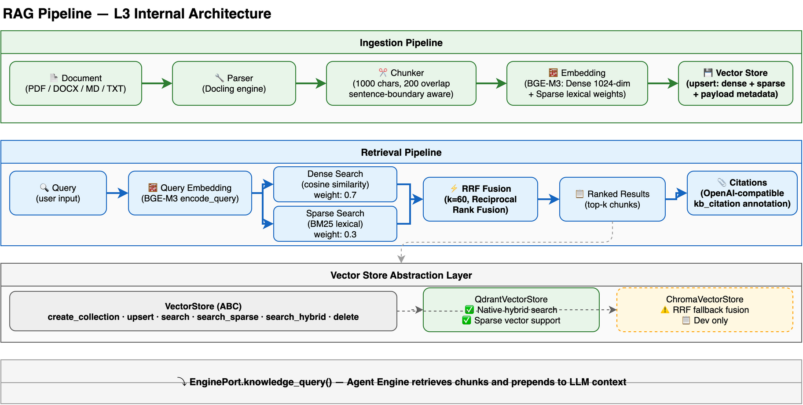

# RAG Pipeline Design

> Deep dive into the Retrieval-Augmented Generation pipeline: document ingestion, chunking, embedding, hybrid search, and citation system. For a system overview, see [Architecture](architecture.md). For security aspects of RAG, see [Security Architecture](security-architecture.md).

---

## Overview

Hecate's RAG pipeline provides knowledge retrieval for agents — converting uploaded documents into searchable vector embeddings, then retrieving relevant passages at query time to ground LLM responses with factual context.

The pipeline has two phases:

- **Ingestion**: Document → Parse → Chunk → Embed → Index
- **Retrieval**: Query → Embed → Hybrid Search (Dense + Sparse) → RRF Fusion → Ranked Results → Citations



---

## Ingestion Pipeline

### Document Parsing (`parser.py`)

The `DocumentParser` extracts text from uploaded files. It uses [Docling](https://github.com/DS4SD/docling) as the primary parsing engine, supporting:

- PDF (with layout-aware extraction)
- Microsoft Word (.docx)
- Markdown (.md)
- Plain text (.txt)
- HTML

When Docling is not installed, the parser falls back to basic text extraction. Web crawling is handled separately by `crawler.py` for URL-based ingestion.

### Text Chunking (`chunker.py`)

The `TextChunker` splits extracted text into chunks suitable for embedding:

| Parameter | Default | Description |
|-----------|---------|-------------|
| `chunk_size` | 1000 chars | Maximum chunk length |
| `chunk_overlap` | 200 chars | Overlap between adjacent chunks |

**Sentence-boundary aware splitting**: When the end of a chunk falls mid-sentence, the chunker looks for the nearest sentence boundary (period or newline) within the second half of the chunk. If found, it adjusts the break point to that boundary. This prevents cutting sentences in half, which would degrade retrieval quality.

Each `Chunk` dataclass captures: `content`, `index`, `start_char`, `end_char`, and `metadata`.

### Embedding (`embedding.py`)

The `EmbeddingService` generates dual-vector embeddings using [BGE-M3](https://huggingface.co/BAAI/bge-m3) (`BAAI/bge-m3`):

| Vector Type | Dimension | Purpose |
|-------------|-----------|---------|
| Dense | 1024 | Semantic similarity (cosine distance) |
| Sparse | Variable (token_id → weight) | Lexical matching (BM25-style) |

**Configuration:**
- Batch size: 32 texts per encode call
- Max sequence length: 512 tokens
- FP16: Disabled (FP32 for compatibility)

The model is lazy-loaded on first use. When FlagEmbedding is not installed, a mock embedding service generates deterministic hash-based vectors for development/testing.

```python
@dataclass
class EmbeddingResult:
    dense: list[float]      # 1024-dim dense vector
    sparse: dict[int, float]  # {token_id: weight} sparse vector
```

### Vector Store Indexing

Embeddings are persisted via the `VectorStore` abstraction (see [Vector Store Layer](#vector-store-layer) below). The `KnowledgeBaseService.ingest_document()` method orchestrates the full ingestion:

```
Document → parse() → text
         → chunk_text() → [Chunk, Chunk, ...]
         → encode() → [EmbeddingResult, ...]
         → store.upsert(ids, dense_vectors, sparse_vectors, payloads)
```

Each chunk's payload includes: text content, chunk metadata (page number, position, source file), and optional `workspace_id` for tenant isolation filtering.

---

## Retrieval Pipeline

### Hybrid Search (`searcher.py`)

The `HybridSearcher` combines dense and sparse retrieval for optimal relevance. Three search modes are supported:

| Mode | Mechanism | Use Case |
|------|-----------|----------|
| `hybrid` (default) | Dense + Sparse → RRF fusion | General purpose — best recall |
| `dense` | Dense vector similarity only | Semantic matching (synonyms, paraphrasing) |
| `sparse` | Sparse lexical matching only | Exact keyword matching (IDs, codes, names) |

**Score weights** (hybrid mode): Dense = 0.7, Sparse = 0.3

### Reciprocal Rank Fusion (`vector_store.py`)

When the vector store backend does not support native hybrid search, the `VectorStore` base class provides an application-layer RRF (Reciprocal Rank Fusion) fallback:

```
RRF_score(d) = Σ 1 / (k + rank_i(d))
```

Where `k = 60` (per Cormack et al. 2009), and `rank_i(d)` is the 1-based rank of document `d` in result list `i`. Documents appearing in both dense and sparse results get summed scores; documents in only one list get a single contribution.

This ensures that backends without native hybrid search (e.g., Chroma) still provide hybrid retrieval quality.

### Citation System (`types.py`)

Search results are converted to `Citation` objects with OpenAI-compatible annotation format:

```python
class Citation:
    position: int          # 1-indexed rank in retrieved context
    kb_id: UUID            # Knowledge base identifier
    kb_name: str           # Knowledge base display name
    document_name: str     # Source document filename
    chunk_id: str          # Vector store chunk ID
    score: float           # Relevance score from hybrid search
    content_snippet: str   # First 150 characters of chunk content
```

The `to_annotation()` method converts citations to the `kb_citation` annotation type, enabling frontend rendering of source references in chat responses.

---

## Vector Store Layer

### Abstraction (`vector_store.py`)

The `VectorStore` ABC defines the contract for all vector database backends:

| Method | Purpose |
|--------|---------|
| `create_collection(name, dim, sparse_dim)` | Initialize a collection with dense + sparse support |
| `upsert(collection, ids, vectors, sparse_vectors, payloads)` | Insert or update chunks |
| `search(collection, query_vector, limit, filter)` | Dense vector similarity search |
| `search_sparse(collection, sparse_vector, limit, filter)` | Sparse lexical search |
| `search_hybrid(collection, dense, sparse, limit, filter)` | Native hybrid search (if supported) |
| `delete(collection, ids)` | Remove chunks |

The base class provides a default `search_hybrid` implementation using RRF fusion of `search()` + `search_sparse()` results, so backends only need to implement the primitive operations.

### Backends

| Backend | File | Native Hybrid | Sparse Support | Production Ready |
|---------|------|:---:|:---:|:---:|
| **Qdrant** | `qdrant_store.py` | ✅ | ✅ | ✅ |
| **Chroma** | `chroma_store.py` | ❌ (RRF fallback) | ❌ | Development |

### Factory (`factory.py`)

The `get_vector_store()` factory selects the backend based on configuration (`settings.VECTOR_STORE_TYPE`). It caches the singleton instance to avoid repeated connection setup.

---

## Tenant Isolation

All search operations accept an optional `workspace_id` parameter. When provided, it is added as a payload filter to vector store queries, ensuring that agents in one workspace cannot retrieve chunks from another workspace's knowledge base — even if collection names collide.

---

## Integration with Agent Engine

The RAG pipeline is accessed by the execution engine via the `EnginePort.knowledge_query()` method. When an LLM node in a Graph has associated knowledge bases, the engine:

1. Retrieves the agent's `knowledge_bases` configuration
2. Calls `HybridSearcher.search()` with the user's query
3. Prepends retrieved chunks to the LLM context as system messages
4. Passes citations through to the response as annotations

This integration is transparent to the Graph DSL — knowledge retrieval is a capability provided by the service layer, not a node type in the engine.

---

## Further Reading

| Document | Description |
|----------|-------------|
| [Architecture](architecture.md) | System overview, module architecture |
| [Security Architecture](security-architecture.md) | PII masking, guardrail hooks for RAG security |
| [Core Concepts](concepts.md) | KnowledgeBase, Document, Chunk entity definitions |
| [Engine Design](engine-design.md) | EnginePort interface for knowledge_query |
