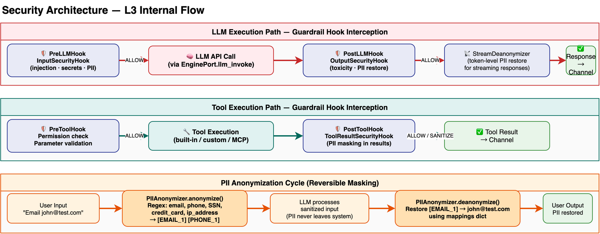

# Security Architecture

> Deep dive into Hecate's multi-layer security system: guardrail hooks, PII anonymization, LLM Guard, authentication, and audit trail. For a system overview, see [Architecture](architecture.md). For RAG pipeline security (PII in documents), see [RAG Pipeline Design](rag-pipeline-design.md).

---

## Overview

Security in Hecate is not a single module — it is a cross-cutting concern that spans the entire platform. The architecture follows a **defense-in-depth** principle with four interception layers:

1. **Engine-level guardrail hooks** — Intercept every LLM call and tool execution at the Pregel runtime boundary
2. **Content scanning** — LLM Guard scans inputs and outputs for prompt injection, secrets, and toxicity
3. **PII anonymization** — Reversible masking ensures sensitive data never reaches external LLM providers
4. **Audit trail** — Every security-relevant event is logged for compliance and incident response



---

## Guardrail Hooks System

### Hook Types (`engine/guardrail.py`)

The engine defines four abstract hook interfaces that provide interception at the boundaries of LLM and tool execution:

| Hook | Fires Before/After | Interface | Purpose |
|------|-------------------|-----------|---------|
| `PreLLMHook` | Before LLM call | `on_pre_llm_call(messages, model, tools)` | Modify prompt, reject request, inject context |
| `PostLLMHook` | After LLM response | `on_post_llm_call(response, messages)` | Filter output, redact PII, trigger re-generation |
| `PreToolHook` | Before tool execution | `on_pre_tool_call(name, arguments, context)` | Validate parameters, check permissions |
| `PostToolHook` | After tool returns | `on_post_tool_call(name, result, context)` | Sanitize output, log usage |

### Guardrail Actions

Each hook returns a `GuardrailResult` with one of three actions:

| Action | Behavior | Example Use Case |
|--------|----------|------------------|
| `ALLOW` | Proceed with original data | Normal flow — no security concerns |
| `BLOCK` | Abort execution, return safety message | Prompt injection detected, tool permission denied |
| `SANITIZE` | Proceed with modified data from `modified_data` | PII anonymized, output filtered |

### Invocation Points in the Pregel Loop

Hooks are invoked by the `LLMWorker` and `ToolWorker` during node execution:

```
LLMWorker.execute():
  ├── PreLLMHook.on_pre_llm_call(messages, model, tools)
  │     ├── ALLOW  → proceed with original messages
  │     ├── BLOCK  → return WorkerResult(safety_message)
  │     └── SANITIZE → replace messages from modified_data
  │
  ├── [LLM API Call]
  │
  └── PostLLMHook.on_post_llm_call(response, messages)
        ├── ALLOW  → proceed with original response
        ├── BLOCK  → return WorkerResult(safety_message)
        └── SANITIZE → replace response from modified_data

ToolWorker._execute_single_tool():
  ├── PreToolHook.on_pre_tool_call(name, arguments, context)
  │     ├── ALLOW  → proceed with tool execution
  │     └── BLOCK  → return error result
  │
  ├── [Tool Execution]
  │
  └── PostToolHook.on_post_tool_call(name, result, context)
        ├── ALLOW  → proceed with original result
        ├── BLOCK  → return sanitized result
        └── SANITIZE → replace result from modified_data
```

Streaming responses follow the same hook pattern in `execute_stream()`, with `StreamDeanonymizer` handling token-by-token PII restoration (see [PII Anonymization](#pii-anonymization) below).

### Hook Registration

Hooks are registered at the Worker level via `create_security_hooks(guardrail_config)`, which reads agent configuration sections (`input_security`, `output_security`, `data_security`) and constructs a `SecurityHookSet`. When security is disabled for an agent, NoOp hooks are used — they always return `ALLOW`.

---

## PII Anonymization

### Detection (`security/anonymizer.py`)

The `PIIAnonymizer` detects and masks five PII entity types using regex patterns:

| Entity | Pattern Example | Placeholder Format |
|--------|----------------|-------------------|
| Email | `user@domain.com` | `[EMAIL_1]` |
| Phone | `+1 (555) 123-4567` | `[PHONE_1]` |
| Credit Card | `4532-1234-5678-9012` | `[CREDIT_CARD_1]` |
| SSN | `123-45-6789` | `[SSN_1]` |
| IP Address | `192.168.1.100` | `[IP_ADDRESS_1]` |

### Anonymization Cycle

PII anonymization is a **reversible** process:

```
1. User Input: "Contact john@example.com from 192.168.1.1"

2. PreLLMHook → PIIAnonymizer.anonymize():
   → "Contact [EMAIL_1] from [IP_ADDRESS_1]"
   → mappings: {"john@example.com": "[EMAIL_1]", "192.168.1.1": "[IP_ADDRESS_1]"}

3. LLM processes sanitized input (PII never leaves the system)

4. PostLLMHook → PIIAnonymizer.deanonymize():
   → Restore placeholders in response using mappings
   → "[EMAIL_1]" → "john@example.com"
```

The mappings dictionary is stored in the execution context and passed between Pre/Post hooks. This ensures the LLM never sees actual PII values, but the user receives a response with their original data restored.

### Streaming Deanonymization (`security/hooks/stream_deanonymizer.py`)

For streaming responses, the `StreamDeanonymizer` handles token-by-token PII restoration:

1. **Non-PII tokens** are emitted immediately to the client
2. When `[` is encountered, the tokenizer enters **buffering mode**
3. Characters are accumulated until `]` completes the placeholder
4. The complete placeholder is looked up in reversed mappings and replaced with the original value
5. On stream end, `flush()` emits any remaining buffered content

This ensures low-latency streaming while correctly restoring multi-token placeholders like `[EMAIL_1]`.

### Tool Result Masking (`security/hooks/tool_result_security.py`)

The `ToolResultSecurityHook` (PostToolHook) scans tool execution results for PII before returning them to the engine. If `pii_anonymizer.has_pii(result)` returns true, the result is masked via SANITIZE action, ensuring PII from external APIs is anonymized before entering the conversation context.

---

## LLM Guard

### Input Scanning (`security/llm_guard.py`)

The `LLMGuardScanner` uses the [llm-guard](https://github.com/protectai/llm-guard) library to scan user inputs before they reach the LLM:

| Scanner | Model | Purpose |
|---------|-------|---------|
| `PromptInjection` | DeBERTa-v3 (threshold=0.5) | Detect prompt injection attacks |
| `Anonymize` | Presidio + BERT NER | Detect and mask PII entities |
| `Secrets` | detect-secrets | Detect API keys, tokens, credentials |

Returns `ScanResult(is_safe, score, issues, sanitized_text)`.

### Output Scanning

| Scanner | Threshold | Purpose |
|---------|-----------|---------|
| `Toxicity` | 0.7 | Detect toxic, harmful, or offensive content |

### Security Middleware (`security/middleware.py`)

The `SecurityMiddleware` provides a simpler scanning interface used by the API layer (outside the engine execution loop):

- `check_input(message)`: Scans user message, returns `{is_safe, issues}`
- `check_output(output, prompt)`: Scans LLM output, returns `{is_safe, issues}`

This middleware is used for pre-execution checks in the API gateway, complementing the engine-level hooks which intercept during execution.

---

## Encryption (`security/encryption.py`)

### Algorithm

Hecate uses **Fernet symmetric encryption** (from the `cryptography` library) for encrypting sensitive data at rest.

| Function | Purpose |
|----------|---------|
| `encrypt_value(plaintext: str) -> bytes` | Encrypt a string value |
| `decrypt_value(ciphertext: bytes) -> str` | Decrypt an encrypted value |

### Key Management

- Primary key: `settings.FERNET_KEY` environment variable
- Fallback: First API key in `settings.HECATE_API_KEYS`
- Key is lazily loaded via `_get_fernet()` with `ConfigurationError` on missing/invalid key

---

## Authentication

### JWT Token System (`services/auth/`)

| Component | File | Responsibility |
|-----------|------|---------------|
| `AuthService` | `service.py` | User registration, login, token refresh, workspace switching |
| Token utilities | `token.py` | JWT creation and decoding |
| Password | `password.py` | bcrypt hashing and verification |

### Token Lifecycle

| Token Type | Expiry | Algorithm | Claims |
|------------|--------|-----------|--------|
| Access Token | 30 minutes | HS256 | sub, exp, iat, org_id, workspace_id, role, type="access" |
| Refresh Token | 7 days | HS256 | sub, exp, iat, type="refresh" |

**Flow:**
```
Login → verify password (bcrypt) → resolve workspace context
      → create_access_token() + create_refresh_token()

API Request → decode_access_token() → validate type="access"
             → extract org_id, workspace_id, role

Token Expired → refresh_tokens() → validate refresh token
              → issue new access + refresh tokens
```

### API Key Service (`services/api_key_service.py`)

API Keys provide an alternative authentication mechanism for programmatic access:

| Operation | Method | Details |
|-----------|--------|---------|
| Create | `create_key()` | Generate `hcat_<32-char-urlsafe>`, store SHA-256 hash only |
| Verify | `verify_key()` | Hash input, lookup by hash, check active + not expired |
| Rotate | `rotate_key()` | Create new key, deactivate old |
| Revoke | `revoke_key()` | Set `is_active=False` |

**Key format**: `hcat_` prefix + 32 bytes URL-safe base64. Only SHA-256 hash is stored — the raw key is shown once at creation time and never persisted.

---

## Audit System (`services/audit/`)

### Architecture

The audit system provides append-only logging of all security-relevant events with batch writing, policy evaluation, and cold storage archiving:

```
Security Event → asyncio.Queue → AuditBatchWriter
                                   ├── PolicyEngine.evaluate()
                                   ├── Batch (50 events / 2 seconds)
                                   └── AuditStore.write() → PostgreSQL
                                       └── AuditArchiver → MinIO/S3 (cold storage)
```

### Audit Event

Each `AuditEvent` captures: org_id, user_id, action, success/failure, workspace_id, resource_type, resource_id, request_method, request_path, response_status, ip_address, user_agent, error details, metadata, and timestamp.

### Batch Writer (`writer.py`)

The `AuditBatchWriter` provides asynchronous batch persistence:

| Parameter | Default | Description |
|-----------|---------|-------------|
| `batch_size` | 50 | Maximum events per write |
| `flush_interval_seconds` | 2.0 | Maximum time between writes |

Events accumulate in an `asyncio.Queue`. The background drain loop batches events, optionally evaluates security policies, then writes to the `AuditStore`. Policy violations are logged as warnings but do **not** block persistence.

### Security Policies (`policy.py`)

Three built-in policies detect anomalous behavior:

| Policy | Trigger | Severity |
|--------|---------|----------|
| `BulkDeleteProtectionPolicy` | 5+ deletes within 10 minutes | MEDIUM |
| `OffHoursSensitiveOpsPolicy` | Permission/API key/settings changes outside Mon-Fri 09:00-18:00 | LOW |
| `UnusualIPDetectionPolicy` | Action from unrecognized IP address | LOW |

The `PolicyEngine` runs all registered policies against each event with a `PolicyContext` containing recent user actions and known IPs. Policies are pluggable — custom policies can be registered via `PolicyEngine.register()`.

### Cold Storage Archiver (`archiver.py`)

The `AuditArchiver` exports old audit logs to MinIO/S3 object storage:

1. Query events before the archive cutoff date
2. Export as JSON via `AuditStore.export()`
3. Upload to `hecate-audit-archive` bucket with filename `audit-{YYYYMMDD}.json`
4. Delete archived records from the database

This keeps the operational database lean while maintaining long-term audit history for compliance.

---

## Hook-to-Audit Integration

When security hooks detect PII or block content, they emit audit events via the `EventStore`:

```python
# InputSecurityHook detects PII in user input
await event_store.append(AuditEvent(
    action="pii.detected",
    metadata={
        "source": "input",
        "pii_types": {"email": 2, "phone": 1},
        "placeholder_count": 3,
    }
))
```

These events flow through the same audit pipeline (batch writer → policy engine → store), providing a complete trail of all PII handling incidents.

---

## Defense-in-Depth Summary

| Layer | Component | Interception Point | Threat Mitigated |
|-------|-----------|-------------------|-----------------|
| API Gateway | SecurityMiddleware | Request entry | Malicious inputs blocked before execution |
| Engine Pre-LLM | InputSecurityHook | Before LLM call | Prompt injection, PII leakage to LLM provider |
| Engine Post-LLM | OutputSecurityHook | After LLM response | Toxic output, PII restoration |
| Engine Pre-Tool | PreToolHook | Before tool execution | Unauthorized tool access |
| Engine Post-Tool | ToolResultSecurityHook | After tool returns | PII in tool results |
| Auth Layer | AuthService + ApiKeyService | Every API request | Unauthorized access |
| Audit Layer | AuditBatchWriter + Policies | All security events | Compliance, anomaly detection |
| A2A Layer | Signed Agent Cards | Agent discovery | Card impersonation attacks |

---

## A2A Protocol Security (Planned)

### Signed Agent Cards

A2A v1.0 introduces cryptographic signatures on Agent Cards — the most significant security improvement in the production-grade release. Signatures allow receiving agents to cryptographically verify that the card was issued by the domain owner, closing off card impersonation attacks.

**Mechanism**:
1. Agent Card is signed with the domain owner's private key
2. Receiving agent fetches the card and verifies the signature against the public key
3. Verification happens before any task delegation
4. Invalid signatures cause the card to be rejected

**Integration with Hecate**:
- Signed Agent Cards will be part of the A2A server implementation
- Card signing keys will be managed through the existing secret management system
- Card verification will happen in the A2A client before task delegation

### Agent-to-Agent Authentication

A2A supports multiple authentication schemes:
- **APIKey** — Simple key-based authentication
- **HTTPAuth** — HTTP Basic/Digest authentication
- **OAuth2** — Token-based authentication with scopes
- **OpenIdConnect** — Federated identity via OIDC
- **MutualTLS** — Certificate-based authentication

Hecate will implement the subset of authentication schemes that align with its enterprise security model, starting with APIKey and OAuth2.

See [ADR-011: A2A Protocol Adoption](adr/011-a2a-protocol-adoption.md) for the full decision record.

---

## Further Reading

| Document | Description |
|----------|-------------|
| [Architecture](architecture.md) | System overview, module architecture |
| [RAG Pipeline Design](rag-pipeline-design.md) | Document ingestion and retrieval pipeline |
| [Engine Design](engine-design.md) | Guardrail hooks, Pregel runtime, worker pool |
| [ADR-008: Security via Hooks](adr/008-security-via-hooks.md) | Decision record for hook-based security architecture |
