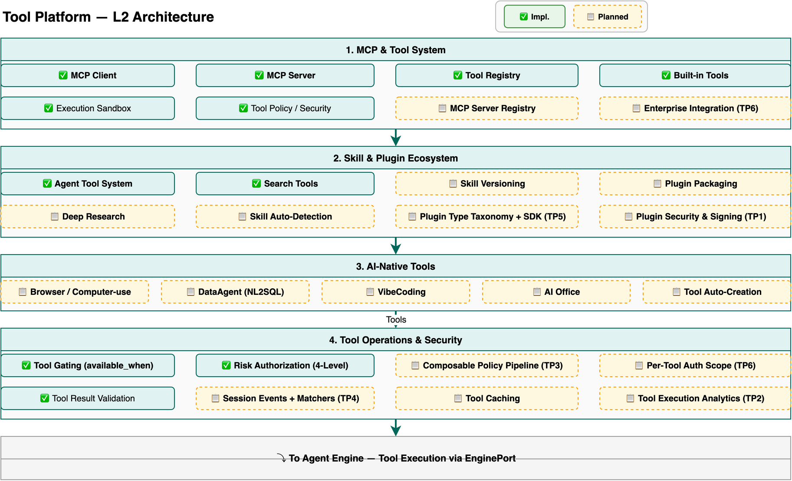

# Tool Platform Design

> Deep dive into Hecate's tool ecosystem: MCP integration, plugin architecture, tool operations, security, observability, and AI-native tools. For a system overview, see [Architecture](architecture.md). For the architecture decisions behind these enhancements, see [ADR-023](adr/023-tool-platform-enhancement.md).

---

## Overview

The Tool Platform is Hecate's unified tool integration and management layer — the primary interface for discovering, configuring, securing, executing, and monitoring tools that agents use to interact with external systems. It serves five operator personas:

- **Application developers** — Register custom tools, configure MCP servers, attach tools to agents, test tool calls
- **Platform / SRE engineers** — Monitor tool execution health, debug failures, manage tool policies, analyze performance
- **Security / Compliance officers** — Configure tool access policies, audit tool usage, approve high-risk tool calls
- **Plugin developers** — Build, package, sign, and publish plugins to the marketplace
- **Enterprise integration teams** — Configure ERP/CRM/OA connectors, manage per-tool credentials, monitor integration health

The Tool Platform follows the same **composition architecture** as the Ops Center and Model Hub — it is not a new microservice but a set of services, registries, and presentation layers that extend the existing tool infrastructure:



1. **MCP & Tool System** — Runtime layer: MCP Client (consume external tools), MCP Server (expose Hecate), Tool Registry (routing), built-in tools, execution sandbox, tool policy
2. **Skill & Plugin Ecosystem** — Agent tool system, search tools, skill versioning, plugin packaging, plugin type taxonomy + SDK, plugin security & signing
3. **AI-Native Tools** — Browser/computer-use, DataAgent (NL2SQL), VibeCoding, AI Office, tool auto-creation
4. **Tool Operations & Security** — Tool gating, risk authorization, composable policy pipeline, per-tool auth scope, session events + tool matchers, tool caching, tool execution analytics
5. **Downstream** — Tool execution flows to Agent Engine via EnginePort

---

## MCP & Tool System (Existing, P1-P2)

The MCP & Tool System layer is Hecate's runtime tool access foundation, built with bidirectional MCP support and a centralized tool registry.

### Architecture

```
Agent (LLM tool call)
        │
        ▼
  EnginePort.tool_execute()
        │
        ▼
  ┌─────────────────────────────────────────────┐
  │            Tool Registry                     │
  │  ┌──────────┐  ┌──────────┐  ┌──────────┐  │
  │  │ Builtin  │  │ Custom   │  │   MCP    │  │
  │  │ Tools    │  │ Tools    │  │  Client  │  │
  │  │ (5 core) │  │ (DB)     │  │ (remote) │  │
  │  └──────────┘  └──────────┘  └──────────┘  │
  └─────────────────────────────────────────────┘
        │                            │
        ▼                            ▼
  ┌──────────────┐          ┌──────────────┐
  │    Sandbox    │          │  MCP Server  │
  │  (Docker)     │          │  Registry    │
  └──────────────┘          └──────────────┘
```

### Key Components

| Component | File |
|-----------|------|
| Tool Registry | `services/tool/registry.py` |
| Built-in Tools | `services/tool/builtin.py` |
| Search Tools | `services/tool/search/` (Tavily/Serper/DDG) |
| MCP Client | `services/mcp/connection.py` |
| MCP Server | `services/mcp/server.py` |
| Docker Sandbox | `services/sandbox/executor.py` |
| Tool Result Validation | `engine/workers/` (JSON Schema) |
| Risk Authorization | `services/security/` (4-level) |
| Tool Gating | `engine/workers/` (available_when) |

### Built-in Tool Inventory

| Tool | Description | Risk Level | Sandbox |
|------|-------------|------------|---------|
| `web_search` | Web search via Tavily/Serper/DuckDuckGo | LOW | No |
| `read_file` | Read file from workspace | LOW | No |
| `write_file` | Write file to workspace | MEDIUM | No |
| `list_files` | List directory contents | LOW | No |
| `execute_code` | Execute Python in Docker container | HIGH | Yes |

---

## Plugin Security & Signing (5.13)

### Problem

The Asset Marketplace (12.0) enables browse→try→install→configure for plugins, but lacks supply chain security. Without signing and scanning, a malicious plugin could compromise the platform. Competitors (OpenClaw ClawPack, npm package signing, ClawHub security scans) have established this as table stakes.

### Architecture

```
Plugin Developer
    │
    ▼ (1) Local scan + sign
┌─────────────────────────────────────────────────┐
│  hecate plugin sign                              │
│  ├── Static analysis (code patterns)            │
│  ├── Dependency vulnerability check (CVE)       │
│  ├── Secret detection (API keys, tokens)        │
│  ├── Permission audit (requested vs declared)   │
│  ├── Security score computation (0-100)         │
│  └── Ed25519 signature on plugin.yaml           │
└─────────────────────────────────────────────────┘
    │
    ▼ (2) Publish
┌─────────────────────────────────────────────────┐
│  Asset Marketplace (12.0)                        │
│  Stores: signed manifest, SHA-256 digest,        │
│  scan results, publisher identity, security score│
└─────────────────────────────────────────────────┘
    │
    ▼ (3) Install
┌─────────────────────────────────────────────────┐
│  hecate plugin install                           │
│  1. Verify Ed25519 signature vs KeyRegistry      │
│  2. Verify SHA-256 digest                        │
│  3. Check security score ≥ org threshold         │
│  4. Fail → block + report to admin               │
│  5. Pass → install + log audit trail             │
└─────────────────────────────────────────────────┘
```

### Data Models

```python
class PluginSignatureModel(Base):
    __tablename__ = "plugin_signatures"
    id: UUID                    # PK
    plugin_id: str              # Plugin package ID
    version: str                # Semver version
    publisher_key_id: str       # Ed25519 public key fingerprint
    signature: str              # Base64 Ed25519 signature
    digest_sha256: str          # SHA-256 of plugin archive
    signed_at: datetime
    created_at: datetime

class PluginSecurityScanModel(Base):
    __tablename__ = "plugin_security_scans"
    id: UUID                    # PK
    plugin_id: str              # Plugin package ID
    version: str                # Semver version
    scan_type: str              # "static" | "cve" | "secret" | "permission"
    scan_status: str            # "pass" | "warn" | "fail"
    findings: dict              # Detailed findings per scan type
    security_score: int         # 0-100 aggregate score
    scanned_at: datetime

class PublisherKeyModel(Base):
    __tablename__ = "publisher_keys"
    key_id: str                 # Ed25519 public key fingerprint
    publisher_name: str         # Publisher display name
    public_key: str             # Base64 Ed25519 public key
    verified: bool              # Admin-verified publisher
    created_at: datetime
```

### API Endpoints

| Method | Path | Description |
|--------|------|-------------|
| POST | `/api/v1/plugin-security/scan` | Trigger security scan on plugin archive |
| GET | `/api/v1/plugin-security/{plugin_id}/{version}/report` | Get security scan report |
| GET | `/api/v1/plugin-security/{plugin_id}/{version}/score` | Get security score |
| POST | `/api/v1/plugin-security/verify` | Verify signature + digest on install |
| POST | `/api/v1/publishers/keys` | Register publisher public key |
| GET | `/api/v1/publishers/{name}/keys` | List publisher's public keys |

### Security Score Computation

| Factor | Weight | Passing Criteria |
|--------|--------|-----------------|
| Static analysis | 30% | No critical code patterns (eval, shell injection) |
| CVE check | 25% | No high-severity CVEs in dependencies |
| Secret detection | 20% | No hardcoded API keys/tokens |
| Permission audit | 15% | Declared permissions match actual API surface |
| Publisher verification | 10% | Publisher key is admin-verified |

Score ≥ 70: install allowed. Score 40-69: admin approval required. Score < 40: blocked.

---

## Tool Execution Analytics Dashboard (8.9c)

### Problem

The Ops Center (8.9) provides system-level, agent-level, and conversation-level analytics, but no tool-level visibility. When an agent's latency increases, operators cannot determine whether a specific tool is the bottleneck. Salesforce Session Trace OTel API and Palantir end-to-end observability provide this capability.

### Architecture

```
ToolRegistry.execute(name, args)
    │
    ▼
┌──────────────────────────────────────────────┐
│         Tool Execution Trace Span             │
│  (OpenTelemetry, already emitted)             │
│  Attributes:                                  │
│    - tool.name, tool.type (builtin/custom/mcp)│
│    - agent.id, workspace.id                   │
│    - tool.latency_ms                          │
│    - tool.status (success/failure)            │
│    - tool.error_type                          │
│    - tool.token_cost                          │
└──────────────────────────────────────────────┘
    │
    ▼ (OTel collector → async export)
┌──────────────────────────────────────────────┐
│            TimescaleDB Hypertable             │
│  tool_executions (partitioned by time)        │
│                                               │
│  Continuous Aggregates:                       │
│  ├── tool_metrics_1min  (real-time dashboard) │
│  ├── tool_metrics_1hour (daily trends)        │
│  └── tool_metrics_1day  (monthly reports)     │
└──────────────────────────────────────────────┘
    │
    ▼
┌──────────────────────────────────────────────┐
│         Analytics Dashboard API                │
│  ┌──────────────────────────────────────────┐ │
│  │  Latency percentiles (p50/p95/p99)       │ │
│  │  Success rate over time                  │ │
│  │  Error distribution by type              │ │
│  │  Usage heatmap (tool × agent)            │ │
│  │  Cost breakdown per tool                 │ │
│  │  Failure drill-down → individual traces  │ │
│  └──────────────────────────────────────────┘ │
└──────────────────────────────────────────────┘
```

### Dashboard Views

**Tool Fleet Overview**: All tools in a table with columns: name, type, invocation count (24h), p95 latency, success rate, avg cost, trend sparkline. Sortable by any column. Color-coded health (green/yellow/red).

**Per-Tool Detail**: Selected tool's time-series charts for latency percentiles, success rate, invocation count. Error breakdown pie chart. Top 10 agents by invocation count. Recent execution traces list with drill-down to full trace.

**Tool Usage Heatmap**: Matrix view of tool (rows) × agent (columns), cell color intensity = invocation frequency. Reveals which tools are used by which agents, identifying underutilized or overloaded tools.

### API Endpoints

| Method | Path | Description |
|--------|------|-------------|
| GET | `/api/v1/tool-analytics/overview` | Tool fleet overview metrics |
| GET | `/api/v1/tool-analytics/{tool_name}` | Per-tool detail metrics |
| GET | `/api/v1/tool-analytics/{tool_name}/latency` | Latency time series |
| GET | `/api/v1/tool-analytics/{tool_name}/errors` | Error distribution |
| GET | `/api/v1/tool-analytics/heatmap` | Tool × agent usage heatmap |
| GET | `/api/v1/tool-analytics/cost` | Cost breakdown per tool |

---

## Composable Tool Policy Pipeline (5.6 Enhancement)

### Problem

The current `available_when` gating is a single condition evaluated per tool. Enterprise scenarios require multi-layer policy composition: a tool might need to pass profile filtering, allow/deny lists, risk-level gating, sandbox requirements, channel restrictions, and plugin-availability checks — all in sequence.

### Architecture

```
LLM requests tool list
        │
        ▼
┌─────────────────────────────────────────┐
│     All Registered Tools                 │
│  (builtin + custom + MCP + plugins)     │
└─────────────────┬───────────────────────┘
                  │
    ┌─────────────▼──────────────┐
    │   Layer 1: Profile         │ → Removes tools not in profile
    │   (enterprise-safe)        │
    └─────────────┬──────────────┘
    ┌─────────────▼──────────────┐
    │   Layer 2: Allow/Deny      │ → Removes denied, keeps allowed
    │   (explicit lists)         │
    └─────────────┬──────────────┘
    ┌─────────────▼──────────────┐
    │   Layer 3: Risk Level      │ → Removes tools above max_risk
    │   (LOW/MEDIUM/HIGH/CRIT)   │
    └─────────────┬──────────────┘
    ┌─────────────▼──────────────┐
    │   Layer 4: Sandbox         │ → Marks sandbox-required tools
    │   (execution constraint)   │
    └─────────────┬──────────────┘
    ┌─────────────▼──────────────┐
    │   Layer 5: Channel         │ → Removes tools restricted by channel
    │   (web/mobile/api/voice)   │
    └─────────────┬──────────────┘
    ┌─────────────▼──────────────┐
    │   Layer 6: Plugin          │ → Removes tools whose plugin is missing
    │   (availability check)     │
    └─────────────┬──────────────┘
                  │
                  ▼
    ┌─────────────────────────────┐
    │   Filtered Tool Set          │
    │   (presented to LLM)         │
    └─────────────────────────────┘
```

### Policy Layer ABC

```python
from abc import ABC, abstractmethod

class ToolPolicyLayer(ABC):
    """Base class for composable tool policy layers."""

    @abstractmethod
    async def filter(
        self,
        tools: list[ToolDefinition],
        context: ToolPolicyContext,
    ) -> list[ToolDefinition]:
        """Filter the tool list. Can only remove tools, never add."""
        ...

class ToolPolicyContext:
    """Context passed through the pipeline."""
    agent_id: str
    workspace_id: str
    channel: str | None
    user_role: str | None
    session_metadata: dict
```

### Policy DSL (YAML)

```yaml
tool_policy:
  layers:
    - type: profile
      profile: "enterprise-safe"
    - type: allow_deny
      deny: ["file_delete", "shell_exec"]
    - type: risk_level
      max_risk: HIGH
      require_approval: CRITICAL
    - type: sandbox
      sandbox_required: true
    - type: channel
      channel_restrictions:
        "web-widget": ["admin_*"]
    - type: plugin
      require_installed: true
```

### Design Principle

The pipeline is **subtractive**: each layer can only remove tools from the visible set, never add them. This ensures security invariants are preserved regardless of layer ordering. A tool blocked by layer 2 cannot be re-added by layer 3.

---

## Plugin Type Taxonomy + Developer SDK (5.5 Enhancement)

### Problem

Hecate's Plugin System (5.5) currently describes "provider/hook/extension" — a vague 3-type model. Dify has 6 well-defined plugin types with a Python SDK, Claude Code has 5 clear extension types. Hecate needs a structured taxonomy and developer SDK to build a thriving plugin ecosystem.

### 6 Plugin Types

| Type | Purpose | Base Class | Trigger |
|------|---------|-----------|---------|
| **Tool Plugin** | Callable function exposed to agents | `ToolPlugin` | LLM function call |
| **Trigger Plugin** | Event-driven workflow invocation | `TriggerPlugin` | Webhook/schedule/event |
| **Extension Plugin** | Hook/middleware injection | `ExtensionPlugin` | Lifecycle event |
| **Model Plugin** | Custom LLM provider | `ModelPlugin` | LLM invocation |
| **Datasource Plugin** | External data connector | `DatasourcePlugin` | Knowledge query |
| **Agent Strategy Plugin** | Custom reasoning loop | `AgentStrategyPlugin` | Agent execution |

### Plugin SDK Example

```python
from hecate.plugin import ToolPlugin, PluginManifest, ToolResponse

class WeatherTool(ToolPlugin):
    """Fetch weather data from OpenWeatherMap API."""

    @classmethod
    def manifest(cls) -> PluginManifest:
        return PluginManifest(
            type="tool",
            name="weather",
            version="1.2.0",
            api_version="1.0",
            min_platform_version="0.5.0",
            description="Get current weather and forecasts",
            permissions=["network:https"],
            parameters={
                "type": "object",
                "properties": {
                    "location": {"type": "string"},
                    "units": {"type": "string", "default": "metric"},
                },
                "required": ["location"],
            },
        )

    async def execute(self, location: str, units: str = "metric") -> ToolResponse:
        # Implementation
        ...
        return ToolResponse(content=[{"type": "text", "text": result}])
```

### Plugin Template Generator

```bash
$ hecate plugin init --type tool --name my-weather
Creating plugin scaffold...
  ✓ my-weather/plugin.yaml
  ✓ my-weather/main.py
  ✓ my-weather/pyproject.toml
  ✓ my-weather/tests/test_plugin.py
  ✓ my-weather/README.md

$ cd my-weather && hecate plugin dev --hot-reload
Plugin loaded. Hot-reload enabled.
Test at: http://localhost:8000/plugin/test/my-weather
```

### Compatibility Validation

On install, the system checks:
1. `api_version` matches installed platform's Plugin API version
2. `min_platform_version` ≤ installed Hecate version
3. Declared `permissions` are allowed by organizational policy
4. Required `dependencies` (other plugins) are installed

---

## Per-Tool Auth Scope (5.8 Enhancement)

### Problem

Enterprise integration tools (Salesforce connector, SAP connector, ServiceNow connector) each need their own credentials. Currently, credentials are managed at the agent or platform level. AgentArts provides per-tool URN + API Key isolation; Hecate needs the same.

### Architecture

```
Agent calls Salesforce tool
        │
        ▼
┌───────────────────────────────────────┐
│       Tool Credential Vault            │
│  ToolCredentialVault.get("salesforce") │
│  → Returns encrypted credentials       │
│  → Tool A CANNOT access Tool B creds   │
└───────────────┬───────────────────────┘
                │
    ┌───────────▼───────────┐
    │  Credential Resolver   │
    │  ├── OAuth 2.0 refresh │
    │  ├── API Key rotation  │
    │  └── Token caching     │
    └───────────┬───────────┘
                │
    ┌───────────▼───────────┐
    │   External System      │
    │   (Salesforce API)     │
    └───────────────────────┘
```

### Data Model

```python
class ToolCredentialModel(Base):
    __tablename__ = "tool_credentials"
    id: UUID                        # PK
    tool_name: str                  # e.g., "salesforce_connector"
    workspace_id: UUID              # Scope to workspace
    credential_type: str            # "oauth2" | "api_key" | "basic" | "bearer"
    credential_data_encrypted: str  # Fernet-encrypted JSON
    oauth_token_url: str | None
    oauth_refresh_token_encrypted: str | None
    oauth_expires_at: datetime | None
    created_by: str
    created_at: datetime
    updated_at: datetime
```

### Isolation Guarantee

```python
class ToolCredentialVault:
    """Per-tool credential access with strict isolation."""

    async def get(self, tool_name: str, workspace_id: UUID) -> Credential:
        """Get credentials for a specific tool. Cross-tool access is blocked."""
        # Service layer enforces: caller's tool_name must match requested tool_name
        ...

    async def set(self, tool_name: str, workspace_id: UUID, credential: Credential) -> None:
        """Set credentials for a tool. Only admin or tool owner can set."""
        ...

    async def refresh_oauth(self, tool_name: str, workspace_id: UUID) -> Credential:
        """Refresh OAuth token if expired. Automatic via background task."""
        ...
```

---

## Session Events + Tool Matchers (1.3.5i Enhancement)

### Problem

Hecate's deterministic hooks (1.3.5i) have 5 events: PreToolUse, PostToolUse, PreEdit, PostEdit, Stop. Claude Code has 12 events including session-level events (SessionStart, SessionEnd, UserPromptSubmit, PreCompact). Additionally, Claude Code supports tool name matchers (regex-based filtering) for targeted hook execution.

### Session-Level Events

```
Session Lifecycle:
  SessionStart
      │
      ▼
  ┌─── UserPromptSubmit ────┐
  │                         │
  │  ┌─── ReAct Loop ───┐   │
  │  │                   │   │
  │  │  PreToolUse ──▶ PostToolUse  (per tool call)  │
  │  │                   │   │
  │  └───────────────────┘   │
  │                         │
  │  PreCompact (if needed) │
  │                         │
  └─── Stop ────────────────┘
      │
      ▼
  SessionEnd
```

### Event Definitions

| Event | When | Input Context |
|-------|------|---------------|
| `SessionStart` | Session created | session_id, agent_id, workspace_id |
| `UserPromptSubmit` | User sends a message | session_id, prompt_text, user_id |
| `PreToolUse` | Before tool execution | session_id, tool_name, tool_args |
| `PostToolUse` | After tool execution | session_id, tool_name, tool_result, latency |
| `PreCompact` | Before context compression | session_id, current_tokens, threshold |
| `Stop` | Agent finishes responding | session_id, final_response |
| `SessionEnd` | Session terminated | session_id, duration, message_count |

### Tool Name Matchers

```json
{
  "hooks": {
    "PreToolUse": [
      {
        "matcher": "mcp__github__.*",
        "command": "python3 /opt/hooks/github-audit.py",
        "timeout": 10
      },
      {
        "matcher": "execute_code",
        "command": "python3 /opt/hooks/code-scan.py",
        "timeout": 30
      }
    ],
    "PostToolUse": [
      {
        "matcher": "write_file",
        "command": "prettier --write $FILE_PATH",
        "timeout": 5
      }
    ],
    "SessionStart": [
      {
        "command": "echo 'Session started' >> /var/log/sessions.log"
      }
    ]
  }
}
```

**Matcher semantics**: POSIX extended regex. `.*` matches all tools. `mcp__github__.*` matches all GitHub MCP tools. Multiple hooks can match; they execute in declaration order. Exit code 2 = block, exit code 0 = allow.

---

## Data Freshness Strategy

| Component | Refresh Interval | Data Source |
|-----------|-----------------|-------------|
| Tool Execution Metrics | Real-time (per-invocation OTel span) | Trace spans → TimescaleDB |
| Tool Analytics Aggregates | 1min / 1hour / 1day | TimescaleDB continuous aggregates |
| Plugin Security Scan | On publish (event-driven) | Static analysis + CVE database |
| Plugin Signature Verification | On install (event-driven) | Ed25519 key registry |
| Tool Credential Vault | On access (cached) | Fernet-encrypted DB + OAuth refresh |
| Policy Pipeline Evaluation | Per-invocation (cached per session) | Agent config + org policy |
| Hook Matcher Resolution | Per-event (cached per session) | Settings JSON |

---

## API Endpoints

### Tool Execution Analytics (TP2)

| Method | Path | Description |
|--------|------|-------------|
| GET | `/api/v1/tool-analytics/overview` | Tool fleet overview with sortable metrics |
| GET | `/api/v1/tool-analytics/{tool_name}` | Per-tool detail with time-series |
| GET | `/api/v1/tool-analytics/heatmap` | Tool × agent usage heatmap |
| GET | `/api/v1/tool-analytics/cost` | Cost breakdown per tool |

### Plugin Security (TP1)

| Method | Path | Description |
|--------|------|-------------|
| POST | `/api/v1/plugin-security/scan` | Trigger security scan |
| GET | `/api/v1/plugin-security/{plugin_id}/{version}/report` | Get scan report |
| POST | `/api/v1/plugin-security/verify` | Verify signature on install |

### Tool Policy Pipeline (TP3)

| Method | Path | Description |
|--------|------|-------------|
| GET | `/api/v1/tool-policies/{agent_id}` | Get agent's tool policy config |
| PUT | `/api/v1/tool-policies/{agent_id}` | Update tool policy layers |
| POST | `/api/v1/tool-policies/preview` | Preview filtered tools for a given context |

### Per-Tool Credentials (TP6)

| Method | Path | Description |
|--------|------|-------------|
| GET | `/api/v1/tool-credentials/{tool_name}` | Get credential status (not the secret) |
| POST | `/api/v1/tool-credentials/{tool_name}` | Set credentials for a tool |
| POST | `/api/v1/tool-credentials/{tool_name}/refresh` | Force OAuth token refresh |

---

## Further Reading

- [ADR-023: Tool Platform Enhancement Architecture](adr/023-tool-platform-enhancement.md) — Architecture decisions for TP1-TP6
- [Architecture Overview](architecture.md) — System-level architecture
- [Engine Design](engine-design.md) — Pregel runtime and EnginePort tool execution
- [Security Architecture](security-architecture.md) — Guardrails, PII masking, sandbox execution, risk authorization
- [Ops Center Design](ops-center-design.md) — Shared composition pattern; Tool Execution Analytics (TP2) integrates with Ops Center
- [Model Hub Design](model-hub-design.md) — Parallel enhancement pattern for gap closure
- [ADR-016: Platform SPI Architecture](adr/016-platform-spi-architecture.md) — Plugin SPI Core foundation
- [ADR-008: Security via Hooks](adr/008-security-via-hooks.md) — Guardrail Hooks architecture
- [Tool Registry Source](https://github.com/xueyufish/hecate/tree/main/src/hecate/services/tool) — Current tool service implementation
